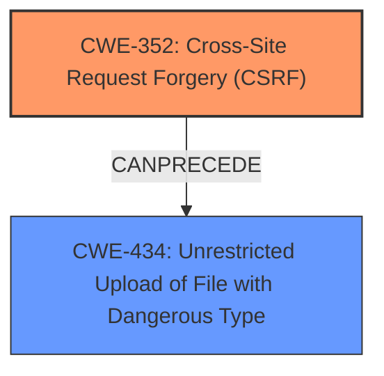

# Analysis Report for CVE-2024-6320

# Vulnerability Analysis Report: CVE-2024-6320

## Description

The ScrollTo Top plugin for WordPress is vulnerable to Cross-Site Request Forgery to **Arbitrary File Upload** in versions up to, and including, 1.2.2. This is due to missing nonce validation and missing file type validation in the options_page function. This makes it possible for unauthenticated attackers to upload arbitrary files on the affected sites server which may make remote code execution possible via a forged request granted they can trick a site administrator into performing an action such as clicking on a link.

## Vulnerability Description Key Phrases

- **Rootcause:** ["['missing nonce validation'", "'missing file type validation']"]
- **Weakness:** ['Arbitrary File Upload', 'cross-site request forgery']
- **Impact:** ['arbitrary file upload', 'remote code execution']
- **Vector:** forged request
- **Attacker:** unauthenticated attackers
- **Product:** ScrollTo Top plugin for WordPress
- **Version:** up to and including 1.2.2
- **Component:** options_page function

## Analysis (with Relationship Data)

# Summary
| CWE ID | CWE Name | Confidence | CWE Abstraction Level | CWE Vulnerability Mapping Label | CWE-Vulnerability Mapping Notes |
|---|---|---|---|---|---|
| CWE-352 | Cross-Site Request Forgery (CSRF) | 1.0 | Compound | Primary | Allowed |
| CWE-434 | Unrestricted Upload of File with Dangerous Type | 1.0 | Base | Secondary | Allowed |

## Evidence and Confidence

*   **Confidence Score:** 1.0
*   **Evidence Strength:** HIGH

## Relationship Analysis
The primary weakness is CWE-352 [Cross-Site Request Forgery (CSRF)], which stems from the **missing nonce validation**. This allows an attacker to perform actions on behalf of an administrator. The secondary weakness is CWE-434 [Unrestricted Upload of File with Dangerous Type], caused by the **missing file type validation**, which results in **arbitrary file upload**. Both weaknesses are exploited due to a lack of proper input validation and authorization mechanisms.



## Vulnerability Chain
The vulnerability chain starts with **missing nonce validation** leading to CWE-352 [Cross-Site Request Forgery (CSRF)]. This allows an attacker to trick an administrator into performing actions, in this case, uploading a file. The **missing file type validation** then allows the attacker to upload a dangerous file, leading to CWE-434 [Unrestricted Upload of File with Dangerous Type]. This can then lead to remote code execution on the server.

## Summary of Analysis
The analysis is based on the provided evidence from the vulnerability description.

The primary weakness is the **missing nonce validation** which allows for CWE-352 [Cross-Site Request Forgery (CSRF)]. "This is due to missing nonce validation and missing file type validation in the options_page function. This makes it possible for unauthenticated attackers to upload arbitrary files on the affected sites server which may make remote code execution possible via a forged request granted they can trick a site administrator into performing an action such as clicking on a link."

The secondary weakness is the **missing file type validation** in the options_page function which allows for CWE-434 [Unrestricted Upload of File with Dangerous Type]. "This is due to missing nonce validation and **missing file type validation** in the options_page function. This makes it possible for unauthenticated attackers to **upload arbitrary files** on the affected sites server which may make remote code execution possible via a forged request granted they can trick a site administrator into performing an action such as clicking on a link."

The selected CWEs are at the optimal level of specificity because they directly address the root causes of the vulnerability.

Relevant CWE Information:

# Enhanced Context (25 CWEs)
The following CWEs were identified as potentially relevant to this vulnerability:

## CWE-425: Direct Request ('Forced Browsing')
**Abstraction Level**: Base
**Similarity Score**: 0.76
**Source**: dense

**Description**:
The web application does not adequately enforce appropriate authorization on all restricted URLs, scripts, or files.

**Mapping Guidance**:
- Usage: Allowed
- Rationale: This CWE entry is at the Base level of abstraction, which is a preferred level of abstraction for mapping to the root causes of vulnerabilities.

*Rationale for Not Selecting:* While related to authorization, it's not the primary issue. The CSRF vulnerability allows bypassing authorization checks, making CWE-352 more relevant.

## CWE-472: External Control of Assumed-Immutable Web Parameter
**Abstraction Level**: Base
**Similarity Score**: 0.75
**Source**: dense

**Description**:
The web application does not sufficiently verify inputs that are assumed to be immutable but are actually externally controllable, such as hidden form fields.

**Mapping Guidance**:
- Usage: Allowed
- Rationale: This CWE entry is at the Base level of abstraction, which is a preferred level of abstraction for mapping to the root causes of vulnerabilities.

*Rationale for Not Selecting:* Not directly applicable as the vulnerability is not about immutable parameters.

## CWE-74: Improper Neutralization of Special Elements in Output Used by a Downstream Component ('Injection')
**Abstraction Level**: Class
**Similarity Score**: 0.75
**Source**: dense

**Description**:
The product constructs all or part of a command, data structure, or record using externally-influenced input from an upstream component, but it does not neutralize or incorrectly neutralizes special elements that could modify how it is parsed or interpreted when it is sent to a downstream component.

**Mapping Guidance**:
- Usage: Discouraged
- Rationale: CWE-74 is high-level and often misused when lower-level weaknesses are more appropriate.

*Rationale for Not Selecting:* This is too general. The specific issues are CSRF and unrestricted file upload.

## CWE-434: Unrestricted Upload of File with Dangerous Type
**Abstraction Level**: Base
**Similarity Score**: 0.75
**Source**: dense

**Description**:
The product allows the upload or transfer of dangerous file types that are automatically processed within its environment.

**Mapping Guidance**:
- Usage: Allowed
- Rationale: This CWE entry is at the Base level of abstraction, which is a preferred level of abstraction for mapping to the root causes of vulnerabilities.

*Rationale for Selecting:* The **missing file type validation** directly leads to the ability to upload arbitrary and potentially dangerous files, which aligns with CWE-434 [Unrestricted Upload of File with Dangerous Type].

## CWE-80: Improper Neutralization of Script-Related HTML Tags in a Web Page (Basic XSS)
**Abstraction Level**: Variant
**Similarity Score**: 0.75
**Source**: dense

**Description**:
The product receives input from an upstream component, but it does not neutralize or incorrectly neutralizes special characters such as "<", ">", and "&" that could be interpreted as web-scripting elements when they are sent to a downstream component that processes web pages.

**Mapping Guidance**:
- Usage: Allowed
- Rationale: This CWE entry is at the Variant level of abstraction, which is a preferred level of abstraction for mapping to the root causes of vulnerabilities.

*Rationale for Not Selecting:* Not relevant as the vulnerability doesn't involve script-related HTML tags.

## CWE-352: Cross-Site Request Forgery (CSRF)
**Abstraction Level**: Compound
**Similarity Score**: 0.74
**Source**: dense

**Description**:
The web application does not, or can not, sufficiently verify whether a well-formed, valid, consistent request was intentionally provided by the user who submitted the request.

**Mapping Guidance**:
- Usage: Allowed
- Rationale: This is a well-known Composite of multiple weaknesses that must all occur simultaneously, although it is attack-oriented in nature.

*Rationale for Selecting:* The **missing nonce validation** directly leads to CWE-352 [Cross-Site Request Forgery (CSRF)], as it allows unauthenticated attackers to perform actions on behalf of an administrator.

## CWE-184: Incomplete List of Disallowed Inputs
**Abstraction Level**: Base
**Similarity Score**: 0.74
**Source**: dense

**Description**:
The product implements a protection mechanism that relies on a list of inputs (or properties of inputs) that are not allowed by policy or otherwise require other action to neutralize before additional processing takes place, but the list is incomplete.

**Mapping Guidance**:
- Usage: Allowed
- Rationale: This CWE entry is at the Base level of abstraction, which is a preferred level of abstraction for mapping to the root causes of vulnerabilities.

*Rationale for Not Selecting:* While related to input validation, the specific issue is the absence of file type validation, making CWE-434 more relevant.

## CWE-116: Improper Encoding or Escaping of Output
**Abstraction Level**: Class
**Similarity Score**: 0.74
**Source**: dense

**Description**:
The product prepares a structured message for communication with another component, but encoding or escaping of the data is either missing or done incorrectly. As a result, the intended structure of the message is not preserved.

**Mapping Guidance**:
- Usage: Allowed-with-Review
- Rationale: This CWE entry is a Class and might have Base-level children that would be more appropriate

*Rationale for Not Selecting:* Not relevant as the vulnerability is not related to encoding or escaping of output.

## CWE-138: Improper Neutralization of Special Elements
**Abstraction Level**: Class
**Similarity Score**: 0.74
**Source**: dense

**Description**:
The product receives input from an upstream component, but it does not neutralize or incorrectly neutralizes special elements that could be interpreted as control elements or syntactic markers when they are sent to a downstream component.

**Mapping Guidance**:
- Usage: Discouraged
- Rationale: This CWE entry is a level-1 Class (


## CWE Relationship Analysis

Current CWEs represent these abstraction levels: .


### Vulnerability Chain Analysis

**Chain starting from CWE-116:**
- 116 (Improper Encoding or Escaping of Output) - ROOT


**Chain starting from CWE-80:**
- 80 (Improper Neutralization of Script-Related HTML Tags in a Web Page (Basic XSS)) - ROOT


### CWE Relationship Diagram

```mermaid
graph TD
    classDef primary fill:#f96,stroke:#333,stroke-width:2px
    classDef secondary fill:#69f,stroke:#333
    classDef tertiary fill:#9e9,stroke:#333
```


*Report generated on 2025-07-14 01:29:06*
