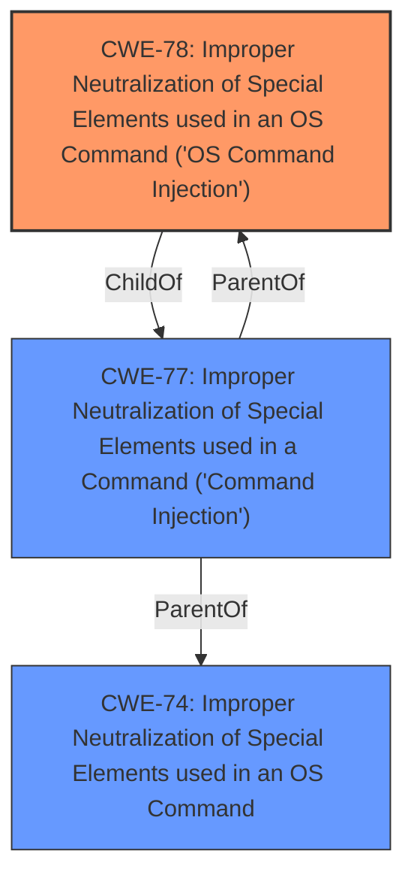

# Analysis for CVE-2024-6364

# Summary

| CWE ID | CWE Name | Confidence | CWE Abstraction Level | CWE Vulnerability Mapping Label | CWE-Vulnerability Mapping Notes |
|---|---|---|---|---|---|
| **CWE-78** | Improper Neutralization of Special Elements used in an OS Command ('OS Command Injection') | 0.8 | Base | Allowed | **Primary CWE** |

## Evidence and Confidence

*   **Confidence Score:** 0.8
*   **Evidence Strength:** MEDIUM

## Relationship Analysis
The primary relationship to consider is that CWE-78 sits within a broader context of injection vulnerabilities. While other CWEs like authentication bypass could be tangentially related, the direct impact and described mechanism point strongly to command injection. The abstraction level of Base is appropriate as it directly describes the flaw: **improper neutralization** leading to command execution.

## Vulnerability Chain
The vulnerability chain starts with a device in a **not activated** state (Absolute Persistence). An attacker with physical access and network control can then inject OS commands due to the **improper neutralization** of special elements. This leads to the ability to initiate OS commands on the device.
  - **Root Cause:** Device is not activated and has older firmware versions.
  - **Weakness:** **Improper neutralization** of special elements in OS commands
  - **Impact:** OS Command Injection leading to arbitrary command execution

## Summary of Analysis
The primary assessment is based on the vulnerability description and the CVE Reference Links Content Summary, which states that a skilled attacker can "initiate OS commands on the device." This, coupled with the requirement of physical access and hostile network control when the Absolute Persistence software is **not activated**, points to the potential for command injection.

The selection of CWE-78 [Improper Neutralization of Special Elements used in an OS Command ('OS Command Injection')] is based on the fact that this is the most direct and specific CWE that describes the vulnerability. The attacker is able to "initiate OS commands," suggesting that the system is not properly neutralizing special elements in those commands.

Other CWEs were considered, but ultimately deemed less appropriate:

*   CWE-22 [Improper Limitation of a Pathname to a Restricted Directory ('Path Traversal')] and CWE-73 [External Control of File Name or Path] were considered, but discarded because the vulnerability description does not explicitly mention file path manipulation.
*   CWE-287 [Improper Authentication] and CWE-285 [Improper Authorization] were considered, but the primary issue is not a failure in authentication or authorization, but rather the ability to inject commands.
*   CWE-912 [Hidden Functionality] was considered, but is not directly related to the **weakness** of command injection.
*   CWE-347 [Improper Verification of Cryptographic Signature] was considered, but the vulnerability description doesn't mention anything related to signatures.

Ultimately, CWE-78 [Improper Neutralization of Special Elements used in an OS Command ('OS Command Injection')] at the Base level of abstraction provides the most accurate and specific description of the vulnerability based on the available evidence.