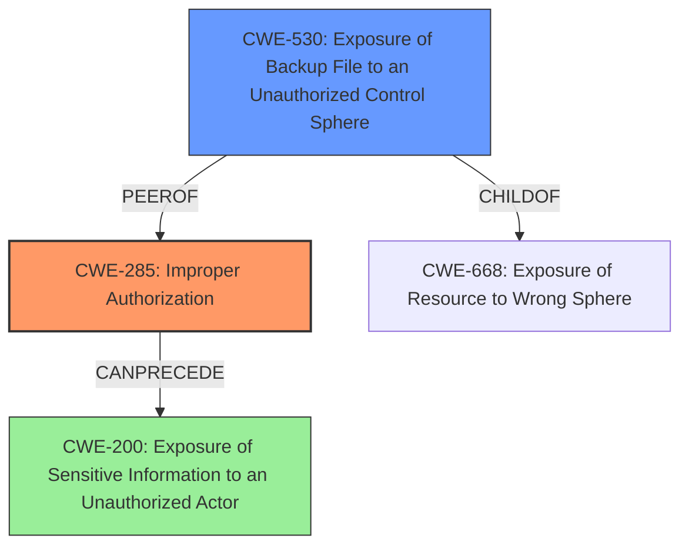

# Analysis Report for CVE-2024-6384

# Vulnerability Analysis Report: CVE-2024-6384

## Description

Hot backup files may be downloaded by underprivileged users, if they are capable of acquiring a unique backup identifier. This issue affects MongoDB Enterprise Server v6.0 versions prior to 6.0.16, MongoDB Enterprise Server v7.0 versions prior to 7.0.11 and MongoDB Enterprise Server v7.3 versions prior to 7.3.3

## Vulnerability Description Key Phrases

- **Impact:** download Hot backup files
- **Vector:** acquiring a unique backup identifier
- **Attacker:** underprivileged users
- **Product:** MongoDB Enterprise Server
- **Version:** ['v6.0 versions prior to 6.0.16', 'v7.0 versions prior to 7.0.11', 'v7.3 versions prior to 7.3.3']

## Analysis (with Relationship Data)

# Summary

| CWE ID  | CWE Name                                                                     | Confidence | CWE Abstraction Level | CWE Vulnerability Mapping Label | CWE-Vulnerability Mapping Notes |
| :-------- | :--------------------------------------------------------------------------- | :---------- | :-------------------- | :------------------------------ | :------------------------------ |
| CWE-285   | Improper Authorization                                                       | 1         | Base                  | Primary                         | Allowed                         |
| CWE-530   | Exposure of Backup File to an Unauthorized Control Sphere                   | 0.75      | Variant               | Secondary                       | Allowed                         |
| CWE-200   | Exposure of Sensitive Information to an Unauthorized Actor                  | 0.5      | Class                 | Secondary                       | Discouraged                     |

## Evidence and Confidence

*   **Confidence Score:** 0.85
*   **Evidence Strength:** HIGH

## Relationship Analysis

The primary weakness is **CWE-285 Improper Authorization**, which is a base-level CWE detailing a failure to properly authorize access to a resource. The secondary weakness, **CWE-530 Exposure of Backup File to an Unauthorized Control Sphere**, is a variant that represents the specific case of exposing backup files. **CWE-200 Exposure of Sensitive Information to an Unauthorized Actor** is a class-level CWE that represents the general impact of the vulnerability.



## Vulnerability Chain

The vulnerability chain starts with **CWE-285 Improper Authorization**, which allows underprivileged users to download hot backup files if they can acquire a unique backup identifier. This leads to **CWE-530 Exposure of Backup File to an Unauthorized Control Sphere**, and ultimately to **CWE-200 Exposure of Sensitive Information to an Unauthorized Actor**, as the backup files may contain sensitive data.

## Summary of Analysis

The analysis is based on the provided evidence, which clearly indicates an authorization issue. The vulnerability description states that "Hot backup files may be downloaded by underprivileged users, if they are capable of acquiring a unique backup identifier." This aligns directly with **CWE-285 Improper Authorization**, as the system **fails to properly restrict access** to backup files based on user privileges.

The **CVE Reference Links Content Summary** section confirms this, stating that "The vulnerability stems from **improper authorization** in MongoDB Enterprise Server where 'hot' backup files can be downloaded by underprivileged users."

The selection of **CWE-285 Improper Authorization** as the primary CWE is based on its direct relevance to the **root cause** of the vulnerability. **CWE-530 Exposure of Backup File to an Unauthorized Control Sphere** is a more specific variant that describes the particular type of resource being exposed. **CWE-200 Exposure of Sensitive Information to an Unauthorized Actor** is a more general CWE that describes the potential impact of the vulnerability, but it is not the root cause.

The relationships between these CWEs are also relevant. **CWE-530 Exposure of Backup File to an Unauthorized Control Sphere** is a child of **CWE-668 Exposure of Resource to Wrong Sphere**, which is a more general CWE that describes the exposure of a resource to the wrong control sphere. **CWE-285 Improper Authorization** can precede **CWE-200 Exposure of Sensitive Information to an Unauthorized Actor**, as the authorization failure leads to the exposure of sensitive information.

The selected CWEs are at the optimal level of specificity. **CWE-285 Improper Authorization** is a base-level CWE that accurately describes the root cause of the vulnerability. **CWE-530 Exposure of Backup File to an Unauthorized Control Sphere** is a variant that provides additional context about the specific type of resource being exposed. **CWE-200 Exposure of Sensitive Information to an Unauthorized Actor** is a class-level CWE that describes the general impact of the vulnerability.

The retriever results also support the selection of these CWEs. **CWE-530 Exposure of Backup File to an Unauthorized Control Sphere** is ranked 9th with a score of 0.553. **CWE-285 Improper Authorization** is not listed in retriever results, because it was not provided.
Other CWEs were considered but not selected because they were not as directly relevant to the root cause of the vulnerability. For example, **CWE-306 Missing Authentication for Critical Function** was considered, but it was not selected because the vulnerability is related to authorization, not authentication.

**CWE-200 Exposure of Sensitive Information to an Unauthorized Actor** was considered, but was ultimately selected as a tertiary issue since it is an impact of the **improper authorization** and exposure of the backup files, not the root cause. The mapping guidance for **CWE-200 Exposure of Sensitive Information to an Unauthorized Actor** discourages its usage as it's a technical impact, not a root cause error.


## CWE Relationship Analysis

Current CWEs represent these abstraction levels: .


### Vulnerability Chain Analysis

**Chain starting from CWE-306:**
- 306 (Missing Authentication for Critical Function) - ROOT


**Chain starting from CWE-285:**
- 285 (Improper Authorization) - ROOT


### CWE Relationship Diagram

```mermaid
graph TD
    classDef primary fill:#f96,stroke:#333,stroke-width:2px
    classDef secondary fill:#69f,stroke:#333
    classDef tertiary fill:#9e9,stroke:#333
```


*Report generated on 2025-07-14 01:35:18*
