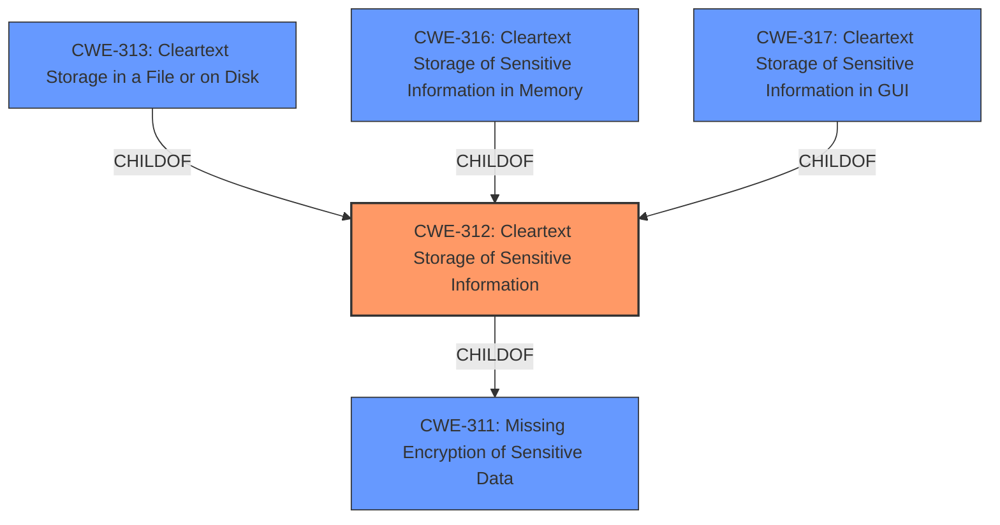

# Enhanced Analysis for CVE-2024-6400

# Summary
| CWE ID  | CWE Name                                                      | Confidence | CWE Abstraction Level | CWE Vulnerability Mapping Label | CWE-Vulnerability Mapping Notes |
| :-------- | :------------------------------------------------------------ | :--------- | :---------------------- | :------------------------------ | :------------------------------ |
| CWE-312 | Cleartext Storage of Sensitive Information                  | 1          | Base                    | Primary                         | Allowed                         |

## Evidence and Confidence

*   **Confidence Score:** 1
*   **Evidence Strength:** HIGH

## Relationship Analysis
The primary CWE is CWE-312, which is a base-level CWE. Several other CWEs were considered, particularly those related to storage of sensitive information and encryption. CWE-311 is a class-level CWE that is the parent of CWE-312, but CWE-312 is more specific. Several variant-level CWEs, children of CWE-312, were considered, such as CWE-313, CWE-316, and CWE-317, but the description does not give enough evidence to select any of them.



## Vulnerability Chain
The vulnerability chain starts with the **cleartext storage of sensitive information** (CWE-312), which then leads to the ability to **retrieve embedded sensitive data**.

## Summary of Analysis
The vulnerability description clearly states that the root cause is **"Cleartext Storage of Sensitive Information"**. This directly aligns with CWE-312. The retriever results also list CWE-312 as the top candidate. The description doesn't provide any information about where the information is stored so a child CWE like CWE-313, CWE-316, and CWE-317 cannot be selected.

Relevant CWE Information:

# Enhanced Context (25 CWEs)
The following CWEs were identified as potentially relevant to this vulnerability:

## CWE-312: Cleartext Storage of Sensitive Information
**Abstraction Level**: Base
**Similarity Score**: 0.74
**Source**: dense

**Description**:
The product stores sensitive information in cleartext within a resource that might be accessible to another control sphere.

**Mapping Guidance**:
- Usage: Allowed
- Rationale: This CWE entry is at the Base level of abstraction, which is a preferred level of abstraction for mapping to the root causes of vulnerabilities.
## CWE-312: Cleartext Storage of Sensitive Information

CWE-312: Cleartext Storage of Sensitive Information

**CWE-312 was selected as the primary CWE.** The vulnerability description clearly indicates **cleartext storage of sensitive information** as the root cause. CWE-312 perfectly matches this description. The retriever results also list CWE-312 as the top candidate.

Other CWEs Considered but Not Used:

*   CWE-311: Missing Encryption of Sensitive Data: This is a higher-level class CWE and less specific than CWE-312. While the missing encryption is related, the description explicitly mentions cleartext storage, making CWE-312 a better fit.
*   CWE-313: Cleartext Storage in a File or on Disk: This is a more specific variant of CWE-312. However, the vulnerability description doesn't mention specifically that the storage is in a file or on disk, making CWE-312 a more appropriate choice.
*   CWE-316: Cleartext Storage of Sensitive Information in Memory: Similar to CWE-313, this is a more specific variant, but the description lacks the detail to confirm the storage location is in memory.
*   CWE-317: Cleartext Storage of Sensitive Information in GUI: Similar to CWE-313, this is a more specific variant, but the description lacks the detail to confirm the storage location is in a GUI.
*   CWE-522: Insufficiently Protected Credentials: While credentials might be involved, the main issue is the cleartext storage itself, not necessarily the protection mechanism.
* CWE-916: Use of Password Hash With Insufficient Computational Effort: The description focuses on cleartext storage, not hashing algorithms.
* CWE-532: Insertion of Sensitive Information into Log File: There's no indication that the information is being stored in a log file.
* CWE-36: Absolute Path Traversal: This CWE is unrelated to the vulnerability description.
* CWE-523: Unprotected Transport of Credentials: The vulnerability is focused on storage, not transport.


## CWE Relationship Analysis

Current CWEs represent these abstraction levels: .


### Vulnerability Chain Analysis

**Chain starting from CWE-317:**
- 317 (Cleartext Storage of Sensitive Information in GUI) - ROOT


**Chain starting from CWE-523:**
- 523 (Unprotected Transport of Credentials) - ROOT


### CWE Relationship Diagram

```mermaid
graph TD
    classDef primary fill:#f96,stroke:#333,stroke-width:2px
    classDef secondary fill:#69f,stroke:#333
    classDef tertiary fill:#9e9,stroke:#333
```