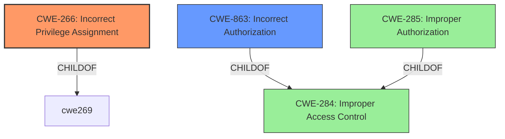

# Analysis Report for CVE-2024-6411

# Vulnerability Analysis Report: CVE-2024-6411

## Description

The ProfileGrid - User Profiles, Groups and Communities plugin for WordPress is vulnerable to privilege escalation in all versions up to, and including, 5.8.9. This is due to a **lack of validation on user-supplied data** in the pm_upload_image AJAX action. This makes it possible for authenticated attackers, with Subscriber-level access and above, to update their user capabilities to Administrator.

## Vulnerability Description Key Phrases

- **Rootcause:** lack of validation on user-supplied data
- **Impact:** ['privilege escalation', 'update user capabilities to Administrator']
- **Attacker:** authenticated attackers with Subscriber-level access and above
- **Product:** ['ProfileGrid - User Profiles', 'Groups and Communities plugin for WordPress']
- **Version:** all versions up to and including 5.8.9
- **Component:** pm_upload_image AJAX action

## Analysis (with Relationship Data)

# Summary

| CWE ID | CWE Name | Confidence | CWE Abstraction Level | CWE Vulnerability Mapping Label | CWE-Vulnerability Mapping Notes |
|---|---|---|---|---|---|
| CWE-266 | Incorrect Privilege Assignment | 0.9 | Base | Primary | Allowed |
| CWE-863 | Incorrect Authorization | 0.7 | Class | Secondary | Allowed-with-Review |
| CWE-20 | Improper Input Validation | 0.6 | Class | Secondary | Discouraged |

## Evidence and Confidence

*   **Confidence Score:** 0.8
*   **Evidence Strength:** HIGH

## Relationship Analysis

The primary weakness is **Incorrect Privilege Assignment** (CWE-266) because the vulnerability description explicitly states that users are able to update their user capabilities to Administrator due to a **lack of validation on user-supplied data**. This means that the system assigned the wrong privileges based on **incorrectly validated data**. The secondary weakness is **Incorrect Authorization** (CWE-863) because the system incorrectly performs the authorization check.
The abstraction level of CWE-266 (Base) is preferred because it is more specific than CWE-269 (Class) or CWE-284 (Pillar). CWE-863 is a Class, and there may be more specific children, but based on the evidence, this is the best fit.



## Vulnerability Chain

The vulnerability chain starts with the **lack of validation on user-supplied data**, which leads to **Incorrect Privilege Assignment** (CWE-266). Authenticated users with low-level access can then exploit this by updating their user capabilities to Administrator, leading to privilege escalation and full control over the WordPress site.

## Summary of Analysis

The primary CWE is **CWE-266 Incorrect Privilege Assignment**, because the **root cause** of the vulnerability stems from a **lack of validation on user-supplied data**. This allows attackers to modify their user capabilities.
The retriever results suggested **CWE-862 Missing Authorization**, **CWE-863 Incorrect Authorization**, and **CWE-284 Improper Access Control**.
**CWE-862 Missing Authorization** was not selected, because the vulnerability description suggests that there *is* authorization, but that it is not correctly implemented.
**CWE-284 Improper Access Control** was not selected because it is too high-level and there are more specific CWEs that apply.
The technical impact of the vulnerability is Privilege Escalation, which is possible because of **CWE-266 Incorrect Privilege Assignment**.

# Relevant CWE Information:

## CWE-266: Incorrect Privilege Assignment
**Abstraction Level**: Base
**Similarity Score**: 0.78
**Source**: dense

**Description**:
A product incorrectly assigns a privilege to a particular actor, creating an unintended sphere of control for that actor.

**Mapping Guidance**:
- Usage: Allowed
- Rationale: This CWE entry is at the Base level of abstraction, which is a preferred level of abstraction for mapping to the root causes of vulnerabilities.

## CWE-863: Incorrect Authorization
**Abstraction Level**: Class
**Similarity Score**: 2049.24
**Source**: sparse

**Description**:
The product performs an authorization check when an actor attempts to access a resource or perform an action, but it does not correctly perform the check.

**Mapping Guidance**:
- Usage: Allowed-with-Review
- Rationale: This CWE entry is a Class and might have Base-level children that would be more appropriate

## CWE-20: Improper Input Validation
**Abstraction Level**: Class
**Similarity Score**: 0.413
**Source**: sparse

**Description**:
The product does not validate or incorrectly validates input.

**Mapping Guidance**:
- Usage: Discouraged
- Rationale: This CWE entry is a Class and might have Base-level children that would be more appropriate


## CWE Relationship Analysis

Current CWEs represent these abstraction levels: .


### Vulnerability Chain Analysis

**Chain starting from CWE-863:**
- 863 (Incorrect Authorization) - ROOT


**Chain starting from CWE-862:**
- 862 (Missing Authorization) - ROOT


### CWE Relationship Diagram

```mermaid
graph TD
    classDef primary fill:#f96,stroke:#333,stroke-width:2px
    classDef secondary fill:#69f,stroke:#333
    classDef tertiary fill:#9e9,stroke:#333
```


*Report generated on 2025-07-14 01:39:17*
