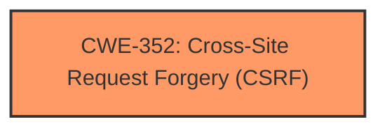

# Enhanced Analysis for CVE-2024-6412

# Summary

| CWE ID  | CWE Name                                                                       | Confidence | CWE Abstraction Level | CWE Vulnerability Mapping Label | CWE-Vulnerability Mapping Notes |
| :-------- | :----------------------------------------------------------------------------- | :--------- | :---------------------- | :-------------------------------- | :------------------------------ |
| CWE-352 | Cross-Site Request Forgery (CSRF)                                              | 1.0        | Compound                | Primary                           | Allowed                         |

## Evidence and Confidence

*   **Confidence Score:** 1.0
*   **Evidence Strength:** HIGH

## Relationship Analysis

The primary CWE identified is CWE-352 [CWE-352: Cross-Site Request Forgery (CSRF)]. This is a compound weakness that directly addresses the **lack of CSRF checks** described in the vulnerability. No parent-child or peer relationships influenced the selection, as CWE-352 directly and accurately captures the vulnerability.



## Vulnerability Chain

The vulnerability chain is straightforward:
1.  **Root Cause:** **Lack of CSRF checks** in the HTML Forms WordPress plugin.
2.  **Impact:** Attackers can induce logged-in users to perform unwanted actions.

The root cause directly leads to the impact, with no missing links in the chain. The **missing CSRF checks** is the vulnerability.

## Summary of Analysis

The analysis clearly points to CWE-352 [CWE-352: Cross-Site Request Forgery (CSRF)] as the primary weakness. The vulnerability description explicitly states that the plugin **does not have CSRF checks**, which aligns directly with the definition of CWE-352 [CWE-352: Cross-Site Request Forgery (CSRF)]. The impact, where attackers can make logged-in users perform unwanted actions, is a direct consequence of this missing security control. The selection of CWE-352 [CWE-352: Cross-Site Request Forgery (CSRF)] is at the appropriate level of specificity, as it accurately represents the vulnerability without needing to consider parent or child CWEs.

The key piece of evidence is: "The HTML Forms WordPress plugin before 1.3.34 **does not have CSRF checks** in some places, which could allow attackers to make logged in users perform unwanted actions via CSRF attacks."

All other CWEs, while potentially related to web application vulnerabilities, do not precisely capture the **missing CSRF protection** as directly as CWE-352 [CWE-352: Cross-Site Request Forgery (CSRF)]. CWE-862 [CWE-862: Missing Authorization], for instance, is broader and refers to the absence of any authorization check, whereas this vulnerability is specifically about **CSRF protection**. Similarly, CWE-116 [CWE-116: Improper Encoding or Escaping of Output] and CWE-434 [CWE-434: Unrestricted Upload of File with Dangerous Type] address different types of web application weaknesses that are not present in the description.


## CWE Relationship Analysis

Current CWEs represent these abstraction levels: .


### Vulnerability Chain Analysis

**Chain starting from CWE-352:**
- 352 (Cross-Site Request Forgery (CSRF)) - ROOT


**Chain starting from CWE-116:**
- 116 (Improper Encoding or Escaping of Output) - ROOT


### CWE Relationship Diagram

```mermaid
graph TD
    classDef primary fill:#f96,stroke:#333,stroke-width:2px
    classDef secondary fill:#69f,stroke:#333
    classDef tertiary fill:#9e9,stroke:#333
```