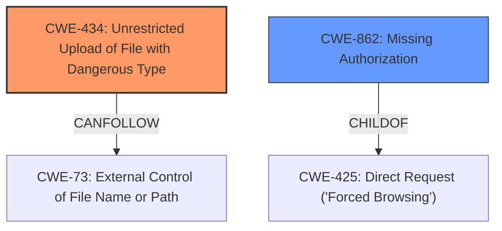

# Raw Analyzer Response for CVE-2024-6431

# Summary

| CWE ID  | CWE Name                                                                             | Confidence | CWE Abstraction Level | CWE Vulnerability Mapping Label | CWE-Vulnerability Mapping Notes |
| :-------- | :----------------------------------------------------------------------------------- | :--------- | :---------------------- | :------------------------------ | :------------------------------ |
| CWE-434   | Unrestricted Upload of File with Dangerous Type                                      | 0.9        | Base                    | Primary                         | Allowed                       |
| CWE-862   | Missing Authorization                                                                  | 0.8        | Class                   | Secondary                       | Allowed-with-Review           |

## Evidence and Confidence

*   **Confidence Score:** 0.85
*   **Evidence Strength:** HIGH

## Relationship Analysis

The primary weakness is **CWE-434 (Unrestricted Upload of File with Dangerous Type)**, which directly addresses the **missing file type validation**. This can lead to arbitrary file uploads, a key aspect of the vulnerability. **CWE-862 (Missing Authorization)** is a secondary weakness, reflecting the **missing capability check** that allows unauthorized users to perform this upload.

## Vulnerability Chain

The vulnerability chain starts with two independent **root causes**:

1.  **Missing file type validation** leading directly to **CWE-434 (Unrestricted Upload of File with Dangerous Type)**.
2.  **Missing capability check** leading to **CWE-862 (Missing Authorization)**, allowing unauthorized access to the upload functionality.

The **impact** is the ability to upload arbitrary files, potentially leading to remote code execution.

## Summary of Analysis

The initial analysis identified both **missing file type validation** and **missing capability check** as significant factors. The final determination is that **CWE-434 (Unrestricted Upload of File with Dangerous Type)** is the primary issue because it directly describes the vulnerability of unrestricted file uploads due to the **lack of file type validation**. **CWE-862 (Missing Authorization)** is a contributing factor as it allows lower-privileged users to access functionality they should not have access to.

The evidence directly supports this: "The Media.net Ads Manager plugin for WordPress is vulnerable to arbitrary file uploads due to **missing file type validation** and **missing capability check** in the sendMail function..."

The graph relationships and retriever results reinforce this selection, with **CWE-434 (Unrestricted Upload of File with Dangerous Type)** being highly relevant given the arbitrary file upload vulnerability.

CWEs considered but not used:

*   CWE-79 (Improper Neutralization of Input During Web Page Generation ('Cross-site Scripting')): While file uploads *could* lead to XSS, it is not the direct vulnerability.
*   CWE-22 (Improper Limitation of a Pathname to a Restricted Directory ('Path Traversal')): Path traversal is not explicitly mentioned in the vulnerability description.
*   CWE-306 (Missing Authentication for Critical Function): Authentication is not the primary problem; authorization is.
*   CWE-352 (Cross-Site Request Forgery (CSRF)): CSRF is not mentioned or implied in the description.

These selections are at the optimal level of specificity, with **CWE-434 (Unrestricted Upload of File with Dangerous Type)** being a Base-level CWE and **CWE-862 (Missing Authorization)** being a Class-level CWE.