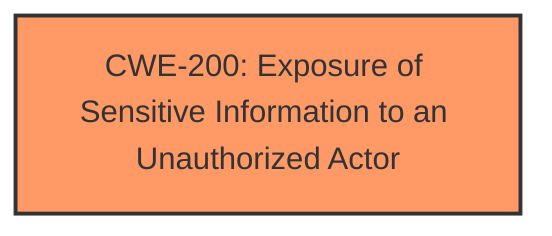

# Analysis Report for CVE-2024-6448

# Vulnerability Analysis Report: CVE-2024-6448

## Description

The Mollie Payments for WooCommerce plugin for WordPress is vulnerable to information exposure in all versions up to, and including, 7.7.0. This is due to the error reporting being enabled by default in multiple plugin files. This makes it possible for unauthenticated attackers to obtain the full path to instances, which they may be able to use in combination with other vulnerabilities or to simplify reconnaissance work. On its own, this information is of very limited use.

## Vulnerability Description Key Phrases

- **Rootcause:** error reporting enabled by default
- **Impact:** obtain full path to instances
- **Attacker:** unauthenticated attackers
- **Product:** Mollie Payments for WooCommerce plugin for WordPress
- **Version:** all versions up to and including 7.7.0

## Analysis (with Relationship Data)

# Summary
| CWE ID | CWE Name | Confidence | CWE Abstraction Level | CWE Vulnerability Mapping Label | CWE-Vulnerability Mapping Notes |
|---|---|---|---|---|---|
| CWE-200 | Exposure of Sensitive Information to an Unauthorized Actor | 0.9 | Class | Primary | Discouraged, but appropriate given the specific information exposure.|

## Evidence and Confidence

*   **Confidence Score:** 0.9
*   **Evidence Strength:** HIGH

## Relationship Analysis
The primary CWE is CWE-200, which is a Class-level CWE. While it is generally discouraged to map directly to Class-level CWEs, in this specific case, the vulnerability directly involves the exposure of sensitive information (full path) to an unauthorized actor. The other considered CWEs, such as CWE-306 and CWE-862, relate to authentication and authorization, which are not the primary issue here. The relationship is simply that the lack of proper error handling leads to information exposure.



## Vulnerability Chain
The vulnerability chain is straightforward:
1.  **Root Cause:** **Error reporting enabled by default** in plugin files.
2.  **Weakness:** Exposure of the full path to instances.
3.  **Impact:** Unauthenticated attackers obtain the full path to instances, which can be used for reconnaissance or in combination with other vulnerabilities.

## Summary of Analysis
The initial analysis focused on identifying the root cause and impact of the vulnerability. The **root cause** is the **error reporting being enabled by default**. The direct impact is the exposure of the full path to instances.

The primary CWE, CWE-200 [Exposure of Sensitive Information to an Unauthorized Actor], directly addresses the core issue of sensitive information exposure. Although it is discouraged to use Class-level CWEs, the specifics of the vulnerability—the unintentional exposure of the full path—align closely with the description of CWE-200. The evidence supports this decision, particularly the "Vulnerability Description Key Phrases" and "CVE Reference Links Content Summary" that both highlight the information exposure aspect.

The other considered CWEs, while potentially related, do not capture the essence of the vulnerability as accurately as CWE-200. For instance, CWE-306 [Missing Authentication for Critical Function] and CWE-862 [Missing Authorization] focus on authentication and authorization issues, which are not the primary factors in this vulnerability. The error reporting is enabled by default, regardless of authentication or authorization status.

Relevant CWE Information:
# Enhanced Context (25 CWEs)
The following CWEs were identified as potentially relevant to this vulnerability:

CWE-425: Direct Request ('Forced Browsing') - Not applicable because the vulnerability is not about bypassing authorization to access resources directly but rather about information disclosure through error messages.

CWE-639: Authorization Bypass Through User-Controlled Key - Not applicable as there is no modification of key values involved.

CWE-472: External Control of Assumed-Immutable Web Parameter - Not relevant because the vulnerability isn't about controlling immutable parameters.

CWE-434: Unrestricted Upload of File with Dangerous Type - Not applicable as file uploads are not involved.

CWE-352: Cross-Site Request Forgery (CSRF) - Not applicable as this is not a CSRF vulnerability.

CWE-201: Insertion of Sensitive Information Into Sent Data - Similar, but the information isn't being intentionally inserted; it's being exposed through error messages. CWE-200 is a better fit.

CWE-538: Insertion of Sensitive Information into Externally-Accessible File or Directory - Not applicable as the information is not being inserted into a file or directory.

CWE-862: Missing Authorization - Not the primary issue; the error reporting exposes information regardless of authorization.

CWE-359: Exposure of Private Personal Information to an Unauthorized Actor - Close, but this is more about system information (path) rather than personal information.

CWE-497: Exposure of Sensitive System Information to an Unauthorized Control Sphere - A strong candidate and very similar, but CWE-200 is slightly more general and captures the essence of the vulnerability.

CWE-306: Missing Authentication for Critical Function - Not applicable because the vulnerability is about information exposure, not missing authentication.

CWE-22: Improper Limitation of a Pathname to a Restricted Directory ('Path Traversal') - Not applicable as there is no path traversal involved.

CWE-1272: Sensitive Information Uncleared Before Debug/Power State Transition - Not applicable because the vulnerability is not about power state transition.

CWE-471: Modification of Assumed-Immutable Data (MAID) - Not applicable as the vulnerability is not about modification of data.

CWE-226: Sensitive Information in Resource Not Removed Before Reuse - Not applicable as the vulnerability is not about resource reuse.

CWE-79: Improper Neutralization of Input During Web Page Generation ('Cross-site Scripting') - Not applicable as there is no cross-site scripting involved.

CWE-183: Permissive List of Allowed Inputs - Not applicable as the vulnerability is not about input validation.

CWE-73: External Control of File Name or Path - Not applicable as the vulnerability is not about file names or paths being controlled by external input.


## CWE Relationship Analysis

Current CWEs represent these abstraction levels: .


### Vulnerability Chain Analysis

**Chain starting from CWE-471:**
- 471 (Modification of Assumed-Immutable Data (MAID)) - ROOT


**Chain starting from CWE-226:**
- 226 (Sensitive Information in Resource Not Removed Before Reuse) - ROOT


### CWE Relationship Diagram

```mermaid
graph TD
    classDef primary fill:#f96,stroke:#333,stroke-width:2px
    classDef secondary fill:#69f,stroke:#333
    classDef tertiary fill:#9e9,stroke:#333
```


*Report generated on 2025-07-14 01:42:52*
