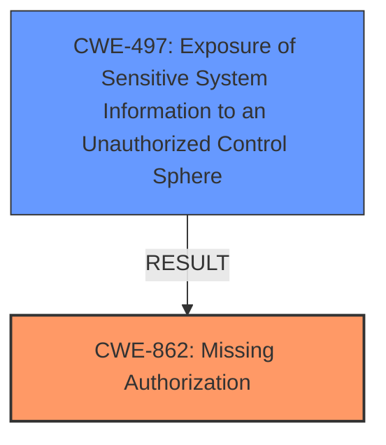

# Analysis for CVE-2024-6455

# Summary
| CWE ID | CWE Name | Confidence | CWE Abstraction Level | CWE Vulnerability Mapping Label | CWE-Vulnerability Mapping Notes |
|---|---|---|---|---|---|
| CWE-862 | Missing Authorization | 1.0 | Class | Primary | Allowed-with-Review |
| CWE-497 | Exposure of Sensitive System Information to an Unauthorized Control Sphere | 0.75 | Base | Secondary | Allowed |

## Evidence and Confidence

*   **Confidence Score:** 0.875
*   **Evidence Strength:** HIGH

## Relationship Analysis
The primary relationship impacting the decision is that CWE-862 [CWE-862: Missing Authorization] is a Class-level CWE, and therefore we should look for more specific Base-level children if the evidence supports it. However, in this case, the **missing capability checks** directly leads to a **missing authorization**, which is best captured by CWE-862 [CWE-862: Missing Authorization]. The secondary CWE, CWE-497 [CWE-497: Exposure of Sensitive System Information to an Unauthorized Control Sphere], highlights the impact of this **missing authorization**.

## Vulnerability Chain
The vulnerability chain starts with the **missing capability checks** (CWE-862 [CWE-862: Missing Authorization]), which allows unauthenticated attackers to access the `ekit_widgetarea_content` function. This leads to the exposure of sensitive information (CWE-497 [CWE-497: Exposure of Sensitive System Information to an Unauthorized Control Sphere]), such as posts, pages, and templates, including drafts, pending, and private items.

## Summary of Analysis
The initial analysis identified CWE-862 [CWE-862: Missing Authorization] as the primary weakness, stemming from the **missing capability checks** on the `ekit_widgetarea_content` function. This allows unauthenticated attackers to view sensitive information.

The evidence supporting this decision is:
- "The ElementsKit Elementor addons plugin for WordPress is vulnerable to Information Exposure in all versions up to, and including, 3.2.0 due to a **missing capability checks** on ekit_widgetarea_content function."
- "The vulnerability stems from a missing capability check in the `ekit_widgetarea_content` function within the ElementsKit Elementor addons plugin. This allows unauthenticated users to trigger the function and access content that should be restricted."

The secondary weakness, CWE-497 [CWE-497: Exposure of Sensitive System Information to an Unauthorized Control Sphere], is a direct result of the **missing authorization**, as it enables the exposure of sensitive data to unauthorized actors.

CWE-862 [CWE-862: Missing Authorization] is at the Class level, but no more specific Base-level CWEs were a better fit. Other CWEs considered, such as CWE-306 [CWE-306: Missing Authentication for Critical Function] and CWE-639 [CWE-639: Authorization Bypass Through User-Controlled Key], were not as accurate because the issue is specifically about authorization checks rather than a complete lack of authentication or a bypass through user-controlled keys.

The selected CWEs are at the optimal level of specificity because they accurately capture the root cause (**missing authorization**) and the resulting impact (exposure of sensitive information) of the vulnerability.

Relevant CWE Information:

# Enhanced Context (25 CWEs)
The following CWEs were identified as potentially relevant to this vulnerability:

## CWE-352: Cross-Site Request Forgery (CSRF)
**Abstraction Level**: Compound
**Similarity Score**: 0.72
**Source**: dense

**Description**:
The web application does not, or can not, sufficiently verify whether a well-formed, valid, consistent request was intentionally provided by the user who submitted the request.

**Mapping Guidance**:
- Usage: Allowed
- Rationale: This is a well-known Composite of multiple weaknesses that must all occur simultaneously, although it is attack-oriented in nature.

*Not Selected*: This CWE is not applicable as there is no evidence of CSRF in the vulnerability description. The vulnerability is due to **missing capability checks**, not a forged request.

## CWE-425: Direct Request ('Forced Browsing')
**Abstraction Level**: Base
**Similarity Score**: 0.71
**Source**: dense

**Description**:
The web application does not adequately enforce appropriate authorization on all restricted URLs, scripts, or files.

**Mapping Guidance**:
- Usage: Allowed
- Rationale: This CWE entry is at the Base level of abstraction, which is a preferred level of abstraction for mapping to the root causes of vulnerabilities.

*Not Selected*: This CWE is related, but not as specific as CWE-862 [CWE-862: Missing Authorization]. The vulnerability is not just about inadequate enforcement of authorization, but about the complete **missing capability checks**.

## CWE-639: Authorization Bypass Through User-Controlled Key
**Abstraction Level**: Base
**Similarity Score**: 0.70
**Source**: dense

**Description**:
The system's authorization functionality does not prevent one user from gaining access to another user's data or record by modifying the key value identifying the data.

**Mapping Guidance**:
- Usage: Allowed
- Rationale: This CWE entry is at the Base level of abstraction, which is a preferred level of abstraction for mapping to the root causes of vulnerabilities.

*Not Selected*: This CWE is not applicable because the vulnerability does not involve bypassing authorization through user-controlled keys. The issue is a **missing capability checks**.

## CWE-472: External Control of Assumed-Immutable Web Parameter
**Abstraction Level**: Base
**Similarity Score**: 0.70
**Source**: dense

**Description**:
The web application does not sufficiently verify inputs that are assumed to be immutable but are actually externally controllable, such as hidden form fields.

**Mapping Guidance**:
- Usage: Allowed
- Rationale: This CWE entry is at the Base level of abstraction, which is a preferred level of abstraction for mapping to the root causes of vulnerabilities.

*Not Selected*: This CWE is not applicable as there is no mention of externally controllable parameters that are assumed to be immutable. The vulnerability stems from **missing capability checks**.

## CWE-434: Unrestricted Upload of File with Dangerous Type
**Abstraction Level**: Base
**Similarity Score**: 0.69
**Source**: dense

**Description**:
The product allows the upload or transfer of dangerous file types that are automatically processed within its environment.

**Mapping Guidance**:
- Usage: Allowed
- Rationale: This CWE entry is at the Base level of abstraction, which is a preferred level of abstraction for mapping to the root causes of vulnerabilities.

*Not Selected*: This CWE is not relevant as the vulnerability is not related to unrestricted file uploads. The issue is a **missing capability checks**.

## CWE-116: Improper Encoding or Escaping of Output
**Abstraction Level**: Class
**Similarity Score**: 0.68
**Source**: dense

**Description**:
The product prepares a structured message for communication with another component, but encoding or escaping of the data is either missing or done incorrectly. As a result, the intended structure of the message is not preserved.

**Mapping Guidance**:
- Usage: Allowed-with-Review
- Rationale: This CWE entry is a Class and might have Base-level children that would be more appropriate

*Not Selected*: This CWE is not related to the vulnerability, as there is no mention of improper encoding or escaping of output. The vulnerability stems from **missing capability checks**.

## CWE-1336: Improper Neutralization of Special Elements Used in a Template Engine
**Abstraction Level**: Base
**Similarity Score**: 0.68
**Source**: dense

**Description**:
The product uses a template engine to insert or process externally-influenced input, but it does not neutralize or incorrectly neutralizes special elements or syntax that can be interpreted as template expressions or other code directives when processed by the engine.

**Mapping Guidance**:
- Usage: Allowed
- Rationale: This CWE entry is at the Base level of abstraction, which is a preferred level of abstraction for mapping to the root causes of vulnerabilities.

*Not Selected*: This CWE is not applicable as the vulnerability is not related to improper neutralization of special elements in a template engine. The issue is a **missing capability checks**.

## CWE-862: Missing Authorization
**Abstraction Level**: Class
**Similarity Score**: 0.67
**Source**: dense

**Description**:
The product does not perform an authorization check when an actor attempts to access a resource or perform an action.

**Mapping Guidance**:
- Usage: Allowed-with-Review
- Rationale: This CWE entry is a Class and might have Base-level children that would be more appropriate

*Selected*: As the Primary CWE.

## CWE