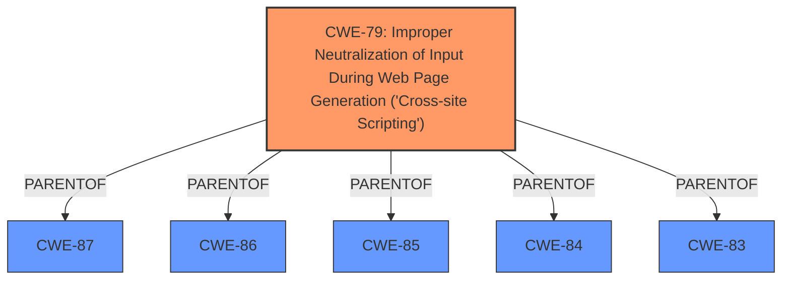

# Analysis Report for CVE-2024-6478

# Vulnerability Analysis Report: CVE-2024-6478

## Description

The CTT Expresso para WooCommerce WordPress plugin before 3.2.13 **does not sanitise and escape some of its settings**, which could allow high privilege users such as admin to perform **Stored Cross-Site Scripting attacks** even when the unfiltered_html capability is disallowed (for example in multisite setup)

## Vulnerability Description Key Phrases

- **Rootcause:** does not sanitise and escape some of its settings
- **Weakness:** Stored Cross-Site Scripting attacks
- **Attacker:** high privilege users such as admin
- **Product:** CTT Expresso para WooCommerce WordPress plugin
- **Version:** before 3.2.13

## Analysis (with Relationship Data)

# Summary
| CWE ID | CWE Name | Confidence | CWE Abstraction Level | CWE Vulnerability Mapping Label | CWE-Vulnerability Mapping Notes |
|---|---|---|---|---|---|
| CWE-79 | Improper Neutralization of Input During Web Page Generation ('Cross-site Scripting') | 1.0 | Base | Allowed | Primary CWE.  The **rootcause** is that the plugin **does not sanitize and escape some of its settings**. This leads directly to the **weakness**, which is Stored Cross-Site Scripting (XSS). |

## Evidence and Confidence

*   **Confidence Score:** 1.0
*   **Evidence Strength:** HIGH

## Relationship Analysis
The primary CWE is CWE-79, which is a Base level CWE. There are several parent CWEs and child CWEs for CWE-79, but none are more specific given the information provided.



## Vulnerability Chain
The vulnerability chain is as follows:

1.  **Root Cause:** **Insufficient sanitization and escaping** of settings in the plugin.
2.  **Weakness:** Stored Cross-Site Scripting (XSS).

## Summary of Analysis
The primary weakness is CWE-79. The description explicitly states the plugin **does not sanitize and escape some of its settings**, which is the **rootcause** for the XSS vulnerability. This aligns directly with the definition of CWE-79, which involves **improper neutralization of input during web page generation**. The provided evidence clearly supports this classification, and the CWE is at the appropriate level of specificity (Base).

Other CWEs were considered but not used:

*   CWE-352 (Cross-Site Request Forgery): While listed in the Retriever Results, CSRF is not indicated in the vulnerability description. The **rootcause** is not related to CSRF, therefore it's not a good fit.
*   CWE-863 (Incorrect Authorization): Incorrect authorization could be a factor, as the user needs admin privileges to exploit the vulnerability. However, the main issue is the **lack of sanitization**, which allows the XSS attack. Therefore, CWE-79 is a more appropriate choice.
*   CWE-96 (Improper Neutralization of Directives in Statically Saved Code ('Static Code Injection')): This is not related to code injection.


## CWE Relationship Analysis

Current CWEs represent these abstraction levels: .


### Vulnerability Chain Analysis

**Chain starting from CWE-87:**
- 87 (Improper Neutralization of Alternate XSS Syntax) - ROOT


**Chain starting from CWE-863:**
- 863 (Incorrect Authorization) - ROOT


### CWE Relationship Diagram

```mermaid
graph TD
    classDef primary fill:#f96,stroke:#333,stroke-width:2px
    classDef secondary fill:#69f,stroke:#333
    classDef tertiary fill:#9e9,stroke:#333
```


*Report generated on 2025-07-14 01:46:16*
