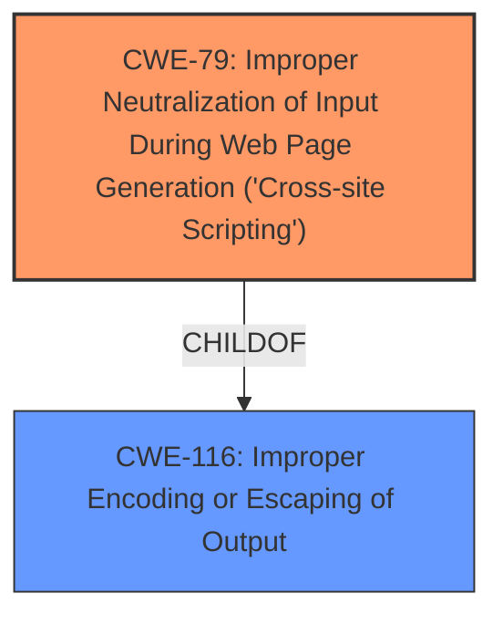

# Analysis Report for CVE-2024-6480

# Vulnerability Analysis Report: CVE-2024-6480

## Description

The SIP Reviews Shortcode for WooCommerce plugin for WordPress is vulnerable to Stored Cross-Site Scripting via the no_of_reviews attribute in the woocommerce_reviews shortcode in all versions up to, and including, 1.2.3 due to **insufficient input sanitization and output escaping on user supplied attributes**. This makes it possible for authenticated attackers, with contributor-level access and above, to inject arbitrary web scripts in pages that will execute whenever a user accesses an injected page.

## Vulnerability Description Key Phrases

- **Rootcause:** insufficient input sanitization and output escaping on user supplied attributes
- **Weakness:** cross-site scripting
- **Impact:** inject arbitrary web scripts
- **Attacker:** authenticated attackers
- **Product:** SIP Reviews Shortcode for WooCommerce plugin for WordPress
- **Version:** all versions up to and including 1.2.3
- **Component:** woocommerce_reviews shortcode

## Analysis (with Relationship Data)

# Summary
| CWE ID | CWE Name | Confidence | CWE Abstraction Level | CWE Vulnerability Mapping Label | CWE-Vulnerability Mapping Notes |
|---|---|---|---|---|---|
| CWE-79 | Improper Neutralization of Input During Web Page Generation ('Cross-site Scripting') | 1.0 | Base | Allowed | Primary CWE. The plugin does not neutralize or incorrectly neutralizes user-controllable input before it is placed in output that is used as a web page. |
| CWE-116 | Improper Encoding or Escaping of Output | 0.7 | Class | Allowed-with-Review | Secondary CWE. The product prepares a structured message for communication with another component, but encoding or escaping of the data is either missing or done incorrectly. |

## Evidence and Confidence

*   **Confidence Score:** 0.9
*   **Evidence Strength:** HIGH

## Relationship Analysis
The primary weakness is **CWE-79 - Improper Neutralization of Input During Web Page Generation ('Cross-site Scripting')**, which is a base-level CWE. **CWE-79**'s parent is **CWE-116 - Improper Encoding or Escaping of Output**, a class-level CWE, indicating a more general category of output issues. The vulnerability description clearly states **insufficient input sanitization and output escaping**, making **CWE-79** the most appropriate choice.



## Vulnerability Chain
The vulnerability chain starts with **insufficient input sanitization and output escaping** leading to **CWE-79 (Cross-Site Scripting)**. An attacker injects malicious JavaScript code via the `no_of_reviews` attribute. When a user visits the page, the script executes, potentially leading to privilege escalation.

## Summary of Analysis
The analysis indicates a Stored Cross-Site Scripting vulnerability due to **insufficient input sanitization and output escaping** in the SIP Reviews Shortcode for WooCommerce plugin. The primary CWE is **CWE-79**, as it directly addresses the improper neutralization of input during web page generation. The high retriever score for **CWE-79** and the explicit mention of **insufficient input sanitization and output escaping** support this choice. The code snippet confirms that the `no_of_reviews` attribute is used without proper sanitization, leading to the vulnerability.

I considered **CWE-116 (Improper Encoding or Escaping of Output)** as a secondary CWE as it represents a broader category of output-related vulnerabilities. **CWE-89 (Improper Neutralization of Special Elements used in an SQL Command ('SQL Injection'))** was not selected because there is no indication of SQL injection in the provided vulnerability description. Similarly, **CWE-352 (Cross-Site Request Forgery (CSRF))** is not relevant as there is no mention of CSRF in the description.

The selected CWEs are at the optimal level of specificity because **CWE-79** directly addresses the XSS vulnerability and **CWE-116** provides a broader context of output handling issues.
Relevant CWE Information:

# Enhanced Context (25 CWEs)
The following CWEs were identified as potentially relevant to this vulnerability:

## CWE-352: Cross-Site Request Forgery (CSRF)
**Abstraction Level**: Compound
**Similarity Score**: 0.74
**Source**: dense

**Description**:
The web application does not, or can not, sufficiently verify whether a well-formed, valid, consistent request was intentionally provided by the user who submitted the request.

**Mapping Guidance**:
- Usage: Allowed
- Rationale: This is a well-known Composite of multiple weaknesses that must all occur simultaneously, although it is attack-oriented in nature.


## CWE-472: External Control of Assumed-Immutable Web Parameter
**Abstraction Level**: Base
**Similarity Score**: 0.70
**Source**: dense

**Description**:
The web application does not sufficiently verify inputs that are assumed to be immutable but are actually externally controllable, such as hidden form fields.

**Mapping Guidance**:
- Usage: Allowed
- Rationale: This CWE entry is at the Base level of abstraction, which is a preferred level of abstraction for mapping to the root causes of vulnerabilities.


## CWE-425: Direct Request ('Forced Browsing')
**Abstraction Level**: Base
**Similarity Score**: 0.69
**Source**: dense

**Description**:
The web application does not adequately enforce appropriate authorization on all restricted URLs, scripts, or files.

**Mapping Guidance**:
- Usage: Allowed
- Rationale: This CWE entry is at the Base level of abstraction, which is a preferred level of abstraction for mapping to the root causes of vulnerabilities.


## CWE-116: Improper Encoding or Escaping of Output
**Abstraction Level**: Class
**Similarity Score**: 0.69
**Source**: dense

**Description**:
The product prepares a structured message for communication with another component, but encoding or escaping of the data is either missing or done incorrectly. As a result, the intended structure of the message is not preserved.

**Mapping Guidance**:
- Usage: Allowed-with-Review
- Rationale: This CWE entry is a Class and might have Base-level children that would be more appropriate


## CWE-96: Improper Neutralization of Directives in Statically Saved Code ('Static Code Injection')
**Abstraction Level**: Base
**Similarity Score**: 0.68
**Source**: dense

**Description**:
The product receives input from an upstream component, but it does not neutralize or incorrectly neutralizes code syntax before inserting the input into an executable resource, such as a library, configuration file, or template.

**Mapping Guidance**:
- Usage: Allowed
- Rationale: This CWE entry is at the Base level of abstraction, which is a preferred level of abstraction for mapping to the root causes of vulnerabilities.


## CWE-201: Insertion of Sensitive Information Into Sent Data
**Abstraction Level**: Base
**Similarity Score**: 0.67
**Source**: dense

**Description**:
The code transmits data to another actor, but a portion of the data includes sensitive information that should not be accessible to that actor.

**Mapping Guidance**:
- Usage: Allowed
- Rationale: This CWE entry is at the Base level of abstraction, which is a preferred level of abstraction for mapping to the root causes of vulnerabilities.


## CWE-138: Improper Neutralization of Special Elements
**Abstraction Level**: Class
**Similarity Score**: 0.67
**Source**: dense

**Description**:
The product receives input from an upstream component, but it does not neutralize or incorrectly neutralizes special elements that could be interpreted as control elements or syntactic markers when they are sent to a downstream component.

**Mapping Guidance**:
- Usage: Discouraged
- Rationale: This CWE entry is a level-1 Class (i.e., a child of a Pillar). It might have lower-level children that would be more appropriate


## CWE-184: Incomplete List of Disallowed Inputs
**Abstraction Level**: Base
**Similarity Score**: 0.67
**Source**: dense

**Description**:
The product implements a protection mechanism that relies on a list of inputs (or properties of inputs) that are not allowed by policy or otherwise require other action to neutralize before additional processing takes place, but the list is incomplete.

**Mapping Guidance**:
- Usage: Allowed
- Rationale: This CWE entry is at the Base level of abstraction, which is a preferred level of abstraction for mapping to the root causes of vulnerabilities.


## CWE-80: Improper Neutralization of Script-Related HTML Tags in a Web Page (Basic XSS)
**Abstraction Level**: Variant
**Similarity Score**: 0.67
**Source**: dense

**Description**:
The product receives input from an upstream component, but it does not neutralize or incorrectly neutralizes special characters such as "<", ">", and "&" that could be interpreted as web-scripting elements when they are sent to a downstream component that processes web pages.

**Mapping Guidance**:
- Usage: Allowed
- Rationale: This CWE entry is at the Variant level of abstraction, which is a preferred level of abstraction for mapping to the root causes of vulnerabilities.


## CWE-434: Unrestricted Upload of File with Dangerous Type
**Abstraction Level**: Base
**Similarity Score**: 0.67
**Source**: dense

**Description**:
The product allows the upload or transfer of dangerous file types that are automatically processed within its environment.

**Mapping Guidance**:
- Usage: Allowed
- Rationale: This CWE entry is at the Base level of abstraction, which is a preferred level of abstraction for mapping to the root causes of vulnerabilities.


## CWE-116: Improper Encoding or Escaping of Output
**Abstraction Level**: Class
**Similarity Score**: 1311.72
**Source**: sparse


## CWE Relationship Analysis

Current CWEs represent these abstraction levels: .


### Vulnerability Chain Analysis

**Chain starting from CWE-89:**
- 89 (Improper Neutralization of Special Elements used in an SQL Command ('SQL Injection')) - ROOT


**Chain starting from CWE-116:**
- 116 (Improper Encoding or Escaping of Output) - ROOT


### CWE Relationship Diagram

```mermaid
graph TD
    classDef primary fill:#f96,stroke:#333,stroke-width:2px
    classDef secondary fill:#69f,stroke:#333
    classDef tertiary fill:#9e9,stroke:#333
```


*Report generated on 2025-07-14 01:46:57*
