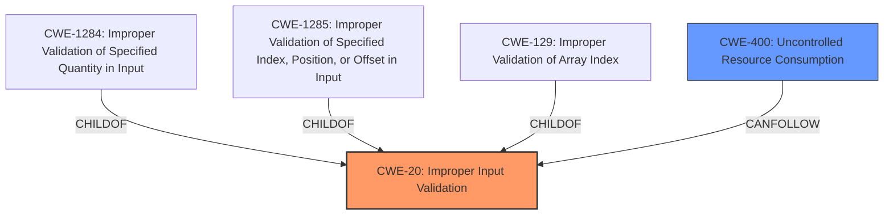

# Analysis for CVE-2024-6501

# Summary
| CWE ID | CWE Name | Confidence | CWE Abstraction Level | CWE Vulnerability Mapping Label | CWE-Vulnerability Mapping Notes |
|---|---|---|---|---|---|
| CWE-20 | Improper Input Validation | 0.8 | Class |  Primary | Discouraged |
| CWE-400 | Uncontrolled Resource Consumption | 0.7 | Class | Secondary | Discouraged |

## Evidence and Confidence

*   **Confidence Score:** 0.75
*   **Evidence Strength:** MEDIUM

## Relationship Analysis
The primary relationship considered was the parent-child relationship between CWE-20 (Improper Input Validation) and more specific CWEs like CWE-1284, CWE-1285, and CWE-129. While the vulnerability involves malformed LLDP packets, the description focuses on the lack of validation, making CWE-20 a reasonable initial choice. However, the impact of crashing the service suggests a potential link to resource consumption issues, leading to the consideration of CWE-400. The relatively high-level nature of these CWEs reflects the limited detail in the vulnerability description.

## Vulnerability Chain
The vulnerability chain starts with the **improper input validation** (CWE-20) of the malformed LLDP packet. This lack of validation leads to a crash, which can be interpreted as an **uncontrolled resource consumption** (CWE-400) issue, ultimately resulting in a denial of service.

## Summary of Analysis
The initial analysis focused on identifying the root cause of the vulnerability. The CVE description and reference links highlight that NetworkManager fails to properly validate malformed LLDP packets. This **improper input validation** is the primary weakness that allows a malicious user to trigger a denial-of-service condition.
"**Improper Input Handling:** NetworkManager fails to properly validate or sanitize incoming LLDP packets, particularly when debug logging is enabled. This allows for a crafted LLDP packet to trigger a crash."

While the retriever results suggested more specific CWEs like CWE-1284 (Improper Validation of Specified Quantity in Input) and CWE-1285 (Improper Validation of Specified Index, Position, or Offset in Input), the available information doesn't provide enough detail to definitively choose these over the more general CWE-20 (Improper Input Validation).
CWE-20 is selected as the primary weakness, despite the discouraged usage, because the description does not provide sufficient detail to select a more specific weakness. The vulnerability results from the **lack of validation** on the malformed LLDP packets.

The crash leading to a denial of service suggests a secondary weakness related to resource management. The system likely exhausts resources due to the malformed packet, leading to the crash. Therefore, CWE-400 (Uncontrolled Resource Consumption) is considered as a secondary weakness.

CWE-119 (Improper Restriction of Operations within the Bounds of a Memory Buffer) was considered but rejected. While a buffer overflow or similar memory corruption issue *could* be the underlying cause of the crash, there's no direct evidence of this in the provided descriptions. The focus is on the **lack of validation** rather than a specific memory safety issue.
Also, "CWE-119 is commonly misused in low-information vulnerability reports when lower-level CWEs could be used instead, or when more details about the vulnerability are available."

Ultimately, CWE-20 and CWE-400 are chosen as the most appropriate CWEs based on the available evidence, representing the initial **improper input validation** and the resulting **uncontrolled resource consumption** leading to a denial of service.