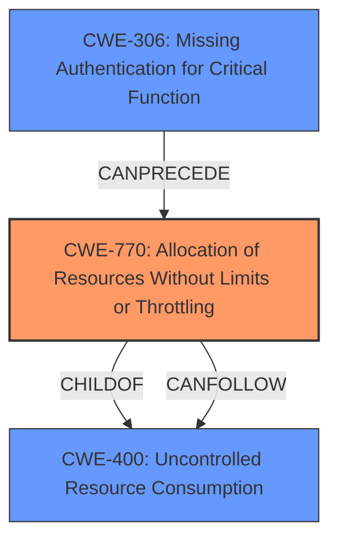

# Enhanced Analysis for CVE-2024-6504

# Summary
| CWE ID    | CWE Name                                                       | Confidence | CWE Abstraction Level | CWE Vulnerability Mapping Label | CWE-Vulnerability Mapping Notes |
| :-------- | :------------------------------------------------------------- | :--------- | :-------------------- | :------------------------------ | :------------------------------ |
| CWE-770   | Allocation of Resources Without Limits or Throttling           | 0.9        | Base                  | Primary                         | Allowed                         |
| CWE-400   | Uncontrolled Resource Consumption                              | 0.7        | Class                 | Secondary                       | Discouraged                    |
| CWE-306   | Missing Authentication for Critical Function                   | 0.3        | Base                  | Secondary                       | Allowed                         |

## Evidence and Confidence

*   **Confidence Score:** 0.9
*   **Evidence Strength:** HIGH

## Relationship Analysis
The primary CWE is CWE-770, which describes the **root cause** of allocating resources without limits or throttling. This can lead to CWE-400, Uncontrolled Resource Consumption, as the system exhausts its resources due to the **lack of limits**. There is also a weak relationship to CWE-306, as the repeated invalid REST requests might suggest a lack of authentication, although this is less direct.



## Vulnerability Chain
The vulnerability chain starts with **allocation of resources without limits or throttling (CWE-770)**. This leads to **uncontrolled resource consumption (CWE-400)**, eventually resulting in a denial-of-service condition due to CPU exhaustion. A potential, but less directly supported, prerequisite is a **missing authentication check (CWE-306)**, which allows unvalidated requests to reach the resource allocation stage.
  - **Root Cause:** CWE-770 Allocation of Resources Without Limits or Throttling
  - **Weakness:** CWE-400 Uncontrolled Resource Consumption
  - **Impact:** Denial of Service (CPU exhaustion, Console crash)

## Summary of Analysis
The primary classification is CWE-770, "Allocation of Resources Without Limits or Throttling," due to the vulnerability description indicating that the Rapid7 InsightVM Console does not properly limit or throttle the allocation of resources when processing invalid REST requests. This **lack of limits** leads to the console entering an exception handling logging loop and exhausting the CPU.

The evidence supporting this decision includes:
- **Vulnerability Description Key Phrases:** "**protection mechanism failure**", "**overload or crash**", "**repeated invalid REST requests**"
- **CVE Reference Links Content Summary:** "The Security Console could be overloaded by sending invalid requests at a high rate, causing it to enter an exception-handling logging loop that exhausts the CPU."

CWE-400, "Uncontrolled Resource Consumption," is considered a secondary CWE, as it describes the resulting state of the system after the resources are exhausted. While CWE-400 is a valid consequence, CWE-770 more accurately represents the **root cause**. The mapping guidance for CWE-400 discourages its use when it is conflated with the "technical impact" of vulnerabilities in which resource consumption occurs.

CWE-306, "Missing Authentication for Critical Function," was considered because the vulnerability involves repeated invalid REST requests, which could potentially bypass authentication checks. However, the description does not explicitly mention a **missing authentication mechanism**, making this mapping less certain.

The final selection is based on the provided evidence, focusing on the **root cause** of the vulnerability and selecting the most specific CWE that accurately represents the weakness.

Relevant CWE Information:

# Enhanced Context (25 CWEs)
The following CWEs were identified as potentially relevant to this vulnerability:

## CWE-770: Allocation of Resources Without Limits or Throttling
**Abstraction Level**: base
**Similarity Score**: 2.47
**Source**: graph

**Description**:
CWE-770: Allocation of Resources Without Limits or Throttling

**Mapping Guidance**:
- Usage: Allowed
- Rationale: This CWE entry is at the Base level of abstraction, which is a preferred level of abstraction for mapping to the root causes of vulnerabilities.

**Relationships**:
- PARENTOF -> CWE-789
- PARENTOF -> CWE-774
- CANFOLLOW -> CWE-20
- PARENTOF -> CWE-1325
- CHILDOF -> CWE-400

## CWE-400: Uncontrolled Resource Consumption
**Abstraction Level**: class
**Similarity Score**: 2.55
**Source**: graph

**Description**:
CWE-400: Uncontrolled Resource Consumption

**Mapping Guidance**:
- Usage: Discouraged
- Rationale: CWE-400 is intended for incorrect behaviors in which the product is expected to track and restrict how many resources it consumes, but CWE-400 is often misused because it is conflated with the "technical impact" of vulnerabilities in which resource consumption occurs. It is sometimes used for low-information vulnerability reports. It is a level-1 Class (i.e., a child of a Pillar).

**Relationships**:
- PARENTOF -> CWE-920
- PARENTOF -> CWE-779
- PARENTOF -> CWE-771
- PARENTOF -> CWE-770
- CANFOLLOW -> CWE-410

## CWE-306: Missing Authentication for Critical Function
**Abstraction Level**: base
**Similarity Score**: 2.47
**Source**: graph

**Description**:
CWE-306: Missing Authentication for Critical Function

**Mapping Guidance**:
- Usage: Allowed
- Rationale: This CWE entry is at the Base level of abstraction, which is a preferred level of abstraction for mapping to the root causes of vulnerabilities.

**Relationships**:
- PARENTOF -> CWE-322
- PARENTOF -> CWE-288
- CHILDOF -> CWE-287
- CHILDOF -> CWE-287
- CHILDOF -> CWE-306


## CWE Relationship Analysis

Current CWEs represent these abstraction levels: .


### Vulnerability Chain Analysis

**Chain starting from CWE-288:**
- 288 (Authentication Bypass Using an Alternate Path or Channel) - ROOT


**Chain starting from CWE-779:**
- 779 (Logging of Excessive Data) - ROOT


### CWE Relationship Diagram

```mermaid
graph TD
    classDef primary fill:#f96,stroke:#333,stroke-width:2px
    classDef secondary fill:#69f,stroke:#333
    classDef tertiary fill:#9e9,stroke:#333
```