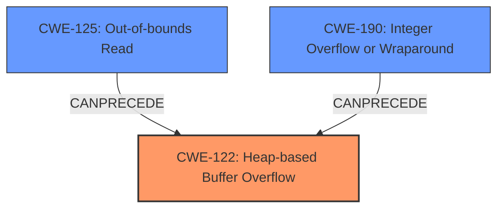

# Analysis for CVE-2024-6505

# Summary
| CWE ID  | CWE Name  | Confidence | CWE Abstraction Level | CWE Vulnerability Mapping Label | CWE-Vulnerability Mapping Notes |
|-----------------|-------------------------------------------------------------------------------------------------|----------------------|-------------------------------|------------------------------------|-------------------------------------------------------------------------------------------------|
| **CWE-122** | Heap-based Buffer Overflow | 0.9 | Base | Primary | Allowed |
| CWE-125 | Out-of-bounds Read | 0.7 | Base | Secondary | Allowed |
| CWE-190 | Integer Overflow or Wraparound | 0.6 | Base | Secondary | Allowed |

## Evidence and Confidence

*   **Confidence Score:** 0.8
*   **Evidence Strength:** MEDIUM

## Relationship Analysis
The primary weakness is CWE-122 Heap-based Buffer Overflow. This is due to an **index out-of-bounds** condition caused by excessively large values, which leads to a **heap overflow**. The **index out-of-bounds** condition can be represented by CWE-125 Out-of-bounds Read, which can precede CWE-122. CWE-190 Integer Overflow can also precede the overflow if the excessively large value is caused by an integer overflow.

## Vulnerability Chain
1.  The vulnerability starts with the RSS feature on the virtio-net network card, where the indirections\_table data becomes controllable.
2.  Setting excessively large values leads to an **index out-of-bounds** issue.
3.  This **index out-of-bounds** condition results in **heap overflow** access (CWE-122).
4.  A privileged user in the guest can then crash the QEMU process on the host.

The vulnerability chain is as follows:
Controllable indirections\_table data -> **Index out-of-bounds** (CWE-125) -> **Heap overflow** (CWE-122) -> QEMU process crash.
CWE-190 could be present if the "excessively large values" are the result of an integer overflow.

## Summary of Analysis
The analysis is based on the provided vulnerability description, which indicates an **index out-of-bounds** condition leading to a **heap overflow**. The primary CWE is CWE-122, which directly addresses the heap-based buffer overflow. Secondary CWEs such as CWE-125 and CWE-190 are included to account for the **index out-of-bounds** and the potential for integer overflow, respectively.

The relationships between the CWEs influenced the selection. CWE-125 and CWE-190 can both precede CWE-122 in a vulnerability chain. This indicates that the **index out-of-bounds** condition and potential integer overflow are contributing factors to the **heap overflow**.

The selected CWEs are at an optimal level of specificity. CWE-122 is a base-level CWE that accurately describes the **heap overflow**. CWE-125 and CWE-190 provide additional context regarding the root causes leading to the overflow.

Relevant CWE Information:
The vulnerability description clearly states that setting excessively large values causes an **index out-of-bounds** issue, potentially resulting in **heap overflow** access. This directly aligns with CWE-122, which describes a heap-based buffer overflow.
# Enhanced Context (25 CWEs)
The following CWEs were identified as potentially relevant to this vulnerability:

## CWE-824: Access of Uninitialized Pointer
**Abstraction Level**: Base
**Similarity Score**: 0.76
**Source**: dense

**Description**:
The product accesses or uses a pointer that has not been initialized.

**Mapping Guidance**:
- Usage: Allowed
- Rationale: This CWE entry is at the Base level of abstraction, which is a preferred level of abstraction for mapping to the root causes of vulnerabilities.

*This CWE was not selected because the vulnerability description does not indicate that an uninitialized pointer is accessed.*

## CWE-404: Improper Resource Shutdown or Release
**Abstraction Level**: Class
**Similarity Score**: 0.75
**Source**: dense

**Description**:
The product does not release or incorrectly releases a resource before it is made available for re-use.

**Mapping Guidance**:
- Usage: Allowed-with-Review
- Rationale: This CWE entry is a Class and might have Base-level children that would be more appropriate

*This CWE was not selected because the vulnerability description does not indicate a resource shutdown or release issue.*

## CWE-667: Improper Locking
**Abstraction Level**: Class
**Similarity Score**: 0.75
**Source**: dense

**Description**:
The product does not properly acquire or release a lock on a resource, leading to unexpected resource state changes and behaviors.

**Mapping Guidance**:
- Usage: Allowed-with-Review
- Rationale: This CWE entry is a Class and might have Base-level children that would be more appropriate

*This CWE was not selected because the vulnerability description does not indicate an improper locking issue.*

## CWE-909: Missing Initialization of Resource
**Abstraction Level**: Class
**Similarity Score**: 0.74
**Source**: dense

**Description**:
The product does not initialize a critical resource.

**Mapping Guidance**:
- Usage: Allowed-with-Review
- Rationale: This CWE entry is a Class and might have Base-level children that would be more appropriate

*This CWE was not selected because the vulnerability description does not indicate a missing resource initialization issue.*

## CWE-131: Incorrect Calculation of Buffer Size
**Abstraction Level**: Base
**Similarity Score**: 0.74
**Source**: dense

**Description**:
The product does not correctly calculate the size to be used when allocating a buffer, which could lead to a buffer overflow.

**Mapping Guidance**:
- Usage: Allowed
- Rationale: This CWE entry is at the Base level of abstraction, which is a preferred level of abstraction for mapping to the root causes of vulnerabilities.

*This CWE was not selected because the vulnerability description does not specifically mention an incorrect calculation of buffer size, but rather an **index out-of-bounds** due to excessively large values.*

## CWE-754: Improper Check for Unusual or Exceptional Conditions
**Abstraction Level**: Class
**Similarity Score**: 0.74
**Source**: dense

**Description**:
The product does not check or incorrectly checks for unusual or exceptional conditions that are not expected to occur frequently during day to day operation of the product.

**Mapping Guidance**:
- Usage: Allowed-with-Review
- Rationale: This CWE entry is a Class and might have Base-level children that would be more appropriate

*This CWE was not selected because the vulnerability description does not indicate an improper check for unusual conditions.*

## CWE-789: Memory Allocation with Excessive Size Value
**Abstraction Level**: Variant
**Similarity Score**: 0.74
**Source**: dense

**Description**:
The product allocates memory based on an untrusted, large size value, but it does not ensure that the size is within expected limits, allowing arbitrary amounts of memory to be allocated.

**Mapping Guidance**:
- Usage: Allowed
- Rationale: This CWE entry is at the Variant level of abstraction, which is a preferred level of abstraction for mapping to the root causes of vulnerabilities.

*This CWE was not selected because the vulnerability description does not specifically mention memory allocation with excessive size, but rather an **index out-of-bounds** leading to a **heap overflow**.*

## CWE-696: Incorrect Behavior Order
**Abstraction Level**: Class
**Similarity Score**: 0.74
**Source**: dense

**Description**:
The product performs multiple related behaviors, but the behaviors are performed in the wrong order in ways which may produce resultant weaknesses.

**Mapping Guidance**:
- Usage: Allowed-with-Review
- Rationale: This CWE entry is a Class and might have Base-level children that would be more appropriate

*This CWE was not selected because the vulnerability description does not indicate an incorrect behavior order.*

## CWE-755: Improper Handling of Exceptional Conditions
**Abstraction Level**: Class
**Similarity Score**: 0.74
**Source**: dense

**Description**:
The product does not handle or incorrectly handles an exceptional condition.

**Mapping Guidance**:
- Usage: Discouraged
- Rationale: This CWE entry is a level-1 Class (i.e., a child of a Pillar). It might have lower-level children that would be more appropriate

*This CWE was not selected because the vulnerability description does not indicate an