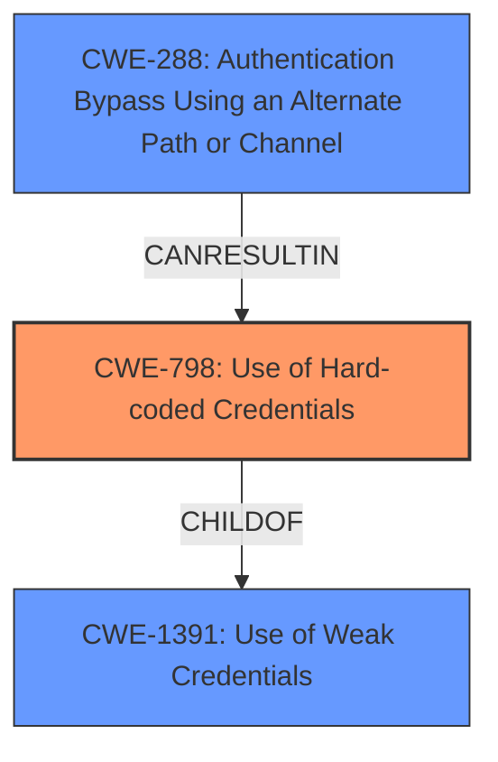

# Analysis Report for CVE-2024-6535

# Vulnerability Analysis Report: CVE-2024-6535

## Description

A flaw was found in Skupper. When Skupper is initialized with the console-enabled and with console-auth set to Openshift, it configures the openshift oauth-proxy with a **static cookie-secret**. In certain circumstances, this may allow an attacker to bypass authentication to the Skupper console via a specially-crafted cookie.

## Vulnerability Description Key Phrases

- **Rootcause:** static cookie-secret
- **Impact:** bypass authentication to Skupper console
- **Vector:** specially-crafted cookie
- **Attacker:** attacker
- **Product:** Skupper
- **Component:** console-auth set to Openshift

## Analysis (with Relationship Data)

# Summary
| CWE ID    | CWE Name                                                                        | Confidence | CWE Abstraction Level | CWE Vulnerability Mapping Label | CWE-Vulnerability Mapping Notes |
| :-------- | :------------------------------------------------------------------------------ | :--------- | :-------------------- | :------------------------------ | :------------------------------ |
| CWE-798   | Use of Hard-coded Credentials                                                   | 0.9        | Base                  | Primary                         | Allowed                       |
| CWE-288   | Authentication Bypass Using an Alternate Path or Channel                         | 0.7        | Base                  | Secondary                       | Allowed                       |
| CWE-1391  | Use of Weak Credentials                                                         | 0.6        | Class                 | Secondary                       | Allowed-with-Review           |

## Evidence and Confidence

*   **Confidence Score:** 0.8
*   **Evidence Strength:** HIGH

## Relationship Analysis
The primary weakness is the use of hard-coded credentials (CWE-798), which can directly lead to authentication bypass. CWE-288 is a related weakness as the hard-coded credentials provide an alternate, unintended path for authentication. CWE-1391 represents a broader class of weak credential usage. The chosen CWEs are at the Base level, providing a specific description of the vulnerability.



## Vulnerability Chain
The vulnerability chain starts with the **static cookie-secret** (CWE-798), which allows an attacker to create a **specially-crafted cookie**. This then leads to the **bypass authentication to the Skupper console**. The root cause is CWE-798, and the direct impact is authentication bypass (CWE-288).

## Summary of Analysis
The vulnerability stems from the use of a **static cookie-secret**, which is a clear instance of CWE-798 (Use of Hard-coded Credentials). This allows attackers to bypass authentication, leading to unauthorized access to the Skupper console. The analysis is primarily based on the provided CVE description and reference links. The reference links clearly state that the **root cause** is a **static cookie secret** of 'SECRET', which allows an attacker to forge cookies and bypass authentication. This aligns perfectly with CWE-798.

CWE-288 is included because the **static cookie-secret** provides an alternate, unintended path for authentication. While it's a consequence of CWE-798, it also directly describes the bypass.

CWE-1391 is also included as it is a more general class of weakness encompassing the use of any weak credential.

Other CWEs Considered:

*   CWE-287 (Improper Authentication): This is a higher-level class that is less specific than CWE-798.
*   CWE-306 (Missing Authentication for Critical Function): Authentication is not entirely missing but bypassed due to the hardcoded secret.
*   CWE-862 (Missing Authorization): The issue is with authentication, not authorization.
*   CWE-784 (Reliance on Cookies without Validation and Integrity Checking in a Security Decision): While cookies are involved, the root cause is the hardcoded secret used to forge them, not the lack of cookie validation.
*   CWE-639 (Authorization Bypass Through User-Controlled Key): Not applicable since the cookie secret is static and not user-controlled.

The selected CWEs are at the optimal level of specificity. CWE-798 directly addresses the root cause, while CWE-288 and CWE-1391 provide additional context and impact.


## CWE Relationship Analysis

Current CWEs represent these abstraction levels: .


### Vulnerability Chain Analysis

**Chain starting from CWE-288:**
- 288 (Authentication Bypass Using an Alternate Path or Channel) - ROOT


**Chain starting from CWE-862:**
- 862 (Missing Authorization) - ROOT


### CWE Relationship Diagram

```mermaid
graph TD
    classDef primary fill:#f96,stroke:#333,stroke-width:2px
    classDef secondary fill:#69f,stroke:#333
    classDef tertiary fill:#9e9,stroke:#333
```


*Report generated on 2025-07-14 01:50:18*
