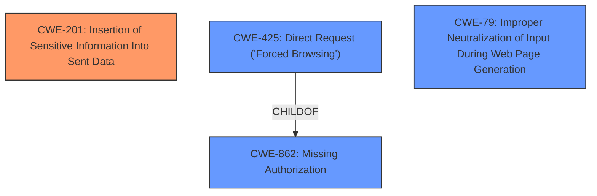

# Analysis Report for CVE-2024-6548

# Vulnerability Analysis Report: CVE-2024-6548

## Description

The Add Admin JavaScript plugin for WordPress is vulnerable to Full Path Disclosure in all versions up to, and including, 2.0. This is due to the plugin **utilizing bootstrap and leaving test files with display_errors on**. This makes it possible for unauthenticated attackers to retrieve the full path of the web application, which can be used to aid other attacks. The information displayed is not useful on its own, and requires another vulnerability to be present for damage to an affected website.

## Vulnerability Description Key Phrases

- **Rootcause:** utilizing bootstrap and leaving test files with display_errors on
- **Impact:** Full Path Disclosure
- **Attacker:** unauthenticated attackers
- **Product:** Add Admin WordPress plugin
- **Version:** up to and including 2.0

## Analysis (with Relationship Data)

# Summary
| CWE ID | CWE Name | Confidence | CWE Abstraction Level | CWE Vulnerability Mapping Label | CWE-Vulnerability Mapping Notes |
|---|---|---|---|---|---|
| CWE-201 | Insertion of Sensitive Information Into Sent Data | 0.9 | Base | Primary | Allowed |

## Evidence and Confidence

*   **Confidence Score:** 0.9
*   **Evidence Strength:** HIGH

## Relationship Analysis
The primary CWE is CWE-201, which is a base-level CWE. Several CWEs were considered, including CWE-425 (Direct Request), CWE-79 (Improper Neutralization of Input During Web Page Generation), and CWE-862 (Missing Authorization). These were rejected because they did not directly address the **root cause** of the vulnerability, which is the exposure of sensitive path information due to improper error handling (`display_errors` being on).



## Vulnerability Chain
The vulnerability chain starts with the **incorrect configuration** (`display_errors` on in a production environment), leading to the exposure of the full path, and ultimately results in information disclosure.

*   **Root Cause:** `display_errors` set to on in the `bootstrap.php` test file, leading to information leakage.
*   **Weakness:** Full Path Disclosure (CWE-201)
*   **Impact:** Information Disclosure, aiding further exploitation.

## Summary of Analysis
The analysis identified CWE-201 (Insertion of Sensitive Information Into Sent Data) as the most appropriate CWE for this vulnerability. This decision is primarily based on the CVE Reference Links Content Summary, which highlights the **root cause** as the `display_errors` setting in the `bootstrap.php` file leading to the exposure of the full server path.

The **rootcause** states: **utilizing bootstrap and leaving test files with display_errors on**. The "CVE Reference Links Content Summary" states: "The vulnerability stems from the "Add Admin JavaScript" plugin for WordPress utilizing a `bootstrap.php` test file which has `display_errors` set to 'on'. This setting causes PHP to output errors and warnings, including the full server path."

The high retriever scores of other CWEs like CWE-425, CWE-79, and CWE-862 were considered, but these do not accurately represent the specific **root cause**, which is the insertion of sensitive information (the full path) into the output due to the `display_errors` setting. Therefore, CWE-201 is the most accurate and specific representation of the vulnerability.


## CWE Relationship Analysis

Current CWEs represent these abstraction levels: .


### Vulnerability Chain Analysis

**Chain starting from CWE-79:**
- 79 (Improper Neutralization of Input During Web Page Generation ('Cross-site Scripting')) - ROOT


**Chain starting from CWE-201:**
- 201 (Insertion of Sensitive Information Into Sent Data) - ROOT


### CWE Relationship Diagram

```mermaid
graph TD
    classDef primary fill:#f96,stroke:#333,stroke-width:2px
    classDef secondary fill:#69f,stroke:#333
    classDef tertiary fill:#9e9,stroke:#333
```


*Report generated on 2025-07-14 01:52:07*
