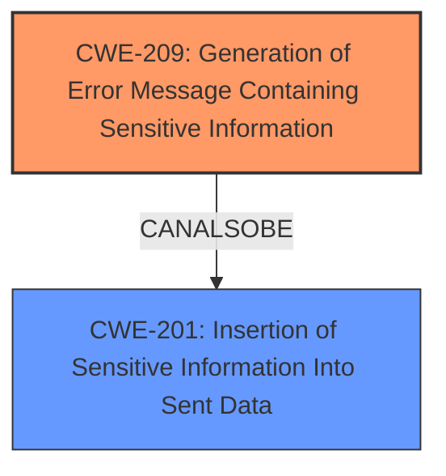

# Analysis for CVE-2024-6549

# Summary
| CWE ID | CWE Name | Confidence | CWE Abstraction Level | CWE Vulnerability Mapping Label | CWE-Vulnerability Mapping Notes |
|---|---|---|---|---|---|
| CWE-209 | Generation of Error Message Containing Sensitive Information | 1.0 | Base | Allowed | Primary CWE. The application is generating an error message that includes sensitive information (the full path of the web application). |

## Evidence and Confidence

*   **Confidence Score:** 1.0
*   **Evidence Strength:** HIGH

## Relationship Analysis
The primary identified CWE is CWE-209. Here's how the relationships influenced the decision:

*   **Hierarchical Relationships:** CWE-209 is a Base-level CWE, which is the preferred level of abstraction. There are child CWEs of CWE-209, but they are too specific and do not apply to this case.
*   **Chain Relationships:** There are no direct chain relationships (CanPrecede, CanFollow) that significantly influence the mapping.
*   **Peer Relationships:** CWE-209 has peer relationships (CanAlsoBe) with CWE-202 (Exposure of Sensitive Information Through Data Element) and CWE-201 (Insertion of Sensitive Information Into Sent Data). However, CWE-209 is more specific to the generation of error messages, which aligns better with the vulnerability description.
*   **Abstraction Levels:** Selecting the Base level CWE-209 provides the appropriate granularity for this vulnerability.

## Vulnerability Chain
The vulnerability chain starts with the plugin's configuration and proceeds to information disclosure:

1.  **Root Cause:** The Admin Post Navigation plugin for WordPress includes test files with `display_errors` enabled.
2.  **Weakness:** This leads to CWE-209 (Generation of Error Message Containing Sensitive Information) because the full path of the web application is exposed in error messages.
3.  **Impact:** An unauthenticated attacker can obtain the full path, which, while not immediately exploitable, can aid further attacks.

## Summary of Analysis
The initial analysis and the provided evidence strongly support the selection of CWE-209 as the primary CWE. The **weakness** is the **full path disclosure** due to the plugin leaving test files with `display_errors` on, causing sensitive information to be included in error messages.

The graph relationships further solidify the decision by highlighting the connection between generating error messages with sensitive information and the broader category of inserting sensitive information into sent data. However, the error message aspect makes CWE-209 more fitting.

The selection of CWE-209 is at the optimal level of specificity because it accurately represents the vulnerability's core issue: the generation of error messages containing sensitive information. The evidence from the "CVE Reference Links Content Summary" confirms that the root cause is the enabled `display_errors` setting in test files, leading to the exposure of the full path.

Relevant CWE Information:

# Enhanced Context (25 CWEs)
The following CWEs were identified as potentially relevant to this vulnerability:

## CWE-425: Direct Request ('Forced Browsing')
**Abstraction Level**: Base
**Similarity Score**: 0.76
**Source**: dense

**Description**:
The web application does not adequately enforce appropriate authorization on all restricted URLs, scripts, or files.

**Mapping Guidance**:
- Usage: Allowed
- Rationale: This CWE entry is at the Base level of abstraction, which is a preferred level of abstraction for mapping to the root causes of vulnerabilities.

*Not Used:* While direct request could be a component of accessing the file, it is not the root cause of the vulnerability. The primary issue is the exposure of sensitive information in the error message.

## CWE-472: External Control of Assumed-Immutable Web Parameter
**Abstraction Level**: Base
**Similarity Score**: 0.75
**Source**: dense

**Description**:
The web application does not sufficiently verify inputs that are assumed to be immutable but are actually externally controllable, such as hidden form fields.

**Mapping Guidance**:
- Usage: Allowed
- Rationale: This CWE entry is at the Base level of abstraction, which is a preferred level of abstraction for mapping to the root causes of vulnerabilities.

*Not Used:* This CWE is not relevant as it concerns the manipulation of assumed-immutable web parameters, which is not the case in this vulnerability.

## CWE-352: Cross-Site Request Forgery (CSRF)
**Abstraction Level**: Compound
**Similarity Score**: 0.74
**Source**: dense

**Description**:
The web application does not, or can not, sufficiently verify whether a well-formed, valid, consistent request was intentionally provided by the user who submitted the request.

**Mapping Guidance**:
- Usage: Allowed
- Rationale: This is a well-known Composite of multiple weaknesses that must all occur simultaneously, although it is attack-oriented in nature.

*Not Used:* This CWE is not applicable as CSRF is not involved in this vulnerability.

## CWE-639: Authorization Bypass Through User-Controlled Key
**Abstraction Level**: Base
**Similarity Score**: 0.73
**Source**: dense

**Description**:
The system's authorization functionality does not prevent one user from gaining access to another user's data or record by modifying the key value identifying the data.

**Mapping Guidance**:
- Usage: Allowed
- Rationale: This CWE entry is at the Base level of abstraction, which is a preferred level of abstraction for mapping to the root causes of vulnerabilities.

*Not Used:* This CWE is not applicable as authorization bypass through user-controlled keys is not part of this vulnerability.

## CWE-434: Unrestricted Upload of File with Dangerous Type
**Abstraction Level**: Base
**Similarity Score**: 0.73
**Source**: dense

**Description**:
The product allows the upload or transfer of dangerous file types that are automatically processed within its environment.

**Mapping Guidance**:
- Usage: Allowed
- Rationale: This CWE entry is at the Base level of abstraction, which is a preferred level of abstraction for mapping to the root causes of vulnerabilities.

*Not Used:* This CWE is not applicable as there is no unrestricted upload of file with dangerous type in this vulnerability.

## CWE-23: Relative Path Traversal
**Abstraction Level**: Base
**Similarity Score**: 0.72
**Source**: dense

**Description**:
The product uses external input to construct a pathname that should be within a restricted directory, but it does not properly neutralize sequences such as ".." that can resolve to a location that is outside of that directory.

**Mapping Guidance**:
- Usage: Allowed
- Rationale: This CWE entry is at the Base level of abstraction, which is a preferred level of abstraction for mapping to the root causes of vulnerabilities.

*Not Used:* This CWE is not relevant since the vulnerability does not involve relative path traversal.

## CWE-178: Improper Handling of Case Sensitivity
**Abstraction Level**: Base
**Similarity Score**: 0.72
**Source**: dense

**Description**:
The product does not properly account for differences in case sensitivity when accessing or determining the properties of a resource, leading to inconsistent results.

**Mapping Guidance**:
- Usage: Allowed
- Rationale: This CWE entry is at the Base level of abstraction, which is a preferred level of abstraction for mapping to the root causes of vulnerabilities.

*Not Used:* Case sensitivity is not a factor in this vulnerability.

## CWE-862: Missing Authorization
**Abstraction Level**: Class
**Similarity Score**: 0.72
**Source**: dense

**Description**:
The product does not perform an authorization check when an actor attempts to access a resource or perform an action.

**Mapping Guidance**:
- Usage: Allowed-with-Review
- Rationale: This CWE entry is a Class and might have Base-level children that would be more appropriate

*Not Used:* While authorization might be indirectly involved, the core issue is the disclosure of sensitive information in error messages.

## CWE-538: Insertion of Sensitive Information into Externally-Accessible File or Directory
**Abstraction Level**: Base
**Similarity Score**: 0.72
**Source**: dense

**Description**:
The product places sensitive information into files or directories that are accessible to actors who are allowed to have access to the files, but not to the sensitive information.

**Mapping Guidance**:
- Usage: Allowed
- Rationale: This CWE entry is at the Base level of abstraction, which is a preferred level of abstraction for mapping to the root causes of vulnerabilities.

*Not Used:* This CWE is not as fitting as CWE-209. The sensitive information is being exposed through an error message, not directly inserted into a file.

## CWE-201: Insertion of Sensitive Information Into Sent Data
**Abstraction Level**: Base
**Similarity Score**: 0.72
**Source**: dense

**Description**:
The code