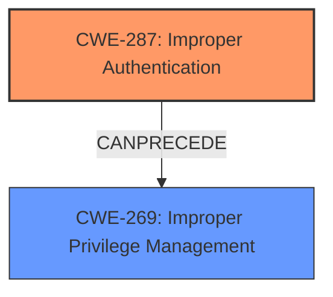

# Analysis Report for CVE-2024-6576

# Vulnerability Analysis Report: CVE-2024-6576

## Description

**Improper Authentication vulnerability** in Progress MOVEit Transfer (SFTP module) can lead to Privilege Escalation.This issue affects MOVEit Transfer from 2023.0.0 before 2023.0.12, from 2023.1.0 before 2023.1.7, from 2024.0.0 before 2024.0.3.

## Vulnerability Description Key Phrases

- **Rootcause:** Improper Authentication vulnerability
- **Impact:** Privilege Escalation
- **Product:** Progress MOVEit Transfer
- **Version:** ["['from 2023.0.0 before 2023.0.12'", "'from 2023.1.0 before 2023.1.7'", "'from 2024.0.0 before 2024.0.3']"]
- **Component:** SFTP module

## Analysis (with Relationship Data)

# Summary
| CWE ID | CWE Name | Confidence | CWE Abstraction Level | CWE Vulnerability Mapping Label | CWE-Vulnerability Mapping Notes |
|---|---|---|---|---|---|
| CWE-287 | Improper Authentication | 0.8 | Class | Primary | Discouraged |
| CWE-269 | Improper Privilege Management | 0.5 | Class | Secondary | Discouraged |

## Evidence and Confidence

*   **Confidence Score:** 0.7
*   **Evidence Strength:** LOW

## Relationship Analysis
The primary relationship influencing the decision is that CWE-287 (Improper Authentication) can lead to CWE-269 (Improper Privilege Management). Authentication comes before Privilege Management. Also, CWE-287 is a class-level CWE, which means it's a higher-level abstraction and might have more specific children that could be applicable. Since evidence is low, it is difficult to determine the best approach.



## Vulnerability Chain
The vulnerability chain starts with **Improper Authentication** (CWE-287), which leads to **Privilege Escalation**. Privilege escalation is associated with **Improper Privilege Management** (CWE-269).

## Summary of Analysis
The initial analysis identified **Improper Authentication** as the root cause due to the vulnerability description explicitly stating "**Improper Authentication vulnerability**." The technical impact is Privilege Escalation. The provided guidance on "Authentication vs Authorization vs Access Control" was used to confirm that authentication issues are related to CWE-306 (Missing Authentication for Critical Function) or its children. However, CWE-306 is for *missing* authentication, whereas this is *improper* authentication, so CWE-287 is more appropriate.

CWE-287 is a class-level CWE. While the ideal mapping would be to a Base or Variant level CWE, the lack of information makes it difficult to select a more specific CWE. It's possible that more specific authentication flaws (e.g., use of weak passwords, bypass of multi-factor authentication) are present, but they are not indicated.

CWE-269 (Improper Privilege Management) is considered a secondary candidate because the vulnerability leads to privilege escalation, but it is a technical impact rather than a root cause. It is also a Class-level CWE, and the mapping guidance discourages its use because it is often misused and not useful for trend analysis.

The retriever results also listed other candidates, such as CWE-863 (Incorrect Authorization), CWE-285 (Improper Authorization), and CWE-306 (Missing Authentication for Critical Function). However, the description focuses on the authentication aspect, making these authorization-related CWEs less relevant.

The confidence in the overall assessment is moderate due to the limited information available in the vulnerability description. The decision to select CWE-287 and CWE-269 is primarily based on the explicit mention of "Improper Authentication" and the resulting "Privilege Escalation". More information would be needed to refine the CWE mapping and identify the specific authentication flaw.

Relevant CWE Information:

# Enhanced Context (25 CWEs)
The following CWEs were identified as potentially relevant to this vulnerability:

## CWE-267: Privilege Defined With Unsafe Actions
**Abstraction Level**: Base
**Similarity Score**: 0.75
**Source**: dense

**Description**:
A particular privilege, role, capability, or right can be used to perform unsafe actions that were not intended, even when it is assigned to the correct entity.

**Mapping Guidance**:
- Usage: Allowed
- Rationale: This CWE entry is at the Base level of abstraction, which is a preferred level of abstraction for mapping to the root causes of vulnerabilities.


## CWE-266: Incorrect Privilege Assignment
**Abstraction Level**: Base
**Similarity Score**: 0.75
**Source**: dense

**Description**:
A product incorrectly assigns a privilege to a particular actor, creating an unintended sphere of control for that actor.

**Mapping Guidance**:
- Usage: Allowed
- Rationale: This CWE entry is at the Base level of abstraction, which is a preferred level of abstraction for mapping to the root causes of vulnerabilities.


## CWE-280: Improper Handling of Insufficient Permissions or Privileges 
**Abstraction Level**: Base
**Similarity Score**: 0.74
**Source**: dense

**Description**:
The product does not handle or incorrectly handles when it has insufficient privileges to access resources or functionality as specified by their permissions. This may cause it to follow unexpected code paths that may leave the product in an invalid state.

**Mapping Guidance**:
- Usage: Allowed
- Rationale: This CWE entry is at the Base level of abstraction, which is a preferred level of abstraction for mapping to the root causes of vulnerabilities.


## CWE-274: Improper Handling of Insufficient Privileges
**Abstraction Level**: Base
**Similarity Score**: 0.74
**Source**: dense

**Description**:
The product does not handle or incorrectly handles when it has insufficient privileges to perform an operation, leading to resultant weaknesses.

**Mapping Guidance**:
- Usage: Discouraged
- Rationale: This CWE entry could be deprecated in a future version of CWE.


## CWE-668: Exposure of Resource to Wrong Sphere
**Abstraction Level**: Class
**Similarity Score**: 0.73
**Source**: dense

**Description**:
The product exposes a resource to the wrong control sphere, providing unintended actors with inappropriate access to the resource.

**Mapping Guidance**:
- Usage: Discouraged
- Rationale: CWE-668 is high-level and is often misused as a catch-all when lower-level CWE IDs might be applicable. It is sometimes used for low-information vulnerability reports [REF-1287]. It is a level-1 Class (i.e., a child of a Pillar). It is not useful for trend analysis.


## CWE-41: Improper Resolution of Path Equivalence
**Abstraction Level**: Base
**Similarity Score**: 0.73
**Source**: dense

**Description**:
The product is vulnerable to file system contents disclosure through path equivalence. Path equivalence involves the use of special characters in file and directory names. The associated manipulations are intended to generate multiple names for the same object.

**Mapping Guidance**:
- Usage: Allowed
- Rationale: This CWE entry is at the Base level of abstraction, which is a preferred level of abstraction for mapping to the root causes of vulnerabilities.


## CWE-754: Improper Check for Unusual or Exceptional Conditions
**Abstraction Level**: Class
**Similarity Score**: 0.72
**Source**: dense

**Description**:
The product does not check or incorrectly checks for unusual or exceptional conditions that are not expected to occur frequently during day to day operation of the product.

**Mapping Guidance**:
- Usage: Allowed-with-Review
- Rationale: This CWE entry is a Class and might have Base-level children that would be more appropriate


## CWE-703: Improper Check or Handling of Exceptional Conditions
**Abstraction Level**: Pillar
**Similarity Score**: 0.72
**Source**: dense

**Description**:
The product does not properly anticipate or handle exceptional conditions that rarely occur during normal operation of the product.

**Mapping Guidance**:
- Usage: Discouraged
- Rationale: This CWE entry is extremely high-level, a Pillar.


## CWE-472: External Control of Assumed-Immutable Web Parameter
**Abstraction Level**: Base
**Similarity Score**: 0.72
**Source**: dense

**Description**:
The web application does not sufficiently verify inputs that are assumed to be immutable but are actually externally controllable, such as hidden form fields.

**Mapping Guidance**:
- Usage: Allowed
- Rationale: This CWE entry is at the Base level of abstraction, which is a preferred level of abstraction for mapping to the root causes of vulnerabilities.


## CWE-345: Insufficient Verification of Data Authenticity
**Abstraction Level**: Class
**Similarity Score**: 0.72
**Source**: dense

**Description**:
The product does not sufficiently verify the origin or authenticity of data, in a way that causes it to accept invalid data.

**Mapping Guidance**:
- Usage: Discouraged
- Rationale: This CWE entry is a level-1 Class (i.e., a child of a Pillar). It might have lower-level children that would be more appropriate


## CWE-863: Incorrect Authorization
**Abstraction Level**: Class
**Similarity Score**: 2144.72
**Source**: sparse

**Description**:
The product performs an authorization check when an actor attempts to access a resource or perform an action, but it does not correctly perform the check.

**Mapping Guidance**:
- Usage: Allowed-with-Review
- Rationale: This CWE entry is a Class and might have Base-level children that would be more appropriate


## CWE-285: Improper Authorization
**Abstraction Level**: Class


## CWE Relationship Analysis

Current CWEs represent these abstraction levels: .


### Vulnerability Chain Analysis

**Chain starting from CWE-274:**
- 274 (Improper Handling of Insufficient Privileges) - ROOT


**Chain starting from CWE-863:**
- 863 (Incorrect Authorization) - ROOT


### CWE Relationship Diagram

```mermaid
graph TD
    classDef primary fill:#f96,stroke:#333,stroke-width:2px
    classDef secondary fill:#69f,stroke:#333
    classDef tertiary fill:#9e9,stroke:#333
```


*Report generated on 2025-07-14 01:56:37*
