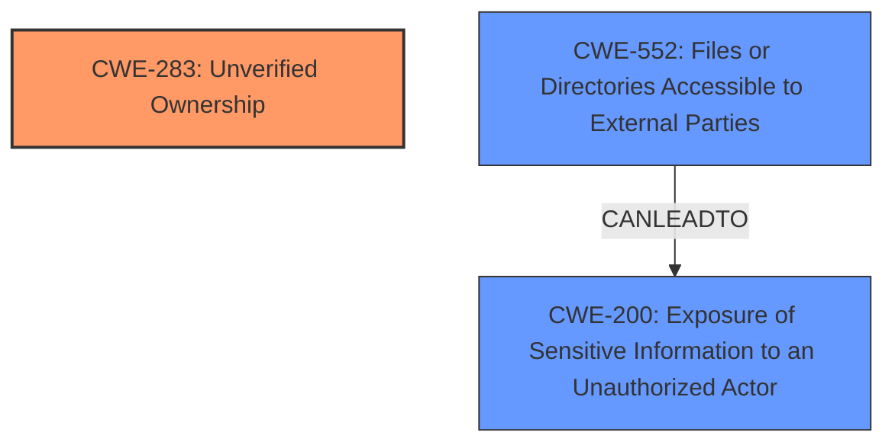

# Enhanced Analysis for CVE-2024-6577

# Summary
| CWE ID | CWE Name | Confidence | CWE Abstraction Level | CWE Vulnerability Mapping Label | CWE-Vulnerability Mapping Notes |
|---|---|---|---|---|---|
| CWE-283 | Unverified Ownership | 0.9 | Base | Primary | Allowed |
| CWE-552 | Files or Directories Accessible to External Parties | 0.7 | Base | Secondary | Allowed |
| CWE-200 | Exposure of Sensitive Information to an Unauthorized Actor | 0.5 | Class | Secondary | Discouraged |

## Evidence and Confidence

*   **Confidence Score:** 0.8
*   **Evidence Strength:** HIGH

## Relationship Analysis
The primary CWE is CWE-283, which directly addresses the **lack of ownership verification** of the S3 bucket. CWE-552 and CWE-200 are potential consequences if the bucket is then accessed by unauthorized parties. CWE-283 is a child of CWE-282 (Improper Ownership Management), but CWE-283 is more specific, as it directly identifies the lack of verification. CWE-552 and CWE-200 are related, as making files/directories accessible (CWE-552) leads to exposure of sensitive information (CWE-200).



## Vulnerability Chain
The vulnerability chain starts with the **lack of verification of ownership** (CWE-283) of the S3 bucket. This can lead to the bucket being accessible to external parties (CWE-552), which in turn results in the exposure of sensitive information (CWE-200).

CWE-283 (Root Cause) -> CWE-552 -> CWE-200 (Impact)

## Summary of Analysis
The analysis is heavily based on the provided vulnerability description, particularly the key phrase: "upload_results_to_s3.sh references the S3 bucket benchmarkai-metrics-prod **without ensuring its ownership or confirming its accessibility**". This directly points to CWE-283 (**Unverified Ownership**). The potential consequences, such as data breaches and exposure of information, are impacts resulting from the initial **lack of ownership verification**, and thus are represented by CWE-552 and CWE-200.

CWE-283 is the optimal choice because it accurately describes the **root cause** of the vulnerability. The other CWEs considered either represent the consequences of the weakness or are too general.

Relevant CWE Information:

*   **CWE-283: Unverified Ownership**: The product uses a resource without verifying that the actor is actually the owner of the resource, or has privileges to use the resource in the intended manner. This aligns perfectly with the description, where the script references the S3 bucket without verifying ownership.
*   **CWE-552: Files or Directories Accessible to External Parties**: The product makes files or directories accessible to unauthorized actors, even though they should not be. This is a likely consequence if the ownership is not verified.
*   **CWE-200: Exposure of Sensitive Information to an Unauthorized Actor**: The product exposes sensitive information to an actor that is not explicitly authorized to have access to that information. This is a potential impact if the bucket is accessible to unauthorized parties due to the **lack of ownership verification**. While it matches the potential impact, CWE-200 is discouraged as a root cause.

I considered other CWEs from the Retriever Results, such as CWE-639 (**Authorization Bypass Through User-Controlled Key**), but it doesn't fit as well because the primary issue isn't about bypassing authorization with a key, but rather the **lack of verification of ownership** of the S3 bucket in the first place. Similarly, CWE-497 (**Exposure of Sensitive System Information to an Unauthorized Control Sphere**) is too broad, and CWE-283 more directly addresses the **root cause**.


## CWE Relationship Analysis

Current CWEs represent these abstraction levels: .


### Vulnerability Chain Analysis

**Chain starting from CWE-283:**
- 283 (Unverified Ownership) - ROOT


**Chain starting from CWE-639:**
- 639 (Authorization Bypass Through User-Controlled Key) - ROOT


### CWE Relationship Diagram

```mermaid
graph TD
    classDef primary fill:#f96,stroke:#333,stroke-width:2px
    classDef secondary fill:#69f,stroke:#333
    classDef tertiary fill:#9e9,stroke:#333
```