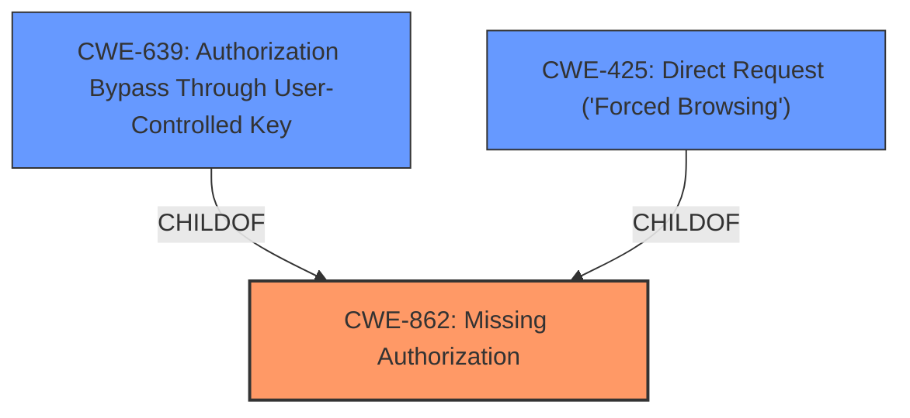

# Enhanced Analysis for CVE-2024-6579

# Summary
| CWE ID | CWE Name | Confidence | CWE Abstraction Level | CWE Vulnerability Mapping Label | CWE-Vulnerability Mapping Notes |
|---|---|---|---|---|---|
| CWE-862 | Missing Authorization | 1.0 | Class | Primary | Allowed-with-Review |
| CWE-639 | Authorization Bypass Through User-Controlled Key | 0.7 | Base | Secondary Candidate | Allowed |
| CWE-425 | Direct Request ('Forced Browsing') | 0.6 | Base | Secondary Candidate | Allowed |

## Evidence and Confidence

*   **Confidence Score:** 0.9
*   **Evidence Strength:** HIGH

## Relationship Analysis
The primary relationship influencing the decision is that CWE-862 [Missing Authorization] is a class-level CWE, and both CWE-639 [Authorization Bypass Through User-Controlled Key] and CWE-425 [Direct Request ('Forced Browsing')] are child CWEs of CWE-862. Although the vulnerability description specifies a **missing capability check**, which could suggest a more specific variant, the available information doesn't provide sufficient detail to confidently select a base or variant CWE. Therefore, I opted for the class-level CWE-862 as the primary mapping, but also included CWE-639 and CWE-425 as secondary candidates.



## Vulnerability Chain
The vulnerability chain begins with a **missing capability check** (CWE-862), leading to unauthorized modification of plugin settings. This can be seen as a direct consequence of the missing authorization, allowing attackers with Subscriber-level access to perform actions they should not be able to.

## Summary of Analysis
The analysis is primarily based on the explicit statement of a **missing capability check** in the vulnerability description: "The Web and WooCommerce Addons for WPBakery Builder plugin for WordPress is vulnerable to unauthorized plugin settings modification due to a **missing capability check** on several plugin functions". The CVE Reference Links Content Summary reinforces this by stating: "The vulnerability stems from a missing authorization check on several plugin functions... Specifically, there's a lack of capability checks within the plugin's code which allows unauthorized access."

CWE-862 [Missing Authorization] is the most appropriate primary CWE because it directly reflects the root cause of the vulnerability: the absence of authorization checks. The relationships show that more specific CWEs like CWE-639 [Authorization Bypass Through User-Controlled Key] and CWE-425 [Direct Request ('Forced Browsing')] could potentially apply, but the provided information doesn't offer enough granularity to confidently select them as the primary CWE. Therefore, CWE-862, as a class-level CWE, provides a suitable balance between specificity and accuracy based on the available evidence.

Other CWEs were considered but deemed less appropriate:

*   CWE-352 [Cross-Site Request Forgery (CSRF)]: While CSRF could be a potential attack vector, the primary weakness is the missing authorization check, not the lack of CSRF protection.
*   CWE-863 [Incorrect Authorization]: The vulnerability description explicitly states that authorization is *missing*, not incorrectly implemented.
*   CWE-285 [Improper Authorization]: Similar to CWE-863, this suggests that authorization exists but is flawed, which doesn't align with the described scenario of missing authorization.
*   CWE-306 [Missing Authentication for Critical Function]: Authentication is not the primary issue; the problem is that even authenticated users with low privileges can bypass authorization checks.
*   CWE-472 [External Control of Assumed-Immutable Web Parameter]: This CWE focuses on the modification of assumed-immutable data, which is not the core issue in this vulnerability.
*   CWE-471 [Modification of Assumed-Immutable Data (MAID)]: Similar to CWE-472, this CWE is less relevant because the primary issue is the absence of authorization checks, rather than the modification of data.


## CWE Relationship Analysis

Current CWEs represent these abstraction levels: .


### Vulnerability Chain Analysis

**Chain starting from CWE-863:**
- 863 (Incorrect Authorization) - ROOT


**Chain starting from CWE-471:**
- 471 (Modification of Assumed-Immutable Data (MAID)) - ROOT


### CWE Relationship Diagram

```mermaid
graph TD
    classDef primary fill:#f96,stroke:#333,stroke-width:2px
    classDef secondary fill:#69f,stroke:#333
    classDef tertiary fill:#9e9,stroke:#333
```