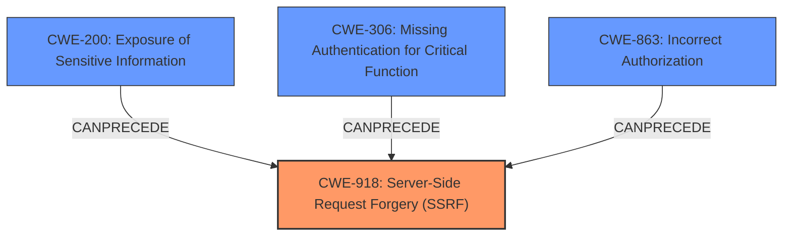

# Raw Analyzer Response for CVE-2024-6586

# Summary
| CWE ID    | CWE Name                                                                 | Confidence | CWE Abstraction Level | CWE Vulnerability Mapping Label | CWE-Vulnerability Mapping Notes |
| :-------- | :----------------------------------------------------------------------- | :--------- | :-------------------- | :------------------------------ | :------------------------------ |
| CWE-918   | Server-Side Request Forgery (SSRF)                                       | 0.9        | Base                  | Primary CWE                     | Allowed                       |
| CWE-200   | Exposure of Sensitive Information to an Unauthorized Actor               | 0.8        | Class                 | Secondary Candidate             | Discouraged                    |
| CWE-306   | Missing Authentication for Critical Function                             | 0.7        | Base                  | Secondary Candidate             | Allowed                       |
| CWE-863   | Incorrect Authorization                                                  | 0.6        | Class                 | Secondary Candidate             | Allowed-with-Review           |

## Evidence and Confidence

*   **Confidence Score:** 0.8
*   **Evidence Strength:** HIGH

## Relationship Analysis
The primary CWE is CWE-918, representing the **Server-Side Request Forgery (SSRF)**. The secondary CWEs, such as CWE-200, CWE-306, and CWE-863, capture aspects of the impact and contributing factors. CWE-918 is a Base level CWE, which is preferred. The class level CWE-200, CWE-306 and CWE-863 are less specific but capture the high level vulnerabilities.

## Vulnerability Chain
The vulnerability chain starts with the injection of HTML elements into a dashboard, leading to **Server-Side Request Forgery (SSRF)** when the dashboard is exported. This SSRF allows the exposure of the user's session cookie to an attacker-controlled domain, potentially due to **Missing Authentication for Critical Function** in the export process or **Incorrect Authorization** allowing external requests with sensitive data. The ultimate impact is the **Exposure of Sensitive Information**, specifically the session token, enabling session takeover.

Vulnerability Chain:
1.  HTML Injection (Implicit)
2.  CWE-918: Server-Side Request Forgery (SSRF)
3.  CWE-200: Exposure of Sensitive Information
4.  Session Takeover (Impact)

## Summary of Analysis
The analysis is based on the vulnerability description and CVE reference links. The primary weakness is clearly identified as **Server-Side Request Forgery (SSRF)**, where the application constructs a request to an external server based on user-controlled input without proper validation. The session token exposure and potential authorization bypass are secondary consequences.

The selection of CWE-918 as the primary CWE is strongly supported by the evidence from the CVE Reference Links Content Summary, which states: "The vulnerability stems from how Lightdash's dashboard export functionality uses Puppeteer... This resulted in the exporting user's session cookie being included in requests to external domains embedded within the dashboard."

The other suggested CWEs are considered as contributing factors or impacts.

*   CWE-200 is a class level weakness and the reference article points to specific sensitive data exposure i.e. session token which is more clearly defined by the SSRF. 
*   CWE-306 and CWE-863 could be contributing factors, but the primary issue is the SSRF itself.

CWE-918 is at the optimal level of specificity, directly addressing the root cause of the vulnerability.

Relevant CWE Information:

# Enhanced Context (25 CWEs)
The following CWEs were identified as potentially relevant to this vulnerability:

## CWE-267: Privilege Defined With Unsafe Actions
**Abstraction Level**: Base
**Similarity Score**: 0.78
**Source**: dense
**Description**: A particular privilege, role, capability, or right can be used to perform unsafe actions that were not intended, even when it is assigned to the correct entity.
**Mapping Guidance**:
- Usage: Allowed
- Rationale: This CWE entry is at the Base level of abstraction, which is a preferred level of abstraction for mapping to the root causes of vulnerabilities.

## CWE-668: Exposure of Resource to Wrong Sphere
**Abstraction Level**: Class
**Similarity Score**: 0.77
**Source**: dense
**Description**: The product exposes a resource to the wrong control sphere, providing unintended actors with inappropriate access to the resource.
**Mapping Guidance**:
- Usage: Discouraged
- Rationale: CWE-668 is high-level and is often misused as a catch-all when lower-level CWE IDs might be applicable. It is sometimes used for low-information vulnerability reports [REF-1287]. It is a level-1 Class (i.e., a child of a Pillar). It is not useful for trend analysis.

## CWE-74: Improper Neutralization of Special Elements in Output Used by a Downstream Component ('Injection')
**Abstraction Level**: Class
**Similarity Score**: 0.77
**Source**: dense
**Description**: The product constructs all or part of a command, data structure, or record using externally-influenced input from an upstream component, but it does not neutralize or incorrectly neutralizes special elements that could modify how it is parsed or interpreted when it is sent to a downstream component.
**Mapping Guidance**:
- Usage: Discouraged
- Rationale: CWE-74 is high-level and often misused when lower-level weaknesses are more appropriate.

## CWE-472: External Control of Assumed-Immutable Web Parameter
**Abstraction Level**: Base
**Similarity Score**: 0.77
**Source**: dense
**Description**: The web application does not sufficiently verify inputs that are assumed to be immutable but are actually externally controllable, such as hidden form fields.
**Mapping Guidance**:
- Usage: Allowed
- Rationale: This CWE entry is at the Base level of abstraction, which is a preferred level of abstraction for mapping to the root causes of vulnerabilities.

## CWE-425: Direct Request ('Forced Browsing')
**Abstraction Level**: Base
**Similarity Score**: 0.77
**Source**: dense
**Description**: The web application does not adequately enforce appropriate authorization on all restricted URLs, scripts, or files.
**Mapping Guidance**:
- Usage: Allowed
- Rationale: This CWE entry is at the Base level of abstraction, which is a preferred level of abstraction for mapping to the root causes of vulnerabilities.

## CWE-639: Authorization Bypass Through User-Controlled Key
**Abstraction Level**: Base
**Similarity Score**: 0.76
**Source**: dense
**Description**: The system's authorization functionality does not prevent one user from gaining access to another user's data or record by modifying the key value identifying the data.
**Mapping Guidance**:
- Usage: Allowed
- Rationale: This CWE entry is at the Base level of abstraction, which is a preferred level of abstraction for mapping to the root causes of vulnerabilities.

## CWE-212: Improper Removal of Sensitive Information Before Storage or Transfer
**Abstraction Level**: Base
**Similarity Score**: 0.76
**Source**: dense
**Description**: The product stores, transfers, or shares a resource that contains sensitive information, but it does not properly remove that information before the product makes the resource available to unauthorized actors.
**Mapping Guidance**:
- Usage: Allowed
- Rationale: This CWE entry is at the Base level of abstraction, which is a preferred level of abstraction for mapping to the root causes of vulnerabilities.

## CWE-497: Exposure of Sensitive System Information to an Unauthorized Control Sphere
**Abstraction Level**: Base
**Similarity Score**: 0.76
**Source**: dense
**Description**: The product does not properly prevent sensitive system-level information from being accessed by unauthorized actors who do not have the same level of access to the underlying system as the product does.
**Mapping Guidance**:
- Usage: Allowed
- Rationale: This CWE entry is at the Base level of abstraction, which is a preferred level of abstraction for mapping to the root causes of vulnerabilities.

## CWE-918: Server-Side Request Forgery (SSRF)
**Abstraction Level**: Base
**Similarity Score**: 0.76
**Source**: dense
**Description**: The web server receives a URL or similar request from an upstream component and retrieves the contents of this URL, but it does not sufficiently ensure that the request is being sent to the expected destination.
**Mapping Guidance**:
-