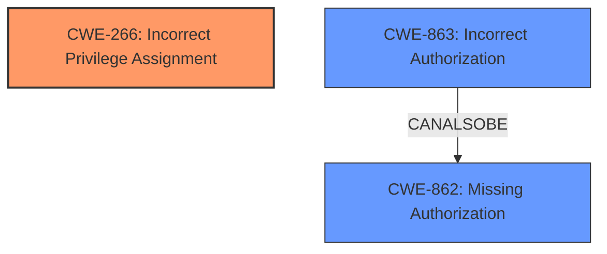

# Raw Analyzer Response for CVE-2024-6624

# Summary
| CWE ID | CWE Name | Confidence | CWE Abstraction Level | CWE Vulnerability Mapping Label | CWE-Vulnerability Mapping Notes |
|---|---|---|---|---|---|
| CWE-266 | Incorrect Privilege Assignment | 0.9 | Base | Primary CWE | Allowed |
| CWE-862 | Missing Authorization | 0.7 | Class | Secondary Candidate | Allowed-with-Review |
| CWE-863 | Incorrect Authorization | 0.7 | Class | Secondary Candidate | Allowed-with-Review |

## Evidence and Confidence

*   **Confidence Score:** 0.8
*   **Evidence Strength:** HIGH

## Relationship Analysis
The primary CWE is CWE-266, as the root cause is the **incorrect assignment of privileges** during user registration. CWE-862 and CWE-863 are related authorization issues. CWE-862 indicates a complete lack of authorization, while CWE-863 implies flawed authorization logic. Although authorization is present, the **incorrect assignment of privileges** is the more fundamental flaw, making CWE-266 the better choice. The relationship between privileges and permissions as detailed in the Privilege vs Permissions Guidance influenced this selection. The base level of abstraction for CWE-266 is also preferred.

## Vulnerability Chain
The vulnerability chain starts with the **improper controls on custom user meta fields** (CWE-266), leading to unauthenticated attackers registering as administrators, resulting in privilege escalation.
  - Root Cause: **Incorrect Privilege Assignment** (CWE-266)
  - Weakness: **Improper controls on custom user meta fields** allows modification of `wp_capabilities` and `wp_user_level`
  - Impact: Unauthenticated Privilege Escalation

## Summary of Analysis
The analysis is based on the provided evidence, which indicates the root cause is an **incorrect privilege assignment** due to **improper controls on custom user meta fields**. This allows unauthenticated users to register as administrators. The Privilege vs Permissions Guidance helped to clarify that the core issue is related to privileges rather than general access control. The provided graph relationships and retriever results also suggested considering CWE-862 and CWE-863, but CWE-266 is the most accurate because it directly addresses the **incorrect assignment of privileges** during registration. My decision is based on the **rootcause** which is the **incorrect assignment of privileges**, and the guidance clearly states that when a user gets a higher privilege role by mistake, the best CWE is CWE-266.

Relevant CWE Information:

# Enhanced Context (25 CWEs)
The following CWEs were identified as potentially relevant to this vulnerability:

## CWE-266: Incorrect Privilege Assignment
**Abstraction Level**: Base
**Similarity Score**: 0.79
**Source**: dense

**Description**:
A product incorrectly assigns a privilege to a particular actor, creating an unintended sphere of control for that actor.

**Mapping Guidance**:
- Usage: Allowed
- Rationale: This CWE entry is at the Base level of abstraction, which is a preferred level of abstraction for mapping to the root causes of vulnerabilities.

## CWE-862: Missing Authorization
**Abstraction Level**: Class
**Similarity Score**: 1836.31
**Source**: sparse

**Description**:
The product does not perform an authorization check when an actor attempts to access a resource or perform an action.

**Mapping Guidance**:
- Usage: Allowed-with-Review
- Rationale: This CWE entry is a Class and might have Base-level children that would be more appropriate

## CWE-863: Incorrect Authorization
**Abstraction Level**: Class
**Similarity Score**: 1996.70
**Source**: sparse

**Description**:
The product performs an authorization check when an actor attempts to access a resource or perform an action, but it does not correctly perform the check.

**Mapping Guidance**:
- Usage: Allowed-with-Review
- Rationale: This CWE entry is a Class and might have Base-level children that would be more appropriate

CWE-266: Incorrect Privilege Assignment

*   Technical Explanation: The JSON API User plugin incorrectly assigns administrative privileges to newly registered users by allowing manipulation of `wp_capabilities` and `wp_user_level` meta fields. This matches the CWE's description of a product incorrectly assigning privileges.
*   Security Implications: Unauthenticated attackers can gain full control of the WordPress site by registering as administrators.
*   Parent-Child Relationships: N/A
*   Primary/Secondary: Primary
*   Mapping Guidance Influence: The "Privileges vs Permissions Guidance" specifically guided the selection of CWE-266 as the most appropriate CWE when a user is assigned the wrong role (in this case, admin).

CWE-862: Missing Authorization & CWE-863: Incorrect Authorization

*   Technical Explanation: While authorization mechanisms might be present in the plugin, they are insufficient to prevent the **incorrect assignment of privileges**.
*   Security Implications: Could lead to unauthorized access and privilege escalation.
*   Parent-Child Relationships: These are Class-level CWEs and could have more specific children.
*   Primary/Secondary: Secondary. They are related, but CWE-266 is more specific to the root cause.
*   Mapping Guidance Influence: The guidance suggests that while these CWEs could apply, a more specific CWE related to privilege management may be more accurate.