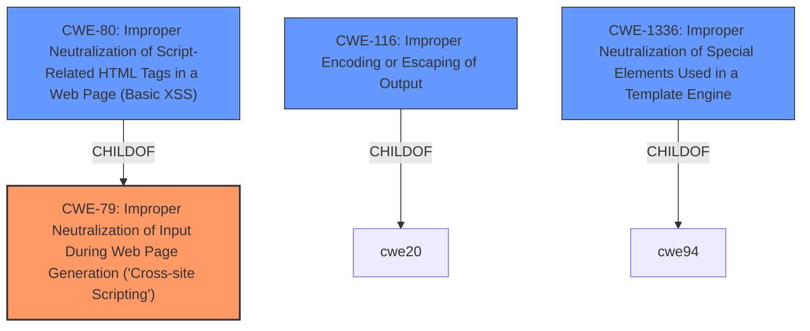

# Raw Analyzer Response for CVE-2024-6702

# Summary
| CWE ID | CWE Name | Confidence | CWE Abstraction Level | CWE Vulnerability Mapping Label | CWE-Vulnerability Mapping Notes |
|---|---|---|---|---|---|
| CWE-79 | Improper Neutralization of Input During Web Page Generation ('Cross-site Scripting') | 1.0 | Base | Primary CWE | Allowed |

## Evidence and Confidence

*   **Confidence Score:** 1.0
*   **Evidence Strength:** HIGH

## Relationship Analysis
The primary CWE is CWE-79 which is a Base level CWE. Other related CWEs such as CWE-80, CWE-116, and CWE-1336 were also considered, but CWE-79 was the most appropriate base level CWE.

## Vulnerability Chain
The vulnerability chain starts with the **HTML Injection** **weakness**, leading to the potential for phishing attacks and defacement.

## Summary of Analysis
The primary **weakness** is **HTML Injection**. The **root cause** is the improper handling of HTML input within the Stage functionality of the Pega Platform. The most relevant CWE is CWE-79, Improper Neutralization of Input During Web Page Generation ('Cross-site Scripting'). This is because the vulnerability allows an attacker to inject arbitrary HTML tags into the application, which aligns directly with the description of CWE-79.

Relevant CWE Information:

# Enhanced Context (25 CWEs)
The following CWEs were identified as potentially relevant to this vulnerability:

## CWE-80: Improper Neutralization of Script-Related HTML Tags in a Web Page (Basic XSS)
**Abstraction Level**: Variant
**Similarity Score**: 0.74
**Source**: dense

**Description**:
The product receives input from an upstream component, but it does not neutralize or incorrectly neutralizes special characters such as "<", ">", and "&" that could be interpreted as web-scripting elements when they are sent to a downstream component that processes web pages.

**Mapping Guidance**:
- Usage: Allowed
- Rationale: This CWE entry is at the Variant level of abstraction, which is a preferred level of abstraction for mapping to the root causes of vulnerabilities.

## CWE-79: Improper Neutralization of Input During Web Page Generation ('Cross-site Scripting')
**Abstraction Level**: Base
**Similarity Score**: 0.71
**Source**: dense

**Description**:
The product does not neutralize or incorrectly neutralizes user-controllable input before it is placed in output that is used as a web page that is served to other users.

**Mapping Guidance**:
- Usage: Allowed
- Rationale: This CWE entry is at the Base level of abstraction, which is a preferred level of abstraction for mapping to the root causes of vulnerabilities.

### CWE Selection:

*   **CWE-79: Improper Neutralization of Input During Web Page Generation ('Cross-site Scripting')**

    *   **Explanation:** This CWE accurately describes the vulnerability. The application does not properly neutralize user-supplied input, allowing for the injection of arbitrary HTML. This directly leads to the potential for cross-site scripting attacks. The "CVE Reference Links Content Summary" states that the **root cause** of the vulnerability is an **HTML Injection** issue.
    *   **Evidence:** The "Vulnerability Description" clearly states that the vulnerability is an **HTML Injection** issue. The "CVE Reference Links Content Summary" also highlights the **HTML Injection** vulnerability and its potential impact, such as phishing attacks and defacement.
    *   **Relationships:** CWE-79 is a base-level CWE with several child CWEs, including CWE-80. While CWE-80 (Improper Neutralization of Script-Related HTML Tags in a Web Page (Basic XSS)) is more specific, the description mentions arbitrary HTML injection, suggesting CWE-79 is the more appropriate choice.
    *   **Mapping Guidance:** The mapping guidance for CWE-79 states that it is allowed and is at the Base level of abstraction, which is a preferred level.
    *   **Confidence:** 1.0

### Other CWEs Considered:

*   **CWE-80: Improper Neutralization of Script-Related HTML Tags in a Web Page (Basic XSS)** - While related, the vulnerability description specifies **HTML Injection**, not specifically script-related tags. Therefore, CWE-79 is more appropriate.
*   **CWE-116: Improper Encoding or Escaping of Output** - This is a more general class of **weakness**. While encoding/escaping might be a mitigation, the core issue is the lack of neutralization, making CWE-79 more directly relevant.
*   **CWE-1336: Improper Neutralization of Special Elements Used in a Template Engine** - This CWE is specific to template engines, and there is no indication that a template engine is involved in this vulnerability.
*   **CWE-94: Improper Control of Generation of Code ('Code Injection')** - The vulnerability description mentions HTML injection, which is different from code injection.
*   **CWE-494: Download of Code Without Integrity Check** - This CWE is not related to the described vulnerability.