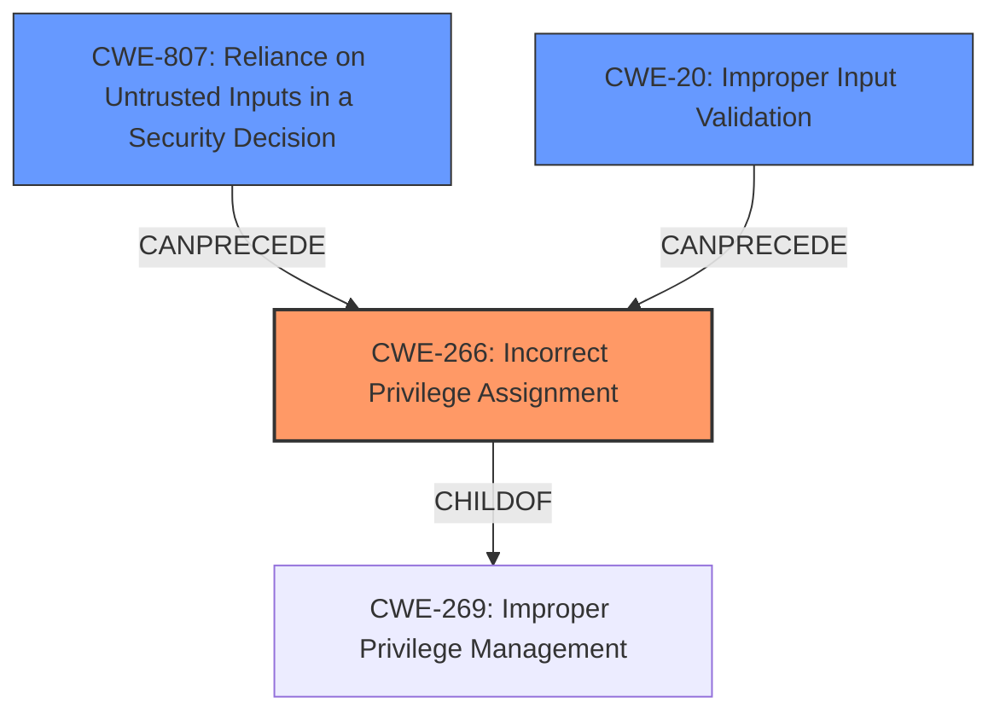

# Analysis Report for CVE-2024-6758

# Vulnerability Analysis Report: CVE-2024-6758

## Description

**Improper Privilege Management** in Sprecher Automation SPRECON-E below version 8.71j allows a remote attacker with low privileges to save unauthorized protection assignments.

## Vulnerability Description Key Phrases

- **Rootcause:** Improper Privilege Management
- **Impact:** save unauthorized protection assignments
- **Attacker:** remote attacker with low privileges
- **Product:** Sprecher Automation SPRECON-E
- **Version:** below version 8.71j

## Analysis (with Relationship Data)

# Summary
| CWE ID | CWE Name | Confidence | CWE Abstraction Level | CWE Vulnerability Mapping Label | CWE-Vulnerability Mapping Notes |
|---|---|---|---|---|---|
| **CWE-266** | **Incorrect Privilege Assignment** | 0.9 | Base | Primary | Allowed |
| CWE-807 | Reliance on Untrusted Inputs in a Security Decision | 0.6 | Base | Secondary | Allowed |

## Evidence and Confidence

*   **Confidence Score:** 0.8
*   **Evidence Strength:** HIGH

## Relationship Analysis
The primary relationship influencing the CWE selection is the parent-child relationship. CWE-266 (Incorrect Privilege Assignment) is a base-level CWE which is more specific than its parent class CWE-269 (Improper Privilege Management). The vulnerability also hints at a chain relationship where missing input validation (potentially CWE-20) leads to the incorrect privilege assignment. This suggests a potential CANPRECEDE relationship between input validation and privilege management CWEs. However, given the strong emphasis on privilege assignment in the description, CWE-266 is chosen as the primary.



## Vulnerability Chain
The vulnerability chain starts with the **incorrect privilege management** (**CWE-266**) which allows an attacker to save unauthorized protection assignments. This is facilitated by a remote attacker with low privileges exploiting the vulnerability in Sprecher Automation SPRECON-E. A potential weakness is a **Reliance on Untrusted Inputs in a Security Decision** (**CWE-807**). This allows an attacker to bypass privilege checks, or perhaps a more fundamental **Improper Input Validation** (**CWE-20**).

## Summary of Analysis
The analysis is based on the provided evidence, particularly the vulnerability description key phrases and CVE reference links content summary. The key phrase "**Improper Privilege Management**" directly points towards a privilege-related CWE. The CVE reference summary elaborates on the root cause, stating that the vulnerability stems from "the ability to save protection assignments with reduced privileges, regardless of the assigned roles" using "specially crafted HTTP(S) requests." This confirms that the system is incorrectly assigning privileges, leading to unauthorized actions.

The retriever results also suggest CWE-266 (Incorrect Privilege Assignment), CWE-269 (Improper Privilege Management), and CWE-285 (Improper Authorization) as potential candidates. However, CWE-266 is selected as the primary CWE because it is a more specific, base-level CWE that directly addresses the root cause of the vulnerability: the incorrect assignment of privileges. The guidance on privileges vs. permissions also supports this decision, as the issue involves assigning the wrong privileges to a user role.

CWE-807, Reliance on Untrusted Inputs in a Security Decision, is considered as a secondary CWE because the vulnerability relies on specially crafted HTTP(S) requests. This suggests that the system may be making security decisions based on untrusted input, which could allow an attacker to bypass privilege checks.

Other CWEs, such as CWE-285 (Improper Authorization), CWE-284 (Improper Access Control), CWE-287 (Improper Authentication), and CWE-732 (Incorrect Permission Assignment for Critical Resource), were considered but deemed less relevant because they do not directly address the root cause of the vulnerability, which is the incorrect assignment of privileges.

The chosen CWEs are at the optimal level of specificity because they accurately represent the weakness and provide sufficient information for understanding and mitigating the vulnerability.

Relevant CWE Information:

# Enhanced Context (25 CWEs)
The following CWEs were identified as potentially relevant to this vulnerability:

## CWE-266: Incorrect Privilege Assignment
**Abstraction Level**: Base
**Similarity Score**: 1762.04
**Source**: sparse

**Description**:
A product incorrectly assigns a privilege to a particular actor, creating an unintended sphere of control for that actor.

**Mapping Guidance**:
- Usage: Allowed
- Rationale: This CWE entry is at the Base level of abstraction, which is a preferred level of abstraction for mapping to the root causes of vulnerabilities.

## CWE-807: Reliance on Untrusted Inputs in a Security Decision
**Abstraction Level**: Base
**Similarity Score**: 0.75
**Source**: dense

**Description**:
The product uses a protection mechanism that relies on the existence or values of an input, but the input can be modified by an untrusted actor in a way that bypasses the protection mechanism.

**Mapping Guidance**:
- Usage: Allowed
- Rationale: This CWE entry is at the Base level of abstraction, which is a preferred level of abstraction for mapping to the root causes of vulnerabilities.

## Complete CWE Specifications

CWE-266: Incorrect Privilege Assignment
A product incorrectly assigns a privilege to a particular actor, creating an unintended sphere of control for that actor.

CWE-807: Reliance on Untrusted Inputs in a Security Decision
The product uses a protection mechanism that relies on the existence or values of an input, but the input can be modified by an untrusted actor in a way that bypasses the protection mechanism.


## CWE Relationship Analysis

Current CWEs represent these abstraction levels: .


### Vulnerability Chain Analysis

**Chain starting from CWE-807:**
- 807 (Reliance on Untrusted Inputs in a Security Decision) - ROOT


**Chain starting from CWE-732:**
- 732 (Incorrect Permission Assignment for Critical Resource) - ROOT


### CWE Relationship Diagram

```mermaid
graph TD
    classDef primary fill:#f96,stroke:#333,stroke-width:2px
    classDef secondary fill:#69f,stroke:#333
    classDef tertiary fill:#9e9,stroke:#333
```


*Report generated on 2025-07-14 02:07:59*
