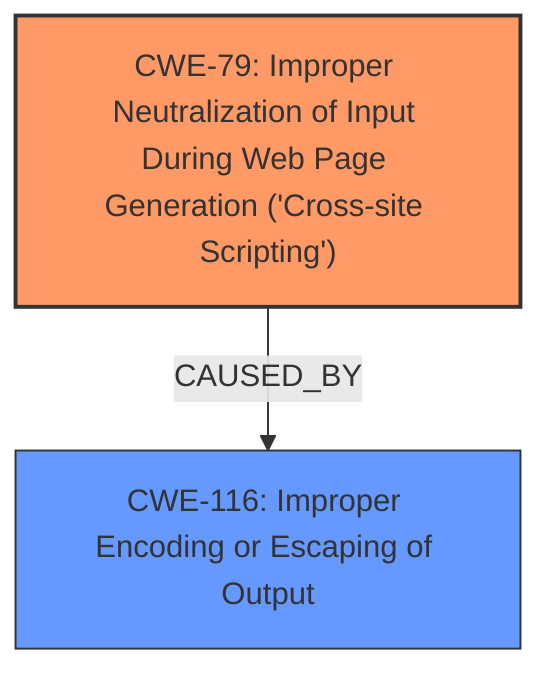

# Enhanced Analysis for CVE-2024-6766

# Summary

| CWE ID | CWE Name | Confidence | CWE Abstraction Level | CWE Vulnerability Mapping Label | CWE-Vulnerability Mapping Notes |
|---|---|---|---|---|---|
| CWE-79 | Improper Neutralization of Input During Web Page Generation ('Cross-site Scripting') | 1.0 | Base | Primary | Allowed |
| CWE-116 | Improper Encoding or Escaping of Output | 0.8 | Class | Secondary | Allowed-with-Review |

## Evidence and Confidence

*   **Confidence Score:** 0.9
*   **Evidence Strength:** HIGH

## Relationship Analysis
The primary weakness is **CWE-79** Improper Neutralization of Input During Web Page Generation ('Cross-site Scripting'). The root cause is the **failure to validate and escape** shortcode attributes. **CWE-116** Improper Encoding or Escaping of Output is a related weakness, as escaping is a form of encoding. **CWE-79** is a base CWE, which is preferred. **CWE-116** is a class CWE, indicating a broader category of encoding/escaping issues, but relevant because the vulnerability description explicitly mentions a failure to escape output. The relationship is that **CWE-116** can lead to **CWE-79**, as improper escaping is a common cause of XSS.



## Vulnerability Chain
The vulnerability chain starts with the **failure to validate and escape** shortcode attributes which directly leads to Stored **Cross-Site Scripting** attacks.

**Root Cause:** **Improper Neutralization** (due to lack of validation and escaping)
**Weakness:** **CWE-79** Improper Neutralization of Input During Web Page Generation ('Cross-site Scripting')
**Impact:** Stored Cross-Site Scripting

## Summary of Analysis
The analysis indicates that the primary vulnerability is **CWE-79** Improper Neutralization of Input During Web Page Generation ('Cross-site Scripting'). This is based on the key phrase 'does not validate and escape some of its shortcode attributes' which directly leads to the ability to perform stored cross-site scripting attacks. **CWE-116** Improper Encoding or Escaping of Output is considered a secondary weakness because the **lack of escaping** is a specific instance of improper encoding/escaping.

The vulnerability description explicitly states that the plugin "does not validate and escape some of its shortcode attributes before outputting them back in a page/post where the shortcode is embed, which could allow users with the contributor role and above to perform Stored Cross-Site Scripting attacks". This directly supports the selection of **CWE-79** as the primary vulnerability, and **CWE-116** as a contributor.

The graph relationships influenced the selection by highlighting the connection between encoding/escaping issues and XSS vulnerabilities.

The selected CWEs are at the optimal level of specificity because **CWE-79** directly describes the XSS vulnerability, and **CWE-116** pinpoints the underlying encoding/escaping issue that leads to it.

# Enhanced Context (25 CWEs)
The following CWEs were identified as potentially relevant to this vulnerability:

## CWE-352: Cross-Site Request Forgery (CSRF)
**Abstraction Level**: Compound
**Similarity Score**: 0.75
**Source**: dense

**Description**:
The web application does not, or can not, sufficiently verify whether a well-formed, valid, consistent request was intentionally provided by the user who submitted the request.

**Mapping Guidance**:
- Usage: Allowed
- Rationale: This is a well-known Composite of multiple weaknesses that must all occur simultaneously, although it is attack-oriented in nature.

**NOT USED:** This CWE is related to request forgery, but the vulnerability is about XSS.

## CWE-80: Improper Neutralization of Script-Related HTML Tags in a Web Page (Basic XSS)
**Abstraction Level**: Variant
**Similarity Score**: 0.74
**Source**: dense

**Description**:
The product receives input from an upstream component, but it does not neutralize or incorrectly neutralizes special characters such as "<", ">", and "&" that could be interpreted as web-scripting elements when they are sent to a downstream component that processes web pages.

**Mapping Guidance**:
- Usage: Allowed
- Rationale: This CWE entry is at the Variant level of abstraction, which is a preferred level of abstraction for mapping to the root causes of vulnerabilities.

**NOT USED:** This is a more specific variant of **CWE-79** that focuses on HTML tags. While relevant, the provided description doesn't limit the scope to only HTML tags, so **CWE-79** is more appropriate.

## CWE-425: Direct Request ('Forced Browsing')
**Abstraction Level**: Base
**Similarity Score**: 0.74
**Source**: dense

**Description**:
The web application does not adequately enforce appropriate authorization on all restricted URLs, scripts, or files.

**Mapping Guidance**:
- Usage: Allowed
- Rationale: This CWE entry is at the Base level of abstraction, which is a preferred level of abstraction for mapping to the root causes of vulnerabilities.

**NOT USED:** This CWE relates to authorization issues, but the vulnerability is about XSS due to lack of input validation and output escaping.

## CWE-472: External Control of Assumed-Immutable Web Parameter
**Abstraction Level**: Base
**Similarity Score**: 0.73
**Source**: dense

**Description**:
The web application does not sufficiently verify inputs that are assumed to be immutable but are actually externally controllable, such as hidden form fields.

**Mapping Guidance**:
- Usage: Allowed
- Rationale: This CWE entry is at the Base level of abstraction, which is a preferred level of abstraction for mapping to the root causes of vulnerabilities.

**NOT USED:** Not relevant as the description is about XSS and not about immutable web parameters.

## CWE-434: Unrestricted Upload of File with Dangerous Type
**Abstraction Level**: Base
**Similarity Score**: 0.73
**Source**: dense

**Description**:
The product allows the upload or transfer of dangerous file types that are automatically processed within its environment.

**Mapping Guidance**:
- Usage: Allowed
- Rationale: This CWE entry is at the Base level of abstraction, which is a preferred level of abstraction for mapping to the root causes of vulnerabilities.

**NOT USED:** This CWE is not relevant as the vulnerability is about XSS and not about file uploads.

## CWE-116: Improper Encoding or Escaping of Output
**Abstraction Level**: Class
**Similarity Score**: 0.72
**Source**: dense

**Description**:
The product prepares a structured message for communication with another component, but encoding or escaping of the data is either missing or done incorrectly. As a result, the intended structure of the message is not preserved.

**Mapping Guidance**:
- Usage: Allowed-with-Review
- Rationale: This CWE entry is a Class and might have Base-level children that would be more appropriate

**USED as Secondary CWE:** This CWE is relevant because the vulnerability description explicitly mentions that the plugin "does not validate and escape some of its shortcode attributes".

## CWE-74: Improper Neutralization of Special Elements in Output Used by a Downstream Component ('Injection')
**Abstraction Level**: Class
**Similarity Score**: 0.72
**Source**: dense

**Description**:
The product constructs all or part of a command, data structure, or record using externally-influenced input from an upstream component, but it does not neutralize or incorrectly neutralizes special elements that could modify how it is parsed or interpreted when it is sent to a downstream component.

**Mapping Guidance**:
- Usage: Discouraged
- Rationale: CWE-74 is high-level and often misused when lower-level weaknesses are more appropriate.

**NOT USED:** This is a general injection CWE. XSS is a specific type of injection, so **CWE-79** is more specific and appropriate.

## CWE-184: Incomplete List of Disallowed Inputs
**Abstraction Level**: Base
**Similarity Score**: 0.71
**Source**: dense

**Description**:
The product implements a protection mechanism that relies on a list of inputs (or properties of inputs) that are not allowed by policy or otherwise require other action to neutralize before additional processing takes place, but the list is incomplete.

**Mapping Guidance**:
- Usage: Allowed
- Rationale: This CWE entry is at the Base level of abstraction, which is a preferred level of abstraction for mapping to the root causes of vulnerabilities.

**NOT USED:** This is not relevant. The vulnerability isn't about an incomplete list of disallowed inputs, but about a general lack of input validation and output escaping.

## CWE-138: Improper Neutralization of Special Elements
**Abstraction Level


## CWE Relationship Analysis

Current CWEs represent these abstraction levels: .


### Vulnerability Chain Analysis

**Chain starting from CWE-116:**
- 116 (Improper Encoding or Escaping of Output) - ROOT


**Chain starting from CWE-80:**
- 80 (Improper Neutralization of Script-Related HTML Tags in a Web Page (Basic XSS)) - ROOT


### CWE Relationship Diagram

```mermaid
graph TD
    classDef primary fill:#f96,stroke:#333,stroke-width:2px
    classDef secondary fill:#69f,stroke:#333
    classDef tertiary fill:#9e9,stroke:#333
```