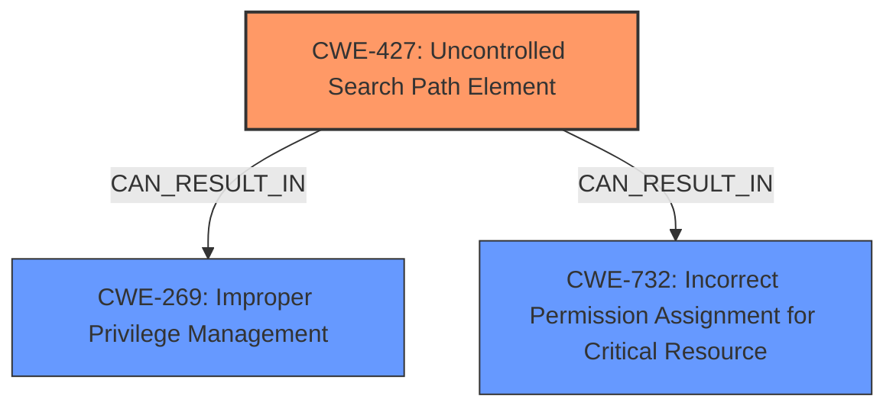

# Raw Analyzer Response for CVE-2024-6769

# Summary
| CWE ID | CWE Name | Confidence | CWE Abstraction Level | CWE Vulnerability Mapping Label | CWE-Vulnerability Mapping Notes |
|---|---|---|---|---|---|
| CWE-427 | Uncontrolled Search Path Element | 0.9 | Base | Primary | Allowed |
| CWE-269 | Improper Privilege Management | 0.7 | Class | Secondary | Discouraged |
| CWE-732 | Incorrect Permission Assignment for Critical Resource | 0.6 | Class | Secondary | Allowed-with-Review |

## Evidence and Confidence

*   **Confidence Score:** 0.8
*   **Evidence Strength:** MEDIUM

## Relationship Analysis
The primary CWE is CWE-427 **Uncontrolled Search Path Element**, which is a Base level CWE. This accurately reflects the root cause of the vulnerability: the system's search path can be influenced by an attacker. CWE-427 relates to other file access issues like CWE-59 **Improper Link Resolution Before File Access ('Link Following')** and CWE-73 **External Control of File Name or Path**, but CWE-427 is a more precise fit given the description of **DLL hijacking**.

CWE-269 **Improper Privilege Management** could be related as the end result is privilege escalation, but it's a higher-level Class and less specific to the root cause. CWE-732 **Incorrect Permission Assignment for Critical Resource** is also a possibility, but the issue isn't directly about incorrect permissions; it's about the search path used to locate resources.

## Vulnerability Chain
The vulnerability chain starts with:
1.  **CWE-427**: **Uncontrolled Search Path Element** due to drive remapping.
2.  **DLL Hijacking**: Loading of a malicious DLL.
3.  **Activation Cache Poisoning**: Manipulation of the Activation Context Cache.
4.  **Privilege Escalation**: Elevation from medium to high integrity process.

The root cause is the **uncontrolled search path**, leading to the **DLL hijacking** and ultimately privilege escalation.

## Summary of Analysis
The primary focus is on **DLL hijacking** and **activation cache poisoning** within the Windows environment, leading to privilege escalation. The most fitting CWE is CWE-427 **Uncontrolled Search Path Element**, due to the attacker's ability to manipulate the search path for DLLs.

The vulnerability description mentions "**DLL Hijacking caused by drive remapping combined with poisoning of activation cache**". The summary states "The remapping of the ROOT drive allows for the redirection of library loading to user-controlled locations." This strongly supports CWE-427 as the primary cause.

CWE-269 **Improper Privilege Management** is considered, given the impact of privilege escalation, but it's a secondary consequence rather than the root cause. CWE-732 **Incorrect Permission Assignment for Critical Resource** is less relevant as the issue is about the search path, not the permissions of specific resources.

The final decision emphasizes the root cause (CWE-427) while acknowledging the potential impact on privilege management (CWE-269). The specificity of CWE-427 makes it the most appropriate choice.

Relevant CWE Information:
*   CWE-427: The product uses a fixed or controlled search path to find resources, but one or more locations in that path can be under the control of unintended actors.
*   CWE-269: A class of weaknesses related to improper privilege management.
*   CWE-732: The product specifies permissions for a security-critical resource in a way that allows that resource to be read or modified by unintended actors.