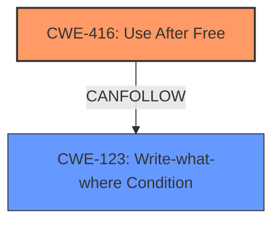

# Raw Analyzer Response for CVE-2024-6775

# Summary
| CWE ID | CWE Name | Confidence | CWE Abstraction Level | CWE Vulnerability Mapping Label | CWE-Vulnerability Mapping Notes |
|---|---|---|---|---|---|
| CWE-416 | Use After Free | 1.0 | Variant | Allowed | Primary CWE. The vulnerability description explicitly states "**use after free**". |
| CWE-123 | Write-what-where Condition | 0.5 | Base | Allowed | Secondary Candidate. **Use-after-free** can lead to an arbitrary write, where the attacker can control both the address and the value written. |

## Evidence and Confidence

*   **Confidence Score:** 1.0
*   **Evidence Strength:** HIGH

## Relationship Analysis
The primary relationship impacting the decision is the potential for CWE-416 to lead to CWE-123.

## Vulnerability Chain
The vulnerability chain starts with a **use-after-free** condition (CWE-416), which then allows for potential heap corruption. In some scenarios, the **use-after-free** (CWE-416) can lead to a write-what-where condition (CWE-123), where an attacker can write arbitrary data to arbitrary memory locations, leading to code execution.
  - **Root Cause:** CWE-416 (Use After Free)
  - **Impact:** CWE-123 (Write-what-where Condition) leading to heap corruption and potential code execution

## Summary of Analysis
The primary CWE is CWE-416 (Use After Free) because the vulnerability description explicitly states "**use after free**". The **use-after-free** condition allows for potential heap corruption due to memory being accessed after it has been freed. The description matches CWE-416's characteristics, as the memory is reused after being freed.

CWE-123 (Write-what-where Condition) is considered as a secondary candidate because a **use-after-free** can often lead to an arbitrary write, where the attacker can control both the address and the value written. While the primary description focuses on the **use-after-free**, the potential for arbitrary memory modification through CWE-123 is a natural consequence.

The selection of CWE-416 is at the Variant level, which is the most specific level possible based on the provided information. CWE-123 is at the Base level because there isn't enough information to determine a more specific variant.

Relevant CWE Information:

# Enhanced Context (25 CWEs)
The following CWEs were identified as potentially relevant to this vulnerability:

## CWE-416: Use After Free
**Abstraction Level**: Variant
**Similarity Score**: 0.79
**Source**: dense

**Description**:
The product reuses or references memory after it has been freed. At some point afterward, the memory may be allocated again and saved in another pointer, while the original pointer references a location somewhere within the new allocation. Any operations using the original pointer are no longer valid because the memory "belongs" to the code that operates on the new pointer.

**Mapping Guidance**:
- Usage: Allowed
- Rationale: This CWE entry is at the Variant level of abstraction, which is a preferred level of abstraction for mapping to the root causes of vulnerabilities.

## CWE-123: Write-what-where Condition
**Abstraction Level**: base
**Similarity Score**: 5.03
**Source**: graph

**Description**:
CWE-123: Write-what-where Condition

**Mapping Guidance**:
- Usage: Allowed
- Rationale: This CWE entry is at the Base level of abstraction, which is a preferred level of abstraction for mapping to the root causes of vulnerabilities.

**Relationships**:
- CANFOLLOW -> CWE-590
- CANFOLLOW -> CWE-479
- CANFOLLOW -> CWE-416
- CANFOLLOW -> CWE-364
- CANFOLLOW -> CWE-134