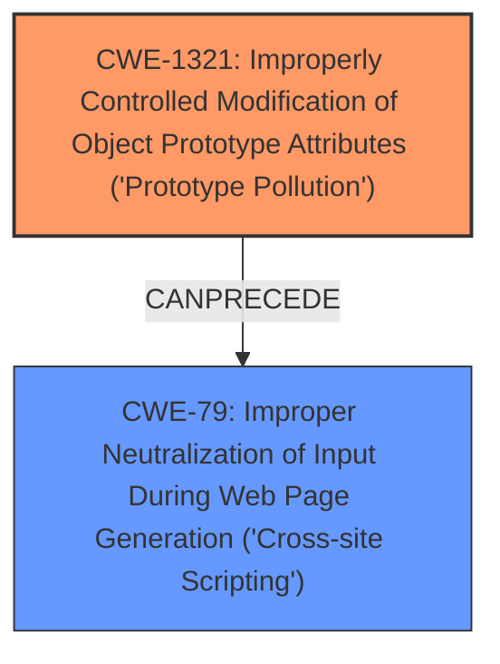

# Raw Analyzer Response for CVE-2024-6783

# Summary
| CWE ID | CWE Name | Confidence | CWE Abstraction Level | CWE Vulnerability Mapping Label | CWE-Vulnerability Mapping Notes |
|---|---|---|---|---|---|
| CWE-1321 | Improperly Controlled Modification of Object Prototype Attributes ('Prototype Pollution') | 1.0 | Variant | Primary | Allowed |
| CWE-79 | Improper Neutralization of Input During Web Page Generation ('Cross-site Scripting') | 0.9 | Base | Secondary | Allowed |

## Evidence and Confidence

*   **Confidence Score:** 0.95
*   **Evidence Strength:** HIGH

## Relationship Analysis
The primary weakness is **CWE-1321 (Variant)**, which directly addresses the **prototype pollution** vulnerability. **CWE-79 (Base)** is a secondary weakness, representing the resulting **XSS** vulnerability, which is the impact of the prototype pollution. **CWE-1321** can precede **CWE-79** in a vulnerability chain, where the uncontrolled modification of object prototypes leads to the execution of arbitrary JavaScript code, resulting in **cross-site scripting**. The abstraction levels are appropriate, with **CWE-1321** as a Variant providing a specific root cause, and **CWE-79** as a Base offering a clear description of the resulting XSS.

## Vulnerability Chain
The vulnerability chain starts with **CWE-1321**, the **improperly controlled modification of object prototype attributes** (**prototype pollution**). This leads to the ability to **execute arbitrary JavaScript code**, which manifests as **CWE-79**, **Improper Neutralization of Input During Web Page Generation ('Cross-site Scripting')**. The initial flaw is the **lack of control over object prototype modifications**, and the final impact is the **execution of arbitrary JavaScript code via XSS**.

## Summary of Analysis
The analysis strongly suggests that **CWE-1321** is the primary cause, as the vulnerability description explicitly mentions **prototype pollution**. The evidence is the statement "The attacker could change the prototype chain of some properties such as `Object.prototype.staticClass` or `Object.prototype.staticStyle` to execute arbitrary JavaScript code." This directly aligns with the description of **CWE-1321**.

**CWE-79** is a secondary weakness because the **XSS** vulnerability is the result of the **prototype pollution**. The attacker modifies object prototypes to inject malicious script, which is then executed in the user's browser.

The graph relationships support the selection, as **CWE-1321** can precede **CWE-79** in a vulnerability chain. This indicates that the **prototype pollution** is the root cause, leading to the **XSS** vulnerability.

The selected CWEs are at the optimal level of specificity. **CWE-1321** is a Variant that specifically addresses **prototype pollution**, while **CWE-79** is a Base CWE that clearly describes the resulting **XSS** vulnerability.

Other CWEs Considered:

*   **CWE-80: Improper Neutralization of Script-Related HTML Tags in a Web Page (Basic XSS)**: While related to XSS, it doesn't address the root cause of **prototype pollution**.
*   **CWE-116: Improper Encoding or Escaping of Output**: This is related to output handling, but the core issue is the **prototype pollution** allowing arbitrary code execution.
*   **CWE-352: Cross-Site Request Forgery (CSRF)**: This is a different type of web vulnerability and doesn't apply to the given description.
*   **CWE-502: Deserialization of Untrusted Data**: This is related to deserialization issues, but not relevant to the **prototype pollution** described.
*   **CWE-843: Access of Resource Using Incompatible Type ('Type Confusion')**: While it involves type issues, it is not the primary issue of prototype modification.
*   **CWE-1188: Initialization of a Resource with an Insecure Default**: This is not the core issue; the vulnerability is about modifying existing prototypes.