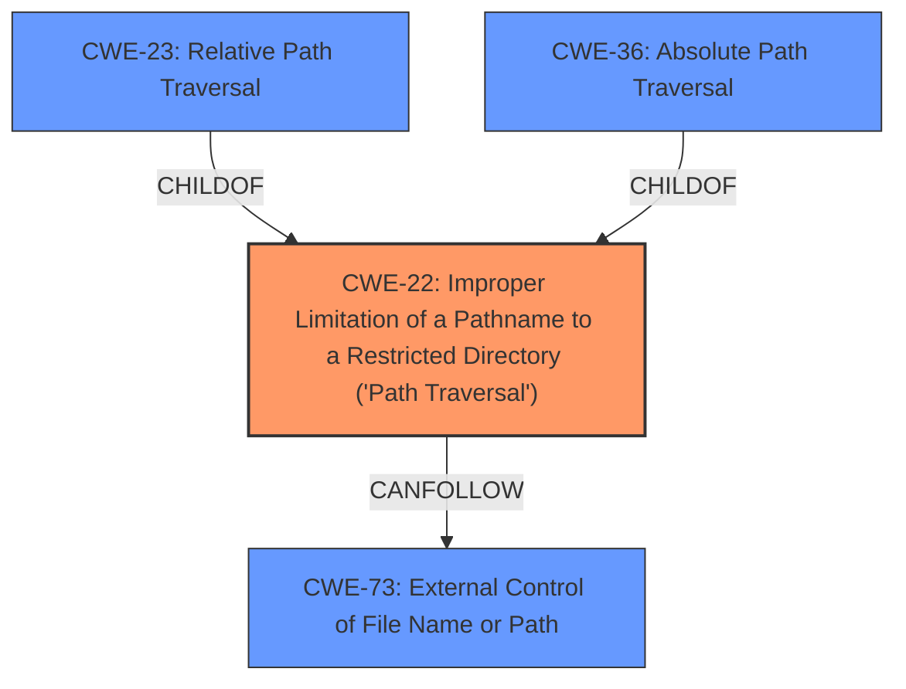

# Enhanced Analysis for CVE-2024-6786

# Summary
| CWE ID | CWE Name | Confidence | CWE Abstraction Level | CWE Vulnerability Mapping Label | CWE-Vulnerability Mapping Notes |
|---|---|---|---|---|---|
| CWE-22 | Improper Limitation of a Pathname to a Restricted Directory ('Path Traversal') | 1.0 | Base | Allowed | Primary CWE: The vulnerability description and CVE summary explicitly mention **path traversal** as the root cause, aligning perfectly with CWE-22. |

## Evidence and Confidence

*   **Confidence Score:** 1.0
*   **Evidence Strength:** HIGH

## Relationship Analysis
The primary relationship that influenced the decision was the hierarchical relationship between CWE-22 and its parents and children. While CWE-23 (Relative Path Traversal) and CWE-36 (Absolute Path Traversal) are children of CWE-22 and represent more specific types of path traversal, the vulnerability description does not explicitly state whether the path traversal is relative or absolute, so the more general CWE-22 is a better fit.



## Vulnerability Chain
The vulnerability chain starts with the **improper limitation of a pathname**, leading to the ability to read arbitrary files.

1.  **Root Cause:** CWE-22 - Improper Limitation of a Pathname to a Restricted Directory ('Path Traversal')
2.  **Impact:** Information Disclosure (reading arbitrary files, including sensitive information)

## Summary of Analysis
The initial analysis identified several potential CWEs related to path traversal and file access. However, the explicit mention of "**path traversal**" in the vulnerability description and CVE summary made CWE-22 the most appropriate choice. The retriever results also listed CWE-22 with the highest score.

The evidence is strong, with the vulnerability description stating: "The vulnerability allows an attacker to craft MQTT messages that include relative **path traversal** sequences, enabling them to read arbitrary files on the system." The CVE Reference Links Content Summary also explicitly mentions "CWE-24: Path Traversal" (should be CWE-22), which further supports this classification.

CWE-22 is at the optimal level of specificity because it directly addresses the root cause of the vulnerability: the **improper limitation of a pathname**, leading to path traversal. While more specific variants exist (e.g., relative or absolute path traversal), the available information does not allow to narrow down the choice further.

Relevant CWE Information:
# Enhanced Context (25 CWEs)
The following CWEs were identified as potentially relevant to this vulnerability:

## CWE-23: Relative Path Traversal
**Abstraction Level**: Base
**Similarity Score**: 0.77
**Source**: dense

**Description**:
The product uses external input to construct a pathname that should be within a restricted directory, but it does not properly neutralize sequences such as ".." that can resolve to a location that is outside of that directory.

**Mapping Guidance**:
- Usage: Allowed
- Rationale: This CWE entry is at the Base level of abstraction, which is a preferred level of abstraction for mapping to the root causes of vulnerabilities.

*Reasoning for not using this CWE*: While the vulnerability description mentions "relative path traversal sequences", it does not explicitly exclude the possibility of absolute path traversal. Therefore, the more general CWE-22 is a better fit.

## CWE-73: External Control of File Name or Path
**Abstraction Level**: Base
**Similarity Score**: 0.75
**Source**: dense

**Description**:
The product allows user input to control or influence paths or file names that are used in filesystem operations.

**Mapping Guidance**:
- Usage: Allowed
- Rationale: This CWE entry is at the Base level of abstraction, which is a preferred level of abstraction for mapping to the root causes of vulnerabilities.

*Reasoning for not using this CWE*: This CWE is too broad. The vulnerability is more specifically about path traversal, not just any external control of file names or paths.

## CWE-36: Absolute Path Traversal
**Abstraction Level**: Base
**Similarity Score**: 0.74
**Source**: dense

**Description**:
The product uses external input to construct a pathname that should be within a restricted directory, but it does not properly neutralize absolute path sequences such as "/abs/path" that can resolve to a location that is outside of that directory.

**Mapping Guidance**:
- Usage: Allowed
- Rationale: This CWE entry is at the Base level of abstraction, which is a preferred level of abstraction for mapping to the root causes of vulnerabilities.

*Reasoning for not using this CWE*: The vulnerability description does not explicitly state that the path traversal is absolute. Therefore, the more general CWE-22 is a better fit.

## CWE-28: Path Traversal: '..\filedir'
**Abstraction Level**: variant
**Similarity Score**: 2.16
**Source**: graph

**Description**:
CWE-28: Path Traversal: '..\filedir'

**Mapping Guidance**:
- Usage: Allowed
- Rationale: This CWE entry is at the Variant level of abstraction, which is a preferred level of abstraction for mapping to the root causes of vulnerabilities.

*Reasoning for not using this CWE*: This is a specific variant of relative path traversal, but the vulnerability description does not limit the path traversal to this specific form.

## CWE-59: Improper Link Resolution Before File Access ('Link Following')
**Abstraction Level**: Base
**Similarity Score**: 2.89
**Source**: graph

**Description**:
The product attempts to access a file based on the filename, but it does not properly prevent that filename from identifying a link or shortcut that resolves to an unintended resource.

*Reasoning for not using this CWE*: While link following could potentially be involved, the core issue is the ability to traverse the file system using path traversal sequences, making CWE-22 a more direct and accurate representation of the vulnerability.


## CWE Relationship Analysis

Current CWEs represent these abstraction levels: .


### Vulnerability Chain Analysis

**Chain starting from CWE-22:**
- 22 (Improper Limitation of a Pathname to a Restricted Directory ('Path Traversal')) - ROOT


**Chain starting from CWE-28:**
- 28 (Path Traversal: '..\filedir') - ROOT


### CWE Relationship Diagram

```mermaid
graph TD
    classDef primary fill:#f96,stroke:#333,stroke-width:2px
    classDef secondary fill:#69f,stroke:#333
    classDef tertiary fill:#9e9,stroke:#333
```