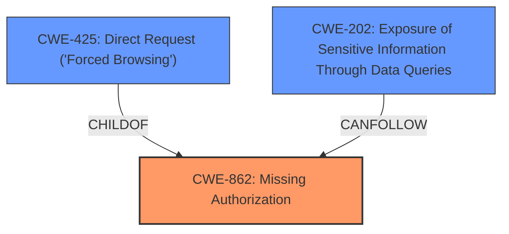

# Analysis Report for CVE-2024-6835

# Vulnerability Analysis Report: CVE-2024-6835

## Description

The Ivory Search - WordPress Search Plugin plugin for WordPress is vulnerable to Information Exposure in all versions up to, and including, 5.5.6 via the ajax_load_posts function. This makes it possible for unauthenticated attackers to extract text data from password-protected posts using the boolean-based attack on the AJAX search form

## Vulnerability Description Key Phrases

- **Impact:** Information Exposure
- **Attacker:** unauthenticated attackers
- **Product:** Ivory Search - WordPress Search Plugin
- **Version:** all versions up to and including 5.5.6
- **Component:** ajax_load_posts function

## Analysis (with Relationship Data)

# Summary
| CWE ID | CWE Name | Confidence | CWE Abstraction Level | CWE Vulnerability Mapping Label | CWE-Vulnerability Mapping Notes |
|---|---|---|---|---|---|
| CWE-862 | Missing Authorization | 1.0 | Class | Allowed-with-Review | Primary CWE. The application **does not perform an authorization check** when an actor attempts to access a resource or perform an action. |
| CWE-202 | Exposure of Sensitive Information Through Data Queries | 0.8 | Base | Allowed | The vulnerability leads to **information exposure** of password-protected posts. |
| CWE-425 | Direct Request ('Forced Browsing') | 0.7 | Base | Allowed | Unauthenticated attackers directly accessing resources without proper authorization |

## Evidence and Confidence

*   **Confidence Score:** 0.9
*   **Evidence Strength:** HIGH

## Relationship Analysis
The primary weakness is **CWE-862 Missing Authorization** as the root cause, because the `ajax_load_posts` function lacks proper authorization checks. **CWE-202 Exposure of Sensitive Information Through Data Queries** is a consequence of the missing authorization, and can be considered as the impact of the vulnerability. **CWE-425 Direct Request ('Forced Browsing')** is a means of exploiting the missing authorization. It is a more specific instance of missing authorization for web resources.



## Vulnerability Chain
The vulnerability chain starts with **CWE-862 Missing Authorization**, where the `ajax_load_posts` function **does not perform an authorization check**. This leads to **CWE-425 Direct Request ('Forced Browsing')** which allows unauthenticated attackers to directly access the password-protected posts. This results in **CWE-202 Exposure of Sensitive Information Through Data Queries**, where sensitive data is exposed to unauthorized users.

## Summary of Analysis
The analysis is based on the provided vulnerability description and the associated CVE details. The primary **root cause** is the **lack of authorization** in the `ajax_load_posts` function, allowing unauthenticated attackers to access sensitive information.

The evidence from the CVE description supports this: "Due to **improper access control**, it allows unauthenticated users to retrieve text content from password-protected posts".

The graph relationships clarify the connection between the root cause (**CWE-862 Missing Authorization**) and the resulting impact (**CWE-202 Exposure of Sensitive Information Through Data Queries**). **CWE-425 Direct Request ('Forced Browsing')** acts as an exploitation method, where unauthenticated users directly access restricted resources.

The selected CWEs are at the optimal level of specificity. While **CWE-863 Incorrect Authorization** was considered, **CWE-862 Missing Authorization** is a more accurate representation of the vulnerability, as the authorization check is entirely missing rather than incorrectly implemented.

Relevant CWE Information:

# Enhanced Context (25 CWEs)
The following CWEs were identified as potentially relevant to this vulnerability:

## CWE-352: Cross-Site Request Forgery (CSRF)
**Abstraction Level**: Compound
**Similarity Score**: 0.74
**Source**: dense

**Description**:
The web application does not, or can not, sufficiently verify whether a well-formed, valid, consistent request was intentionally provided by the user who submitted the request.

**Mapping Guidance**:
- Usage: Allowed
- Rationale: This is a well-known Composite of multiple weaknesses that must all occur simultaneously, although it is attack-oriented in nature.

## CWE-425: Direct Request ('Forced Browsing')
**Abstraction Level**: Base
**Similarity Score**: 0.74
**Source**: dense

**Description**:
The web application does not adequately enforce appropriate authorization on all restricted URLs, scripts, or files.

**Mapping Guidance**:
- Usage: Allowed
- Rationale: This CWE entry is at the Base level of abstraction, which is a preferred level of abstraction for mapping to the root causes of vulnerabilities.

## CWE-201: Insertion of Sensitive Information Into Sent Data
**Abstraction Level**: Base
**Similarity Score**: 0.73
**Source**: dense

**Description**:
The code transmits data to another actor, but a portion of the data includes sensitive information that should not be accessible to that actor.

**Mapping Guidance**:
- Usage: Allowed
- Rationale: This CWE entry is at the Base level of abstraction, which is a preferred level of abstraction for mapping to the root causes of vulnerabilities.

## CWE-639: Authorization Bypass Through User-Controlled Key
**Abstraction Level**: Base
**Similarity Score**: 0.73
**Source**: dense

**Description**:
The system's authorization functionality does not prevent one user from gaining access to another user's data or record by modifying the key value identifying the data.

**Mapping Guidance**:
- Usage: Allowed
- Rationale: This CWE entry is at the Base level of abstraction, which is a preferred level of abstraction for mapping to the root causes of vulnerabilities.

## CWE-116: Improper Encoding or Escaping of Output
**Abstraction Level**: Class
**Similarity Score**: 0.73
**Source**: dense

**Description**:
The product prepares a structured message for communication with another component, but encoding or escaping of the data is either missing or done incorrectly. As a result, the intended structure of the message is not preserved.

**Mapping Guidance**:
- Usage: Allowed-with-Review
- Rationale: This CWE entry is a Class and might have Base-level children that would be more appropriate

## CWE-472: External Control of Assumed-Immutable Web Parameter
**Abstraction Level**: Base
**Similarity Score**: 0.72
**Source**: dense

**Description**:
The web application does not sufficiently verify inputs that are assumed to be immutable but are actually externally controllable, such as hidden form fields.

**Mapping Guidance**:
- Usage: Allowed
- Rationale: This CWE entry is at the Base level of abstraction, which is a preferred level of abstraction for mapping to the root causes of vulnerabilities.

## CWE-79: Improper Neutralization of Input During Web Page Generation ('Cross-site Scripting')
**Abstraction Level**: Base
**Similarity Score**: 0.72
**Source**: dense

**Description**:
The product does not neutralize or incorrectly neutralizes user-controllable input before it is placed in output that is used as a web page that is served to other users.

**Mapping Guidance**:
- Usage: Allowed
- Rationale: This CWE entry is at the Base level of abstraction, which is a preferred level of abstraction for mapping to the root causes of vulnerabilities.

## CWE-434: Unrestricted Upload of File with Dangerous Type
**Abstraction Level**: Base
**Similarity Score**: 0.71
**Source**: dense

**Description**:
The product allows the upload or transfer of dangerous file types that are automatically processed within its environment.

**Mapping Guidance**:
- Usage: Allowed
- Rationale: This CWE entry is at the Base level of abstraction, which is a preferred level of abstraction for mapping to the root causes of vulnerabilities.

## CWE-502: Deserialization of Untrusted Data
**Abstraction Level**: Base
**Similarity Score**: 0.71
**Source**: dense

**Description**:
The product deserializes untrusted data without sufficiently ensuring that the resulting data will be valid.

**Mapping Guidance**:
- Usage: Allowed
- Rationale: This CWE entry is at the Base level of abstraction, which is a preferred level of abstraction for mapping to the root causes of vulnerabilities.

## CWE-209: Generation of Error Message Containing Sensitive Information
**Abstraction Level**: Base
**Similarity Score**: 0.71
**Source**: dense

**Description**:
The product generates an error message that includes sensitive information about its environment, users, or associated data.

**Mapping Guidance**:
- Usage: Allowed
- Rationale: This CWE entry is at the Base level of abstraction, which is a preferred level of abstraction for mapping to the root causes of vulnerabilities.

## CWE-863: Incorrect Authorization
**Abstraction Level**: Class
**Similarity Score**: 1602.64
**Source**: sparse

**Description**:
The product performs an authorization check when an actor attempts to access a resource or perform an action, but it does not correctly perform the check.

**Mapping Guidance**:
- Usage: Allowed-with-Review
- Rationale: This CWE entry is a Class and might have Base-level children that would be more appropriate

## CWE-86


## CWE Relationship Analysis

Current CWEs represent these abstraction levels: .


### Vulnerability Chain Analysis

**Chain starting from CWE-863:**
- 863 (Incorrect Authorization) - ROOT


**Chain starting from CWE-502:**
- 502 (Deserialization of Untrusted Data) - ROOT


### CWE Relationship Diagram

```mermaid
graph TD
    classDef primary fill:#f96,stroke:#333,stroke-width:2px
    classDef secondary fill:#69f,stroke:#333
    classDef tertiary fill:#9e9,stroke:#333
```


*Report generated on 2025-07-14 02:14:08*
