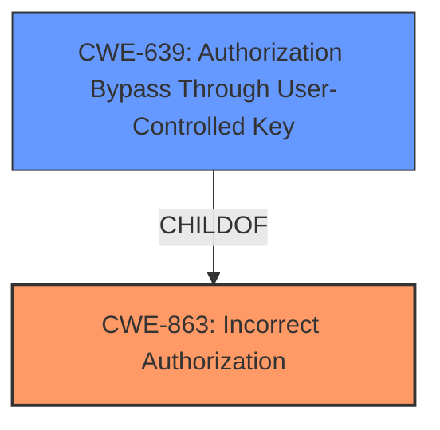

# Analysis Report for CVE-2024-6840

# Vulnerability Analysis Report: CVE-2024-6840

## Description

An **improper authorization flaw** exists in the Ansible Automation Controller. This flaw allows an attacker using the k8S API server to send an HTTP request with a service account token mounted via `automountServiceAccountToken true`, resulting in privilege escalation to a service account.

## Vulnerability Description Key Phrases

- **Rootcause:** improper authorization flaw
- **Impact:** privilege escalation to service account
- **Vector:** send an HTTP request with a service account token
- **Attacker:** attacker
- **Product:** Ansible Automation Controller

## Analysis (with Relationship Data)

# Summary

| CWE ID | CWE Name | Confidence | CWE Abstraction Level | CWE Vulnerability Mapping Label | CWE-Vulnerability Mapping Notes |
|---|---|---|---|---|---|
| CWE-863 | Incorrect Authorization | 1.0 | Class | Allowed-with-Review | Primary CWE: The application checks authorization, but does it incorrectly. |
| CWE-639 | Authorization Bypass Through User-Controlled Key | 0.75 | Base | Allowed | Secondary Candidate: System's authorization functionality does not prevent one user from gaining access to another user's data or record by modifying the key value identifying the data. |

## Evidence and Confidence

*   **Confidence Score:** 0.9
*   **Evidence Strength:** HIGH

## Relationship Analysis
The primary CWE selected is CWE-863, "Incorrect Authorization," a Class-level CWE. While it is generally preferred to select a Base or Variant level CWE, CWE-863 is the most appropriate given the available information which clearly indicates that an authorization check is performed, but it is done incorrectly. CWE-639 is a Base level CWE and a child of CWE-863. This secondary CWE is a good option since it identifies how the key is modified to perform the authorization bypass.



## Vulnerability Chain
The vulnerability chain begins with an **improper authorization flaw**. This allows an attacker to send an HTTP request with a service account token, leading to **privilege escalation** to a service account.

## Summary of Analysis
The analysis concludes that the primary weakness is **CWE-863 Incorrect Authorization**, as the Ansible Automation Controller performs authorization checks, but does so incorrectly, allowing an attacker to escalate privileges. This is supported by the "Vulnerability Description Key Phrases" identifying an "**improper authorization flaw**" as the root cause. The "CVE Reference Links Content Summary" also supports this, stating: "The vulnerability stems from improper authorization within the Ansible Automation Controller when using in-cluster access to the Kubernetes (k8s) API server."

The evidence supports that the authorization check exists, but it's flawed, making CWE-863 a more appropriate choice than **CWE-862 Missing Authorization**. CWE-285 is also broader ("Improper Authorization") and is not as specific as CWE-863.

**CWE-639 Authorization Bypass Through User-Controlled Key** is added as secondary since it describes the mechanism used to bypass authorization.

Both CWEs are at the optimal level of specificity, with CWE-863 at the Class level and CWE-639 at the Base level.

Relevant CWE Information:


## CWE Relationship Analysis

Current CWEs represent these abstraction levels: .


### Vulnerability Chain Analysis

**Chain starting from CWE-863:**
- 863 (Incorrect Authorization) - ROOT


**Chain starting from CWE-285:**
- 285 (Improper Authorization) - ROOT


### CWE Relationship Diagram

```mermaid
graph TD
    classDef primary fill:#f96,stroke:#333,stroke-width:2px
    classDef secondary fill:#69f,stroke:#333
    classDef tertiary fill:#9e9,stroke:#333
```


*Report generated on 2025-07-14 02:14:41*
