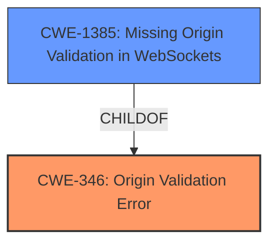

# Enhanced Analysis for CVE-2024-6844

# Summary
| CWE ID | CWE Name | Confidence | CWE Abstraction Level | CWE Vulnerability Mapping Label | CWE-Vulnerability Mapping Notes |
|---|---|---|---|---|---|
| CWE-346 | Origin Validation Error | 0.7 | Class | Primary | Allowed-with-Review |
| CWE-1385 | Missing Origin Validation in WebSockets | 0.6 | Variant | Secondary | Allowed |

## Evidence and Confidence

*   **Confidence Score:** 0.7
*   **Evidence Strength:** MEDIUM

## Relationship Analysis
The primary relationship influencing the decision is the ChildOf relationship between CWE-1385 (Missing Origin Validation in WebSockets) and CWE-346 (Origin Validation Error). Since the vulnerability description mentions CORS and specifically points to origin validation issues due to the handling of '+' character in URL paths, CWE-346 serves as a broader classification. The more specific CWE-1385 is also applicable because the context involves web-based communication and origin validation. CWE-346 is a Class, so it is better to choose a child that is a Base or Variant. CWE-1385 fits that description.



## Vulnerability Chain
The vulnerability chain starts with the **improper handling of the + character in URL paths**, leading to **inconsistent CORS matching**, which results in **unauthorized cross-origin access** or blocked valid requests. The root cause is the **missing or improper origin validation**.

## Summary of Analysis
The initial assessment identified that the vulnerability stemmed from **inconsistent CORS matching** due to the handling of the + character. The vulnerability description states that "The request.path is passed through the unquote_plus function, which converts the + character to a space. This behavior leads to incorrect path normalization, causing potential mismatches in CORS configuration." This issue is primarily related to origin validation, making CWE-346 (Origin Validation Error) a relevant candidate. Furthermore, the mention of CORS and the context of web requests suggests that CWE-1385 (Missing Origin Validation in WebSockets) is also applicable, providing a more specific classification within the broader scope of origin validation errors.

The evidence suggests that the application **does not properly verify the origin** due to the way it processes URL paths, leading to potential security vulnerabilities. This aligns well with the description of CWE-346. The connection to web requests and CORS makes the more specific CWE-1385 also relevant.

The selection is based on the evidence provided in the vulnerability description and the relationships between the CWEs. The chosen CWEs are at an appropriate level of specificity, addressing both the general issue of origin validation and the specific context of web-based communication.

Relevant CWE Information:

# Enhanced Context (25 CWEs)
The following CWEs were identified as potentially relevant to this vulnerability:

## CWE-346: Origin Validation Error
**Abstraction Level**: Class
**Similarity Score**: 0.74
**Source**: dense

**Description**:
The product does not properly verify that the source of data or communication is valid.

**Mapping Guidance**:
- Usage: Allowed-with-Review
- Rationale: This CWE entry is a Class and might have Base-level children that would be more appropriate

## CWE-1385: Missing Origin Validation in WebSockets
**Abstraction Level**: Variant
**Similarity Score**: 0.435
**Source**: sparse

**Description**:
The product uses a WebSocket, but it does not properly verify that the source of data or communication is valid.

**Mapping Guidance**:
- Usage: Allowed
- Rationale: This CWE entry is at the Variant level of abstraction, which is a preferred level of abstraction for mapping to the root causes of vulnerabilities.

**Relationships**:
- CHILDOF -> CWE-346
- PARENTOF -> CWE-1385

## CWE-942: Permissive Cross-domain Policy with Untrusted Domains
**Abstraction Level**: Variant
**Similarity Score**: 0.502
**Source**: sparse

**Description**:
The product uses a cross-domain policy file that includes domains that should not be trusted.

**Mapping Guidance**:
- Usage: Allowed
- Rationale: This CWE entry is at the Variant level of abstraction, which is a preferred level of abstraction for mapping to the root causes of vulnerabilities.

## CWE-93: Improper Neutralization of CRLF Sequences ('CRLF Injection')
**Abstraction Level**: Base
**Similarity Score**: 0.482
**Source**: sparse

**Description**:
The product uses CRLF (carriage return line feeds) as a special element, e.g. to separate lines or records, but it does not neutralize or incorrectly neutralizes CRLF sequences from inputs.

**Mapping Guidance**:
- Usage: Allowed
- Rationale: This CWE entry is at the Base level of abstraction, which is a preferred level of abstraction for mapping to the root causes of vulnerabilities.

## CWE-923: Improper Restriction of Communication Channel to Intended Endpoints
**Abstraction Level**: Class
**Similarity Score**: 0.475
**Source**: sparse

**Description**:
The product establishes a communication channel to (or from) an endpoint for privileged or protected operations, but it does not properly ensure that it is communicating with the correct endpoint.

**Mapping Guidance**:
- Usage: Allowed-with-Review
- Rationale: This CWE entry is a Class and might have Base-level children that would be more appropriate

## CWE-113: Improper Neutralization of CRLF Sequences in HTTP Headers ('HTTP Request/Response Splitting')
**Abstraction Level**: Variant
**Similarity Score**: 0.454
**Source**: sparse

**Description**:
The product receives data from an HTTP agent/component (e.g., web server, proxy, browser, etc.), but it does not neutralize or incorrectly neutralizes CR and LF characters before the data is included in outgoing HTTP headers.

**Mapping Guidance**:
- Usage: Allowed
- Rationale: This CWE entry is at the Variant level of abstraction, which is a preferred level of abstraction for mapping to the root causes of vulnerabilities.

## CWE-696: Incorrect Behavior Order
**Abstraction Level**: Class
**Similarity Score**: 0.441
**Source**: sparse

**Description**:
The product performs operations in an order that causes an unexpected or undesirable behavior.

**Mapping Guidance**:
- Usage: Allowed-with-Review
- Rationale: This CWE entry is a Class and might have Base-level children that would be more appropriate

## CWE-863: Incorrect Authorization
**Abstraction Level**: Class
**Similarity Score**: 0.415
**Source**: sparse

**Description**:
The application does not perform proper authorization checks when a user attempts to access a resource or perform an action.

**Mapping Guidance**:
- Usage: Allowed-with-Review
- Rationale: This CWE entry is a Class and might have Base-level children that would be more appropriate

## CWE-204: Observable Response Discrepancy
**Abstraction Level**: Base
**Similarity Score**: 0.410
**Source**: sparse

**Description**:
The product provides different responses to incoming requests in a way that reveals internal state information to an unauthorized actor outside of the intended control sphere.

**Mapping Guidance**:
- Usage: Allowed
- Rationale: This CWE entry is at the Base level of abstraction, which is a preferred level of abstraction for mapping to the root causes of vulnerabilities.

## CWE-36: Absolute Path Traversal
**Abstraction Level**: Base
**Similarity Score**: 0.529
**Source**: dense

**Description**:
The product uses external input to construct a pathname that should be within a restricted directory, but it does not properly neutralize special elements within the pathname that can cause the resulting pathname to resolve to a location that is outside of the restricted directory.

**Mapping Guidance**:
- Usage: Allowed
- Rationale: This CWE entry is at the Base level of abstraction, which is a preferred level of abstraction for mapping to the root causes of vulnerabilities.

## CWE-1275: Sensitive Cookie with Improper SameSite Attribute
**Abstraction Level**: variant
**Similarity Score**: 0.002
**Source**: graph

**Description**:
CWE-1275: Sensitive Cookie with Improper SameSite Attribute

**Mapping Guidance**:
- Usage: Allowed
- Rationale: This CWE entry is at the Variant level of abstraction, which is a preferred level of abstraction for mapping to the root causes of vulnerabilities.

CWEs considered but not used:

*   CWE-942 (Permissive Cross-domain Policy with Untrusted Domains), CWE-93 (Improper Neutralization of CRLF Sequences ('CRLF Injection')), CWE-923 (Improper Restriction of Communication Channel to Intended Endpoints), and CWE-113 (Improper Neutralization of CRLF


## CWE Relationship Analysis

Current CWEs represent these abstraction levels: .


### Vulnerability Chain Analysis

**Chain starting from CWE-863:**
- 863 (Incorrect Authorization) - ROOT


**Chain starting from CWE-93:**
- 93 (Improper Neutralization of CRLF Sequences ('CRLF Injection')) - ROOT


### CWE Relationship Diagram

```mermaid
graph TD
    classDef primary fill:#f96,stroke:#333,stroke-width:2px
    classDef secondary fill:#69f,stroke:#333
    classDef tertiary fill:#9e9,stroke:#333
```