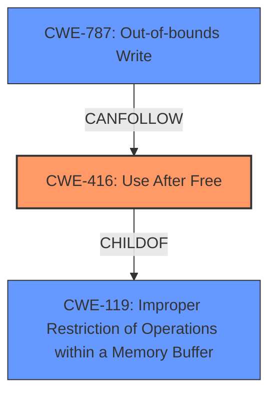

# Enhanced Analysis for CVE-2024-6988

# Summary
| CWE ID | CWE Name | Confidence | CWE Abstraction Level | CWE Vulnerability Mapping Label | CWE-Vulnerability Mapping Notes |
|---|---|---|---|---|---|
| CWE-416 | Use After Free | 1.0 | Variant | Primary | Allowed |

## Evidence and Confidence

*   **Confidence Score:** 1.0
*   **Evidence Strength:** HIGH

## Relationship Analysis
The primary relationship is that **CWE-416** Use After Free is a variant-level CWE. There are other related CWEs, like **CWE-415** Double Free, but the description explicitly mentions **use after free**, making **CWE-416** the most appropriate choice. Other CWEs like **CWE-787** Out-of-bounds Write, are often related to heap corruption but are secondary effects rather than the root cause in this case.



## Vulnerability Chain
The vulnerability chain starts with a **use after free** (**CWE-416**), leading to potential **heap corruption**. A remote attacker can then exploit the **heap corruption** via a crafted HTML page. The chain is: **CWE-416** -> **heap corruption** -> **remote code execution**.

## Summary of Analysis
The vulnerability description clearly states a "**use after free**" vulnerability in the Downloads component of Google Chrome on iOS. The CVE Reference Links Content Summary section confirms that the **root_cause** is "**Use after free** in Downloads". The "**weakness**" is listed as "**Use after free**". The primary CWE match from similar CVE descriptions is **CWE-416**. The retriever results also list **CWE-416** as the top candidate. All evidence points to **CWE-416** as the most appropriate CWE. **CWE-416** is a Variant level CWE, which is the preferred level of abstraction.

Relevant CWE Information:

# Enhanced Context (25 CWEs)
The following CWEs were identified as potentially relevant to this vulnerability:

## CWE-416: Use After Free
**Abstraction Level**: Variant
**Similarity Score**: 0.77
**Source**: dense

**Description**:
The product reuses or references memory after it has been freed. At some point afterward, the memory may be allocated again and saved in another pointer, while the original pointer references a location somewhere within the new allocation. Any operations using the original pointer are no longer valid because the memory "belongs" to the code that operates on the new pointer.

**Mapping Guidance**:
- Usage: Allowed
- Rationale: This CWE entry is at the Variant level of abstraction, which is a preferred level of abstraction for mapping to the root causes of vulnerabilities.


## CWE Relationship Analysis

Current CWEs represent these abstraction levels: .


### Vulnerability Chain Analysis

**Chain starting from CWE-119:**
- 119 (Improper Restriction of Operations within the Bounds of a Memory Buffer) - ROOT


**Chain starting from CWE-787:**
- 787 (Out-of-bounds Write) - ROOT


### CWE Relationship Diagram

```mermaid
graph TD
    classDef primary fill:#f96,stroke:#333,stroke-width:2px
    classDef secondary fill:#69f,stroke:#333
    classDef tertiary fill:#9e9,stroke:#333
```