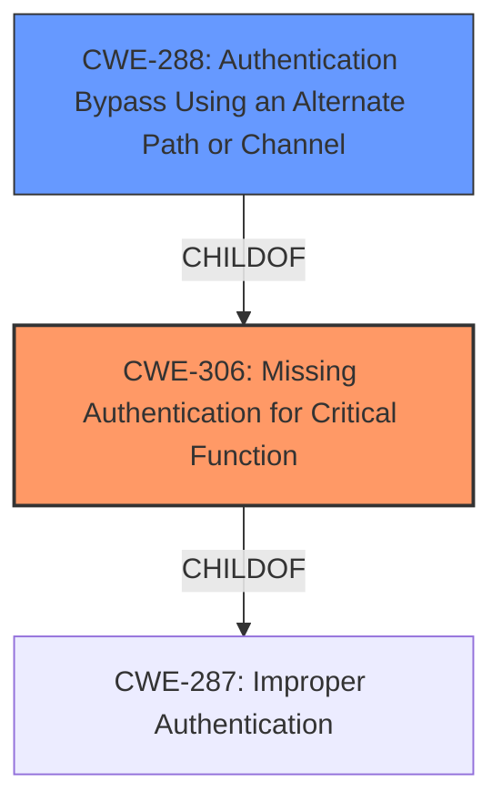

# Analysis Report for CVE-2024-7012

# Vulnerability Analysis Report: CVE-2024-7012

## Description

An **authentication bypass** vulnerability has been identified in Foreman when deployed with External Authentication, due to the puppet-foreman configuration. This issue arises from Apaches mod_proxy not properly unsetting headers because of restrictions on underscores in HTTP headers, allowing authentication through a malformed header. This flaw impacts all active Satellite deployments (6.13, 6.14 and 6.15) and could potentially enable unauthorized users to gain administrative access.

## Vulnerability Description Key Phrases

- **Rootcause:** improper header unsetting in mod_proxy
- **Weakness:** authentication bypass
- **Impact:** gain administrative access
- **Vector:** malformed header
- **Attacker:** unauthorized users
- **Product:** Foreman
- **Version:** ['6.13', '6.14', '6.15']

## Analysis (with Relationship Data)

# Summary
| CWE ID  | CWE Name                                                      | Confidence | CWE Abstraction Level | CWE Vulnerability Mapping Label | CWE-Vulnerability Mapping Notes |
|---------|---------------------------------------------------------------|------------|-----------------------|---------------------------------|---------------------------------|
| CWE-306 | Missing Authentication for Critical Function                | 0.9        | Base                  | Primary                           | Allowed                         |
| CWE-288 | Authentication Bypass Using an Alternate Path or Channel | 0.7        | Base                  | Secondary                         | Allowed                         |

## Evidence and Confidence

*   **Confidence Score:** 0.8
*   **Evidence Strength:** HIGH

## Relationship Analysis
The primary relationship that impacted my decision was the ChildOf relationship between CWE-306 and CWE-287 (Improper Authentication), and between CWE-288 and CWE-306. CWE-306 represents a specific case of improper authentication where authentication is completely missing for a critical function, aligning well with the vulnerability description. CWE-288 is a sibling of CWE-306 which is another specific case of improper authentication where authentication is bypassed using an alternate path. These hierarchical relationships helped refine the selection of the most appropriate CWE.



## Vulnerability Chain
The vulnerability chain starts with the **missing authentication** (CWE-306) for a critical function due to **improper header unsetting in mod_proxy**. This leads to an **authentication bypass** allowing unauthorized users to gain administrative access.

## Summary of Analysis
Initially, several CWEs seemed relevant based on the description. However, focusing on the root cause and the provided "Authentication vs Authorization vs Access Control Guidance" helped narrow down the selection. The key evidence is that the Apache mod_proxy **fails to unset headers properly**, leading to a complete **bypass** of authentication, not just an authorization issue after authentication.

The retriever results suggested CWE-863 (Incorrect Authorization) as a top candidate, but the vulnerability description and CVE summary indicate that the primary issue is the **lack of authentication** due to the **improper header unsetting**. The guidance clarifies that CWE-306 is appropriate when there is "no identity check (no login)," which accurately reflects the vulnerability where authentication is bypassed due to the header issue.

CWE-288 (Authentication Bypass Using an Alternate Path or Channel) was considered as a secondary CWE because the malformed header could be considered an alternate path.

The selected CWEs are at the optimal level of specificity because they directly address the root cause (missing authentication) and a potential method of exploitation (alternate path).

Relevant CWE Information:

# Enhanced Context (25 CWEs)
The following CWEs were identified as potentially relevant to this vulnerability:

## CWE-288: Authentication Bypass Using an Alternate Path or Channel
**Abstraction Level**: Base
**Similarity Score**: 0.75
**Source**: dense

**Description**:
The product requires authentication, but the product has an alternate path or channel that does not require authentication.

**Mapping Guidance**:
- Usage: Allowed
- Rationale: This CWE entry is at the Base level of abstraction, which is a preferred level of abstraction for mapping to the root causes of vulnerabilities.

## CWE-306: Missing Authentication for Critical Function
**Abstraction Level**: Base
**Similarity Score**: 1334.60
**Source**: sparse

**Description**:
The product does not perform any authentication for functionality that requires a provable user identity or consumes a significant amount of resources.

**Mapping Guidance**:
- Usage: Allowed
- Rationale: This CWE entry is at the Base level of abstraction, which is a preferred level of abstraction for mapping to the root causes of vulnerabilities.


## CWE Relationship Analysis

Current CWEs represent these abstraction levels: .


### Vulnerability Chain Analysis

**Chain starting from CWE-288:**
- 288 (Authentication Bypass Using an Alternate Path or Channel) - ROOT


**Chain starting from CWE-863:**
- 863 (Incorrect Authorization) - ROOT


### CWE Relationship Diagram

```mermaid
graph TD
    classDef primary fill:#f96,stroke:#333,stroke-width:2px
    classDef secondary fill:#69f,stroke:#333
    classDef tertiary fill:#9e9,stroke:#333
```


*Report generated on 2025-07-14 02:21:18*
