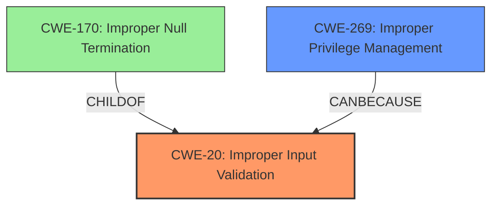

# Analysis for CVE-2024-7023

# Summary
| CWE ID | CWE Name | Confidence | CWE Abstraction Level | CWE Vulnerability Mapping Label | CWE-Vulnerability Mapping Notes |
|---|---|---|---|---|---|
| CWE-20 | Improper Input Validation | 0.8 | Class | Primary | Allowed-with-Review |
| CWE-269 | Improper Privilege Management | 0.4 | Class | Secondary | Discouraged |

## Evidence and Confidence

*   **Confidence Score:** 0.8
*   **Evidence Strength:** MEDIUM

## Relationship Analysis
The primary CWE is CWE-20 Improper Input Validation, a class-level CWE. While more specific base or variant CWEs might exist, the provided information is insufficient to pinpoint the exact type of input validation error. The vulnerability description indicates that the **insufficient data validation** led to privilege escalation. Therefore, we can consider a secondary CWE like CWE-269 Improper Privilege Management because privilege escalation is a potential impact. CWE-20 is a parent of CWE-170.

## Vulnerability Chain
The vulnerability chain starts with **insufficient data validation** (CWE-20). This **rootcause** allows a malicious file to be processed, leading to privilege escalation. Thus, the chain is: CWE-20 (Improper Input Validation) -> Privilege Escalation.

## Summary of Analysis
The initial assessment and resulting conclusion is based on the provided evidence, specifically the key phrase "**insufficient data validation**" which directly points to CWE-20.

The graph relationships influenced the selection by highlighting potential related CWEs, but the evidence does not fully support them.

The selected CWEs are at a reasonable level of specificity given the available information. While a more specific variant of CWE-20 might exist, the current description does not provide enough detail to identify it.

**CWE-20: Improper Input Validation** is selected because the vulnerability description clearly states "**insufficient data validation**". This is the **rootcause** that allows the malicious file to be exploited. The security implication is that an attacker can bypass security checks and execute arbitrary code with elevated privileges.

**CWE-269: Improper Privilege Management** is considered as a secondary CWE because the impact of the vulnerability is privilege escalation. It's a Class level CWE, and its selection is influenced by the privilege vs permission guidance. However, since the description focuses on input validation as the primary issue, and given the guidance discourages using CWE-269 directly for privilege escalation impacts, it is only a secondary consideration.

The retriever results listed several other CWEs.

*   CWE-356, CWE-451, and CWE-357 relate to UI warnings but are not relevant as the vulnerability is not related to the UI.
*   CWE-416 (Use After Free), CWE-843 (Type Confusion), and CWE-123 (Write-what-where) are memory corruption issues, but there's no evidence to suggest memory corruption is involved.
*   CWE-366 (Race Condition within a Thread) and CWE-113 (Improper Neutralization of CRLF Sequences in HTTP Headers) are unrelated to input validation or privilege escalation in this context.
*   CWE-116 (Improper Encoding or Escaping of Output) is about output handling, not input validation.