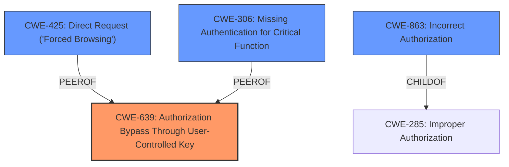

# Raw Analyzer Response for CVE-2024-7041

# Summary

| CWE ID  | CWE Name                                                                        | Confidence | CWE Abstraction Level | CWE Vulnerability Mapping Label | CWE-Vulnerability Mapping Notes |
| :------- | :------------------------------------------------------------------------------ | :--------- | :-------------------- | :------------------------------ | :-------------------------------- |
| CWE-639 | Authorization Bypass Through User-Controlled Key                                | 0.90       | Base                  | Primary                         | Allowed                           |
| CWE-425 | Direct Request ('Forced Browsing')                                              | 0.60       | Base                  | Secondary                       | Allowed                           |
| CWE-306 | Missing Authentication for Critical Function                                    | 0.50       | Base                  | Secondary                       | Allowed                           |
| CWE-863 | Incorrect Authorization                                                         | 0.40       | Class                 | Secondary                       | Allowed-with-Review             |

## Evidence and Confidence

*   **Confidence Score:** 0.80
*   **Evidence Strength:** MEDIUM

## Relationship Analysis

The primary CWE is CWE-639, which is a Base level CWE and directly addresses the vulnerability of bypassing authorization through user-controlled keys. CWE-425, CWE-306 and CWE-863 are also considered due to authorization and authentication issues, but they are less specific than CWE-639. CWE-639 captures the essence of the IDOR vulnerability more precisely.

## Vulnerability Chain

The vulnerability chain starts with an **Insecure Direct Object Reference** (**ROOTCAUSE**) which allows an attacker to modify other users' memories (**IMPACT**) due to a flaw in the decentralization design of the API endpoint.

## Summary of Analysis

The primary assessment is based on the vulnerability description, particularly the phrase "**Insecure Direct Object Reference**" and the ability of "attackers to edit other users memories without proper authorization."

CWE-639 (Authorization Bypass Through User-Controlled Key) is the most fitting because it directly addresses the core issue of manipulating keys to access unauthorized resources. The retriever results also support this with a high similarity score.

CWE-425 (Direct Request ('Forced Browsing')) is a possible secondary CWE because it relates to inadequate enforcement of authorization on URLs.

CWE-306 (Missing Authentication for Critical Function) is a less likely candidate since the description doesn't explicitly mention a lack of authentication, but it's considered because the authorization bypass might stem from insufficient authentication measures.

CWE-863 (Incorrect Authorization) is another secondary candidate because it describes a scenario where authorization checks are performed incorrectly.

The selected CWEs are at the optimal level of specificity because CWE-639 is a Base level CWE that directly describes the **ROOT CAUSE**, while the others represent related but less specific aspects of the vulnerability.

Relevant CWE Information:

**CWE-639: Authorization Bypass Through User-Controlled Key**

*   **Technical Explanation:** The vulnerability allows attackers to modify the 'id' parameter in the API request to access and edit memories belonging to other users. This is a direct bypass of authorization because the system trusts the user-supplied key without proper validation against the user's privileges.
*   **Security Implications:** An attacker can potentially read, modify, or delete sensitive information belonging to other users, leading to data breaches, privacy violations, and potential reputational damage.
*   **Relationship:** This is a Base level CWE.
*   **Mapping Guidance Influence:** The CWE description aligns perfectly with the vulnerability description, and the "Allowed" usage strengthens the selection.

**CWE-425: Direct Request ('Forced Browsing')**

*   **Technical Explanation:** The API endpoint `http//0.0.0.03000/api/v1/memories/{id}/update` does not adequately enforce authorization, allowing users to directly request and modify resources they should not have access to.
*   **Security Implications:** Similar to CWE-639, this allows unauthorized access and modification of user data.
*   **Relationship:** This is a Base level CWE and a peer of CWE-639.
*   **Mapping Guidance Influence:** The CWE description aligns with the vulnerability, and the "Allowed" usage supports the selection.

**CWE-306: Missing Authentication for Critical Function**

*   **Technical Explanation:** While not explicitly stated, the **authorization bypass** could be due to a complete lack of authentication for this API endpoint, allowing anyone to attempt modifications without any identity check.
*   **Security Implications:** This would be a severe vulnerability, allowing anyone to manipulate user data without any credentials.
*   **Relationship:** This is a Base level CWE.
*   **Mapping Guidance Influence:** The CWE description fits if we assume a complete lack of authentication, and the "Allowed" usage is appropriate.

**CWE-863: Incorrect Authorization**

*   **Technical Explanation:** The system might be performing some authorization checks, but they are flawed, allowing attackers to bypass them by manipulating the 'id' parameter.
*   **Security Implications:** This leads to unauthorized access and modification of user data.
*   **Relationship:** This is a Class level CWE and a parent of more specific authorization-related CWEs.
*   **Mapping Guidance Influence:** The CWE description aligns if the authorization is performed but incorrectly, and the "Allowed-with-Review" usage is appropriate.

**CWEs Considered But Not Used:**

*   CWE-99 (Improper Control of Resource Identifiers ('Resource Injection')): This CWE is too broad and doesn't specifically address the authorization bypass issue.
*   CWE-285 (Improper Authorization): This is a Class level CWE and is too general compared to CWE-639.
*   CWE-94 (Improper Control of Generation of Code ('Code Injection')): This CWE is not relevant as the vulnerability does not involve code injection.
*   CWE-79 (Improper Neutralization of Input During Web Page Generation ('Cross-site Scripting')): This CWE is not relevant as the vulnerability does not involve cross-site scripting.
*   CWE-1188 (Initialization of a Resource with an Insecure Default): This CWE is not relevant as the vulnerability does not involve insecure defaults.
*   CWE-472 (External Control of Assumed-Immutable Web Parameter): While related to external control, it's not as direct as CWE-639 in addressing the authorization bypass.