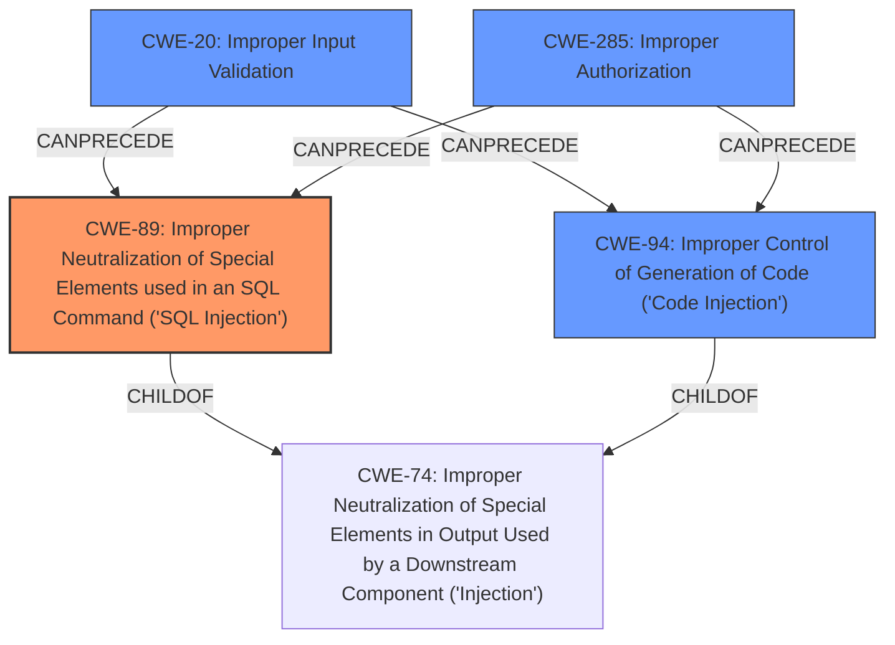

# Raw Analyzer Response for CVE-2024-7042

# Summary

| CWE ID  | CWE Name                                                                       | Confidence | CWE Abstraction Level | CWE Vulnerability Mapping Label | CWE-Vulnerability Mapping Notes |
| :-------- | :----------------------------------------------------------------------------- | :--------- | :---------------------- | :------------------------------ | :------------------------------ |
| CWE-89    | Improper Neutralization of Special Elements used in an SQL Command ('SQL Injection') | 1.0        | Base                    | Primary                         | Allowed                         |
| CWE-94    | Improper Control of Generation of Code ('Code Injection')                    | 0.7        | Base                    | Secondary                       | Allowed-with-Review             |
| CWE-20    | Improper Input Validation                                                      | 0.6        | Class                   | Secondary                       | Discouraged                     |
| CWE-285   | Improper Authorization                                                       | 0.5        | Class                   | Secondary                       | Allowed-with-Review             |

## Evidence and Confidence

*   **Confidence Score:** 0.8
*   **Evidence Strength:** HIGH

## Relationship Analysis

The primary weakness is **CWE-89: Improper Neutralization of Special Elements used in an SQL Command ('SQL Injection')**, as the vulnerability allows for the construction of malicious SQL commands via prompt injection. **CWE-94: Improper Control of Generation of Code ('Code Injection')** is a possible secondary weakness, if the prompt injection leads to arbitrary code execution, which could be the case but is not explicitly specified. **CWE-20: Improper Input Validation** is also a secondary consideration, as the system fails to properly validate user input, which enables prompt injection. **CWE-285: Improper Authorization** is also a consideration, as the attacker is able to perform actions without proper authorization checks.

## Vulnerability Chain

The vulnerability chain starts with **prompt injection** due to a **lack of input validation** (**CWE-20**), leading to the construction of malicious SQL commands that are executed due to **improper neutralization** (**CWE-89**). The attacker can then perform unauthorized actions due to **improper authorization** (**CWE-285**). If the SQL injection allows for arbitrary code execution, **CWE-94** is also applicable.

## Summary of Analysis

The primary weakness is clearly **CWE-89: Improper Neutralization of Special Elements used in an SQL Command ('SQL Injection')**. The vulnerability description explicitly mentions "SQL injection" and describes how **prompt injection** leads to the construction of malicious SQL commands. This aligns directly with the definition of **CWE-89**, which focuses on the **improper neutralization** of special elements in SQL commands.

The other CWEs are secondary considerations. **CWE-94: Improper Control of Generation of Code ('Code Injection')** is possible if the SQL injection allows for arbitrary code execution, but this is not explicitly stated in the description. **CWE-20: Improper Input Validation** is relevant because the system fails to properly validate user input, enabling **prompt injection**, but it's a more general weakness compared to the specific **SQL injection**. **CWE-285: Improper Authorization** is considered because the SQL injection allows attackers to perform actions they should not be authorized to do.

The final classification is based on the evidence provided in the vulnerability description, which focuses on the **prompt injection** leading to **SQL injection**. This aligns most directly with **CWE-89**, making it the primary weakness.

Relevant CWE Information:
*   **CWE-89: Improper Neutralization of Special Elements used in an SQL Command ('SQL Injection')**: This is the primary weakness, as the vulnerability allows for the construction of malicious SQL commands.
*   **CWE-94: Improper Control of Generation of Code ('Code Injection')**: This is a possible secondary weakness, if the prompt injection leads to arbitrary code execution.
*   **CWE-20: Improper Input Validation**: This is also a secondary consideration, as the system fails to properly validate user input, which enables prompt injection.
*   **CWE-285: Improper Authorization**: This is also a consideration, as the attacker is able to perform actions without proper authorization checks.