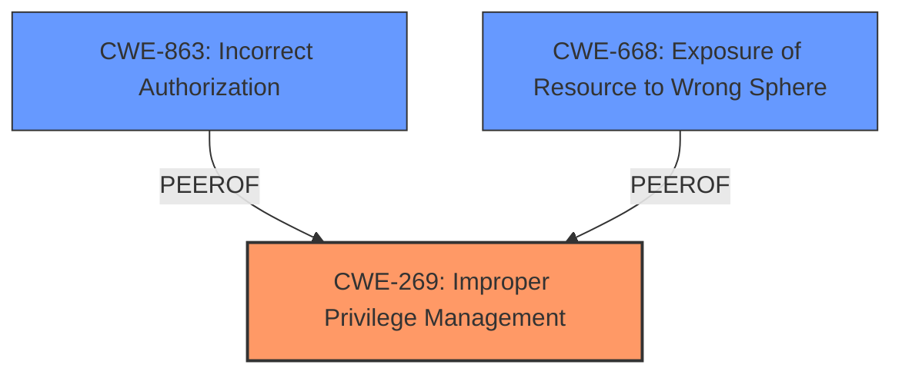

# Raw Analyzer Response for CVE-2024-7048

# Summary
| CWE ID | CWE Name | Confidence | CWE Abstraction Level | CWE Vulnerability Mapping Label | CWE-Vulnerability Mapping Notes |
|---|---|---|---|---|---|
| CWE-269 | Improper Privilege Management | 0.8 | Class | Primary | Discouraged |
| CWE-863 | Incorrect Authorization | 0.6 | Class | Secondary | Allowed-with-Review |
| CWE-668 | Exposure of Resource to Wrong Sphere | 0.5 | Class | Secondary | Discouraged |

## Evidence and Confidence

*   **Confidence Score:** 0.7
*   **Evidence Strength:** MEDIUM

## Relationship Analysis
The primary relationship influencing the choice of CWE-269 is its direct match to the **improper privilege management** root cause described in the vulnerability. While CWE-269 is a Class-level CWE and generally discouraged, in this specific case, the description focuses on the broad concept of privilege management rather than a specific authorization or permission issue. Secondary CWEs like CWE-863 and CWE-668 are considered because they represent potential ways in which **improper privilege management** can manifest.

## Vulnerability Chain
The vulnerability chain starts with **improper privilege management** (CWE-269), allowing a low-privileged user to access resources managed by a higher-privileged admin. This leads to the ability to view metadata and overwrite files, compromising integrity and availability.

## Summary of Analysis
The initial assessment focused on identifying the root cause of the vulnerability, which the description explicitly states as **improper privilege management**. The retriever results also highlighted CWE-269, although it is generally discouraged. Given the direct statement in the description, CWE-269 is selected as the primary CWE with a confidence score of 0.8. This assessment is heavily based on the explicit statement of the root cause.

CWE-863 and CWE-668 are considered as secondary CWEs because the vulnerability leads to an **incorrect authorization** (CWE-863) where the lower-privileged user is authorized to perform actions they shouldn't be allowed to do. Additionally, it leads to **Exposure of Resource to Wrong Sphere** (CWE-668) because files managed by an admin are accessible to a lower-privileged user.

The selected CWEs are at the Class level of specificity because the provided evidence doesn't allow us to pinpoint the exact flaw. If we had more information such as the exact line of code with the flaw, we may be able to specify a Base or Variant CWE.

Relevant CWE Information:

# Enhanced Context (25 CWEs)
The following CWEs were identified as potentially relevant to this vulnerability:

## CWE-269: Improper Privilege Management
**Abstraction Level**: Class
**Similarity Score**: 1396.35
**Source**: sparse

**Description**:
The product does not properly assign, modify, track, or check privileges for an actor, creating an unintended sphere of control for that actor.

**Mapping Guidance**:
- Usage: Discouraged
- Rationale: CWE-269 is commonly misused. It can be conflated with "privilege escalation," which is a technical impact that is listed in many low-information vulnerability reports [REF-1287]. It is not useful for trend analysis.

## CWE-863: Incorrect Authorization
**Abstraction Level**: Class
**Similarity Score**: 1427.62
**Source**: sparse

**Description**:
The product performs an authorization check when an actor attempts to access a resource or perform an action, but it does not correctly perform the check.

**Mapping Guidance**:
- Usage: Allowed-with-Review
- Rationale: This CWE entry is a Class and might have Base-level children that would be more appropriate

## CWE-668: Exposure of Resource to Wrong Sphere
**Abstraction Level**: Class
**Similarity Score**: 0.76
**Source**: dense

**Description**:
The product exposes a resource to the wrong control sphere, providing unintended actors with inappropriate access to the resource.

**Mapping Guidance**:
- Usage: Discouraged
- Rationale: CWE-668 is high-level and is often misused as a catch-all when lower-level CWE IDs might be applicable. It is sometimes used for low-information vulnerability reports [REF-1287]. It is a level-1 Class (i.e., a child of a Pillar). It is not useful for trend analysis.