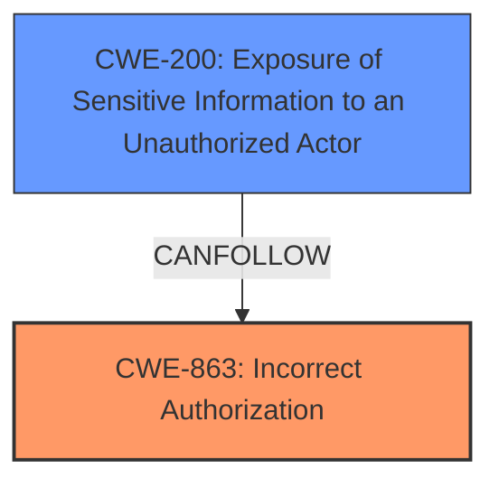

# Analysis for CVE-2024-7063

# Summary
| CWE ID | CWE Name | Confidence | CWE Abstraction Level | CWE Vulnerability Mapping Label | CWE-Vulnerability Mapping Notes |
|---|---|---|---|---|---|
| CWE-863 | Incorrect Authorization | 1.0 | Class | Primary | Allowed-with-Review |
| CWE-200 | Exposure of Sensitive Information to an Unauthorized Actor | 0.7 | Class | Secondary | Discouraged |

## Evidence and Confidence

*   **Confidence Score:** 0.85
*   **Evidence Strength:** HIGH

## Relationship Analysis
The primary relationship that impacted my decision was the parent-child relationship between CWE-863 (Incorrect Authorization) and its potential child CWEs. While I considered more specific CWEs, CWE-863 accurately captures the **root cause** of the vulnerability, where the authorization check is present but flawed. CWE-200 (Exposure of Sensitive Information to an Unauthorized Actor) is a consequence of the **incorrect authorization**, so it is mapped as a secondary weakness. The high-level nature of CWE-285 (Improper Authorization) made it a less suitable choice compared to CWE-863, as the latter more precisely describes the scenario where authorization is present but implemented incorrectly.

## Vulnerability Chain
The vulnerability chain starts with **incorrect authorization** in the `render_raw` function (CWE-863), leading to **exposure of sensitive information** (CWE-200).

CWE-863 (Root Cause) -> CWE-200 (Impact)

## Summary of Analysis
My assessment is strongly based on the provided evidence, particularly the "CVE Reference Links Content Summary" section. The root cause is explicitly stated as a failure to properly check user permissions within the `render_raw` function, leading to unauthorized access to sensitive information.

> **CVE Reference Links Content Summary:**
>
> **Root Cause of Vulnerability:** The vulnerability lies within the `render_raw` function of the ElementsKit Pro plugin. This function does not properly check user permissions, allowing unauthorized access to sensitive information.

The graph relationships influenced my decision by highlighting the connections between authorization flaws and information exposure. The selection of CWE-863 is at the optimal level of specificity because it directly addresses the **incorrect authorization** mechanism, which is the **root cause**.

Relevant CWE Information:

# Enhanced Context (25 CWEs)
The following CWEs were identified as potentially relevant to this vulnerability:

## CWE-863: Incorrect Authorization
**Abstraction Level**: Class
**Similarity Score**: 1817.07
**Source**: sparse

**Description**:
The product performs an authorization check when an actor attempts to access a resource or perform an action, but it does not correctly perform the check.

**Mapping Guidance**:
- Usage: Allowed-with-Review
- Rationale: This CWE entry is a Class and might have Base-level children that would be more appropriate

## CWE-200: Exposure of Sensitive Information to an Unauthorized Actor
**Abstraction Level**: Class
**Similarity Score**: 0.284
**Source**: sparse

**Description**:
The product exposes sensitive information to an actor that is not explicitly authorized to have access to that information.

**Mapping Guidance**:
- Usage: Discouraged
- Rationale: CWE-200 is very high level. More specific child-level CWEs exist that are more appropriate.

### Detailed Analysis of Selected CWEs:

*   **CWE-863: Incorrect Authorization**

    *   **How the vulnerability's details match the CWE's characteristics:** The vulnerability description states that the `render_raw` function does not properly check user permissions. This aligns directly with CWE-863, which describes a scenario where an authorization check is performed but is implemented incorrectly.
    *   **Security Implications and Potential Impact:** The security implication is that authenticated attackers with Contributor-level permissions can access sensitive data, including private, future, and draft posts. The potential impact is unauthorized disclosure of confidential information.
    *   **Parent-Child Relationships or Chain Patterns:** CWE-863 is a child of CWE-285 (Improper Authorization) and CWE-862 (Missing Authorization). However, CWE-863 is more specific because it indicates that an authorization check is present but flawed, rather than completely missing. It can precede CWE-200 (Exposure of Sensitive Information to an Unauthorized Actor).
    *   **Whether the Weakness is Primary or Secondary in the Vulnerability:** This is the primary weakness because it is the **root cause** of the vulnerability.
    *   **How the Official MITRE Mapping Guidance Influenced Your Decision:** The MITRE mapping guidance for CWE-863 suggests that it is "Allowed-with-Review" because it is a Class and might have Base-level children that would be more appropriate. However, in this case, no more specific child CWE adequately captures the **incorrect authorization** issue.
*   **CWE-200: Exposure of Sensitive Information to an Unauthorized Actor**

    *   **How the vulnerability's details match the CWE's characteristics:** The vulnerability allows authenticated attackers to extract sensitive data, including private, future, and draft posts, which directly aligns with CWE-200.
    *   **Security Implications and Potential Impact:** The security implication is the potential disclosure of sensitive or confidential information to unauthorized actors.
    *   **Parent-Child Relationships or Chain Patterns:** CWE-200 is a class-level CWE, and it can follow CWE-863 (Incorrect Authorization) in a vulnerability chain.
    *   **Whether the Weakness is Primary or Secondary in the Vulnerability:** This is a secondary weakness representing the impact of the **incorrect authorization**.
    *   **How the Official MITRE Mapping Guidance Influenced Your Decision:** The MITRE mapping guidance for CWE-200 suggests that it is "Discouraged" because it is very high level. More specific child-level CWEs exist that are more appropriate, but there is no information on what type of data was exposed, so a more specific CWE is not available.

### CWEs Considered But Not Used:

*   **CWE-285: Improper Authorization:** While this CWE is related, it is more generic than CWE-863. CWE-863 specifies that the authorization is performed incorrectly, whereas CWE-285 could also include cases where authorization is missing entirely. Since the vulnerability description indicates that the `render_raw` function *attempts* to check permissions but does so incorrectly, CWE-863 is a more precise fit.
*   **CWE-862: Missing Authorization:** This CWE was not selected because the vulnerability description explicitly states that the `render_raw` function attempts to check user permissions, indicating that authorization is not entirely missing.
*   **CWE-668: Exposure of Resource to Wrong Sphere:** This CWE is too abstract. While it's true that sensitive information is exposed to the wrong sphere, the root cause is the **incorrect authorization** (CWE-863), which is a more specific and accurate representation of the vulnerability.