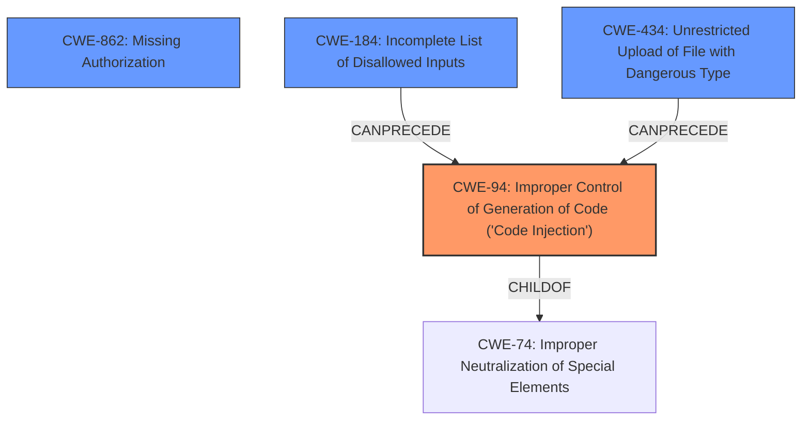

# Enhanced Analysis for CVE-2024-7094

# Summary
| CWE ID  | CWE Name                                                                        | Confidence | CWE Abstraction Level | CWE Vulnerability Mapping Label | CWE-Vulnerability Mapping Notes |
| :-------- | :------------------------------------------------------------------------------ | :----------- | :---------------------- | :------------------------------ | :------------------------------ |
| CWE-94    | Improper Control of Generation of Code ('Code Injection')                      | 0.9          | Base                    | Primary                         | Allowed-with-Review             |
| CWE-862   | Missing Authorization                                                           | 0.9          | Base                    | Secondary                       | Allowed                         |
| CWE-184   | Incomplete List of Disallowed Inputs                                            | 0.7          | Base                    | Secondary                       | Allowed                         |
| CWE-434   | Unrestricted Upload of File with Dangerous Type                                 | 0.7          | Base                    | Secondary                       | Allowed                         |

## Evidence and Confidence

*   **Confidence Score:** 0.8
*   **Evidence Strength:** HIGH

## Relationship Analysis
The primary weakness is **CWE-94** Improper Control of Generation of Code ('Code Injection'), indicating the direct injection of code due to a **lack of sanitization**. This is augmented by **CWE-862** Missing Authorization, allowing **unauthenticated attackers** access. **CWE-184** Incomplete List of Disallowed Inputs and **CWE-434** Unrestricted Upload of File with Dangerous Type describe the mechanism and method of the vulnerability being exploited.



## Vulnerability Chain
The vulnerability chain begins with **CWE-862** Missing Authorization, allowing unauthenticated access. This is followed by a **lack of sanitization** which is related to **CWE-184** Incomplete List of Disallowed Inputs, facilitating **CWE-94** Improper Control of Generation of Code ('Code Injection'). **CWE-434** Unrestricted Upload of File with Dangerous Type is a means of bypassing input validation. The ultimate impact is Remote Code Execution.

## Summary of Analysis
The initial assessment focused on the description emphasizing "**PHP Code Injection** due to a **lack of sanitization** on user-supplied values, which replace values in the style.php file, along with **missing capability checks**." The primary CWE is **CWE-94** Improper Control of Generation of Code ('Code Injection'), which is the direct result of the **lack of sanitization**. The **missing capability checks** is **CWE-862** Missing Authorization because "**unauthenticated attackers** can execute code on the server."

The retriever results offered several potential CWEs, including **CWE-352** Cross-Site Request Forgery (CSRF), **CWE-79** Improper Neutralization of Input During Web Page Generation ('Cross-site Scripting'), and **CWE-89** Improper Neutralization of Special Elements used in an SQL Command ('SQL Injection'). However, these were deemed less relevant as they did not directly address the root cause of the vulnerability, which is the injection of code due to **lack of sanitization** and **missing authorization**.

**CWE-94** is selected as the primary weakness because it directly reflects the **PHP Code Injection** aspect of the vulnerability. **CWE-862** Missing Authorization is selected because the vulnerability is exploitable by **unauthenticated attackers** due to **missing capability checks**. **CWE-184** Incomplete List of Disallowed Inputs and **CWE-434** Unrestricted Upload of File with Dangerous Type support the **lack of sanitization**.

Relevant CWE Information:
*   "The JS Help Desk - The Ultimate Help Desk & Support Plugin plugin for WordPress is vulnerable to **PHP Code Injection** leading to Remote Code Execution in all versions up to, and including, 2.8.6 via the storeTheme function. This is due to a **lack of sanitization** on user-supplied values, which replace values in the style.php file, along with **missing capability checks**. This makes it possible for **unauthenticated attackers** to execute code on the server."

Therefore the selected CWEs accurately reflect the vulnerability at an appropriate level of specificity.


## CWE Relationship Analysis

Current CWEs represent these abstraction levels: .


### Vulnerability Chain Analysis

**Chain starting from CWE-89:**
- 89 (Improper Neutralization of Special Elements used in an SQL Command ('SQL Injection')) - ROOT


**Chain starting from CWE-94:**
- 94 (Improper Control of Generation of Code ('Code Injection')) - ROOT


### CWE Relationship Diagram

```mermaid
graph TD
    classDef primary fill:#f96,stroke:#333,stroke-width:2px
    classDef secondary fill:#69f,stroke:#333
    classDef tertiary fill:#9e9,stroke:#333
```