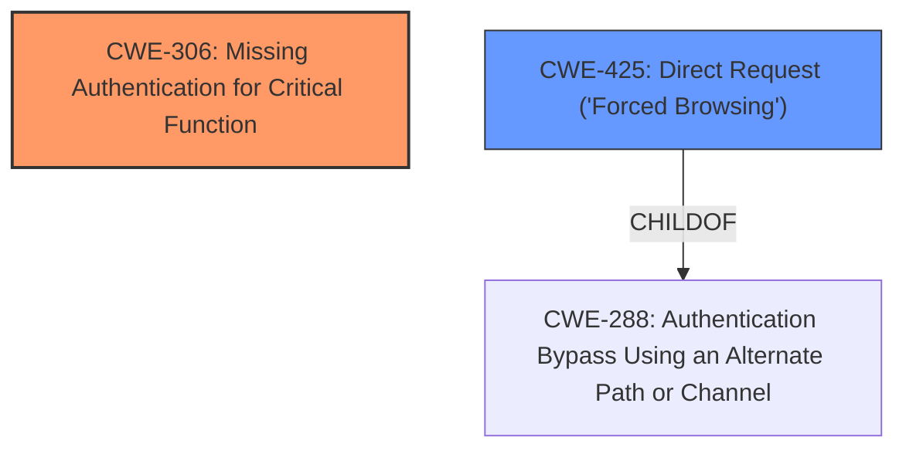

# Enhanced Analysis for CVE-2024-7154

# Summary
| CWE ID | CWE Name | Confidence | CWE Abstraction Level | CWE Vulnerability Mapping Label | CWE-Vulnerability Mapping Notes |
|---|---|---|---|---|---|
| CWE-306 | Missing Authentication for Critical Function | 1.0 | Base | Primary | Allowed |
| CWE-425 | Direct Request ('Forced Browsing') | 0.7 | Base | Secondary | Allowed |

## Evidence and Confidence

*   **Confidence Score:** 0.9
*   **Evidence Strength:** HIGH

## Relationship Analysis
The primary CWE is CWE-306, which falls under the broader category of authentication issues. CWE-425, a peer of CWE-288 (Authentication Bypass Using an Alternate Path or Channel), is considered as a secondary CWE because the lack of authentication directly leads to forced browsing of sensitive functionalities. The base abstraction level for both CWEs is suitable because the provided information clearly points to specific implementation flaws.



## Vulnerability Chain
The vulnerability chain starts with the **missing authentication** (CWE-306) for critical functions, specifically the password reset functionality. This allows for **direct requests** (CWE-425) to the `/wizard.html` endpoint, leading to **unauthorized password reset** and complete device compromise.

## Summary of Analysis
The initial assessment identified CWE-306 as the primary weakness due to the explicit **missing authentication** for the password reset functionality. The vulnerability description clearly states that the `/wizard.html` page can be accessed without authentication, leading to unauthorized password resets. This aligns perfectly with the definition of CWE-306.

The "CVE Reference Links Content Summary" section further reinforces this by stating, "The vulnerability stems from **Incorrect Access Control**... Specifically, the `/wizard.html` and `/phone/wizard.html` pages lack proper authentication checks" and "**Missing Authentication:** The web pages responsible for changing passwords can be accessed without prior authentication. This bypasses the intended access control mechanisms."

CWE-425 (Direct Request) is included as a secondary CWE because the **missing authentication** allows an attacker to directly request the protected functionality without proper authorization checks.

Other CWEs like CWE-79 and CWE-89 were considered but rejected as they are related to input validation and injection vulnerabilities, which are not the primary issue in this case. The focus here is on the **missing authentication** mechanism, making CWE-306 the most appropriate primary classification. The selected CWEs are at the optimal level of specificity, providing a clear and accurate representation of the vulnerability.

Relevant CWE Information:

# Enhanced Context (25 CWEs)
The following CWEs were identified as potentially relevant to this vulnerability:

## CWE-306: Missing Authentication for Critical Function
**Abstraction Level**: Base
**Similarity Score**: 947.80
**Source**: sparse

**Description**:
The product does not perform any authentication for functionality that requires a provable user identity or consumes a significant amount of resources.

**Mapping Guidance**:
- Usage: Allowed
- Rationale: This CWE entry is at the Base level of abstraction, which is a preferred level of abstraction for mapping to the root causes of vulnerabilities.

## CWE-425: Direct Request ('Forced Browsing')
**Abstraction Level**: Base
**Similarity Score**: 2.36
**Source**: graph

**Description**:
The web application does not adequately enforce appropriate authorization on all restricted URLs, scripts, or files.

**Mapping Guidance**:
- Usage: Allowed
- Rationale: This CWE entry is at the Base level of abstraction, which is a preferred level of abstraction for mapping to the root causes of vulnerabilities.


## CWE Relationship Analysis

Current CWEs represent these abstraction levels: .


### Vulnerability Chain Analysis

**Chain starting from CWE-288:**
- 288 (Authentication Bypass Using an Alternate Path or Channel) - ROOT


**Chain starting from CWE-89:**
- 89 (Improper Neutralization of Special Elements used in an SQL Command ('SQL Injection')) - ROOT


### CWE Relationship Diagram

```mermaid
graph TD
    classDef primary fill:#f96,stroke:#333,stroke-width:2px
    classDef secondary fill:#69f,stroke:#333
    classDef tertiary fill:#9e9,stroke:#333
```