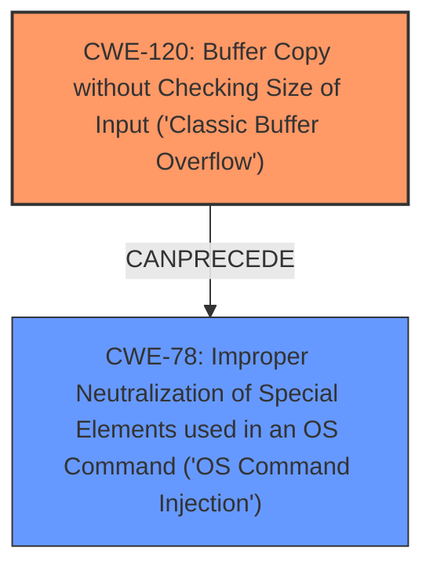

# Analysis Report for CVE-2024-7177

# Vulnerability Analysis Report: CVE-2024-7177

## Description

A vulnerability was found in TOTOLINK A3600R 4.1.2cu.5182_B20201102. It has been classified as critical. Affected is the function setLanguageCfg of the file /cgi-bin/cstecgi.cgi. The manipulation of the argument langType leads to **buffer overflow**. It is possible to launch the attack remotely. The exploit has been disclosed to the public and may be used. VDB-272598 is the identifier assigned to this vulnerability. NOTE The vendor was contacted early about this disclosure but did not respond in any way.

## Vulnerability Description Key Phrases

- **Weakness:** buffer overflow
- **Product:** TOTOLINK A3600R
- **Version:** 4.1.2cu.5182_B20201102
- **Component:** setLanguageCfg in /cgi-bin/cstecgi.cgi

## Analysis (with Relationship Data)

# Summary
| CWE ID | CWE Name | Confidence | CWE Abstraction Level | CWE Vulnerability Mapping Label | CWE-Vulnerability Mapping Notes |
|---|---|---|---|---|---|
| CWE-120 | Buffer Copy without Checking Size of Input ('Classic Buffer Overflow') | 0.9 | Base | Allowed-with-Review | Primary CWE. Matches the **buffer overflow** root cause. |
| CWE-78 | Improper Neutralization of Special Elements used in an OS Command ('OS Command Injection') | 0.7 | Base | Allowed | Secondary CWE. The buffer overflow allows for command injection. |

## Evidence and Confidence

*   **Confidence Score:** 0.8
*   **Evidence Strength:** HIGH

## Relationship Analysis
The primary weakness is a **buffer overflow** (CWE-120), which can lead to command injection (CWE-78). CWE-120 is a base-level CWE, providing a good level of specificity for this vulnerability. CWE-78 results from the overflow. The chain relationship shows how a **buffer overflow** can allow for command injection if the overflow overwrites parts of memory that will be executed as commands.



## Vulnerability Chain
The vulnerability chain starts with:
1.  **Root Cause:** CWE-120 (**Buffer Copy without Checking Size of Input ('Classic Buffer Overflow')**) - The `setLanguageCfg` function copies data into a buffer without checking the size of the input `langType` argument.
2.  **Weakness:** The **buffer overflow** allows an attacker to overwrite memory.
3.  **Impact:** CWE-78 (**Improper Neutralization of Special Elements used in an OS Command ('OS Command Injection')**) - By overflowing the buffer, an attacker can inject and execute arbitrary OS commands.

## Summary of Analysis
The vulnerability is a **buffer overflow** in the `setLanguageCfg` function. The `langType` parameter is copied to a buffer without proper bounds checking, leading to a **buffer overflow** (CWE-120). This allows an attacker to inject and execute arbitrary commands (CWE-78).

The primary CWE is CWE-120, representing the root cause of the vulnerability, which is the **buffer overflow** due to missing size validation. The secondary CWE is CWE-78, representing the impact, which is the ability to inject OS commands.

CWE-119 (Improper Restriction of Operations within the Bounds of a Memory Buffer) was considered, as it is a parent of CWE-120, but CWE-120 is more specific and accurately captures the nature of the **buffer overflow**. CWE-79 (Improper Neutralization of Input During Web Page Generation ('Cross-site Scripting')) and CWE-89 (Improper Neutralization of Special Elements used in an SQL Command ('SQL Injection')) were considered due to the presence of input, but they don't accurately describe the **buffer overflow** vulnerability.

The selection of CWE-120 and CWE-78 is based on the vulnerability description and the identified chain of events from **buffer overflow** to command execution. The chosen CWEs are at the base level of abstraction, providing the appropriate level of detail.


## CWE Relationship Analysis

Current CWEs represent these abstraction levels: .


### Vulnerability Chain Analysis

**Chain starting from CWE-89:**
- 89 (Improper Neutralization of Special Elements used in an SQL Command ('SQL Injection')) - ROOT


**Chain starting from CWE-79:**
- 79 (Improper Neutralization of Input During Web Page Generation ('Cross-site Scripting')) - ROOT


### CWE Relationship Diagram

```mermaid
graph TD
    classDef primary fill:#f96,stroke:#333,stroke-width:2px
    classDef secondary fill:#69f,stroke:#333
    classDef tertiary fill:#9e9,stroke:#333
```


*Report generated on 2025-07-14 02:32:43*
