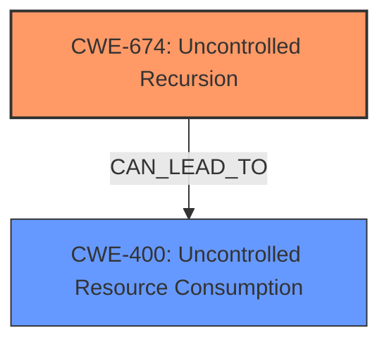

# Analysis for CVE-2024-7254

# Summary
| CWE ID | CWE Name | Confidence | CWE Abstraction Level | CWE Vulnerability Mapping Label | CWE-Vulnerability Mapping Notes |
|---|---|---|---|---|---|
| CWE-674 | Uncontrolled Recursion | 0.9 | Class | Primary | Allowed-with-Review |
| CWE-400 | Uncontrolled Resource Consumption | 0.7 | Class | Secondary | Allowed-with-Review |

## Evidence and Confidence

*   **Confidence Score:** 0.8
*   **Evidence Strength:** MEDIUM

## Relationship Analysis
The primary CWE is CWE-674 (Uncontrolled Recursion), which is a Class-level CWE. While a more specific Base or Variant might be ideal, the description clearly points to a recursion issue. CWE-674 is related to resource consumption, specifically stack exhaustion, which leads to the consideration of CWE-400 (Uncontrolled Resource Consumption) as a secondary weakness. The relationship between recursion and resource exhaustion is a common pattern.

## Vulnerability Chain
The vulnerability chain starts with the **improper parsing of nested groups**, leading to **uncontrolled recursion**, which then causes **stack overflow** and ultimately a **Denial of Service (DoS)**.

## Summary of Analysis
The initial assessment strongly points to CWE-674 (Uncontrolled Recursion) due to the explicit mention of "unbounded recursions" and "exceeding the stack limit." The CVE Reference Links Content Summary reinforces this by highlighting "potential Denial of Service (DoS)." Further analysis reveals that the recursion is triggered by parsing nested groups as unknown fields. While more specific CWEs related to input validation could be considered, the core issue is the uncontrolled recursion itself. The choice of CWE-674 is further supported by the retriever results, which identify it as a relevant CWE. Additionally, CWE-400 (Uncontrolled Resource Consumption) is considered as a secondary weakness since uncontrolled recursion directly leads to excessive resource usage (stack exhaustion).

The evidence supporting the selection of CWE-674 includes:
- "Any project that parses untrusted Protocol Buffers data containing an arbitrary number of nested groups / series of SGROUP tags can corrupted by **exceeding the stack limit** i.e. **StackOverflow**."
- "Parsing nested groups as unknown fields with DiscardUnknownFieldsParser or Java Protobuf Lite parser, or against Protobuf map fields, creates **unbounded recursions** that can be abused by an attacker."

The selection of CWE-674 at the Class level is justified because the vulnerability description focuses on the recursion aspect rather than any specific implementation flaw that would warrant a Base or Variant CWE.

Relevant CWE Information:

# Enhanced Context (25 CWEs)
The following CWEs were identified as potentially relevant to this vulnerability:

## CWE-674: Uncontrolled Recursion
**Abstraction Level**: Class
**Similarity Score**: 0.76
**Source**: dense

**Description**:
The product does not properly control the amount of recursion that takes place,  consuming excessive resources, such as allocated memory or the program stack.

**Mapping Guidance**:
- Usage: Allowed-with-Review
- Rationale: This CWE entry is a Class and might have Base-level children that would be more appropriate

**Technical Explanation**: The vulnerability arises because the parser recursively processes nested groups without proper safeguards against excessive nesting. Each nested group adds a new frame to the call stack.

**Security Implications**: An attacker can craft a malicious input with deeply nested groups, causing the parser to exhaust the stack space, leading to a denial-of-service condition.

**Relationships**: CWE-674 is a Class-level CWE. While it could have more specific children, none of them directly address the specific issue of unbounded recursion due to nested group parsing.

## CWE-400: Uncontrolled Resource Consumption
**Abstraction Level**: Class

**Description**:
The software does not properly control the consumption of resources, leading to a denial of service.

**Mapping Guidance**:
- Usage: Allowed-with-Review
- Rationale: This CWE entry is a Class and might have Base-level children that would be more appropriate.

**Technical Explanation**: In this vulnerability, the resource being consumed is the stack space. The uncontrolled recursion leads to excessive stack usage, causing the program to crash.

**Security Implications**: An attacker can exploit this vulnerability to cause a denial-of-service condition by providing an input that triggers excessive resource consumption.

**Relationships**: CWE-400 is a parent of several more specific CWEs related to resource exhaustion. While these could be considered, the description doesn't provide enough details to pinpoint a specific resource type beyond the stack. CWE-400 is a general case of resource exhaustion, applicable here.

**CWEs Considered but Not Used:**

*   **CWE-190 (Integer Overflow or Wraparound):** While integer overflows can sometimes contribute to resource exhaustion issues, the primary driver here is the uncontrolled recursion, not an integer overflow. Therefore, CWE-190 is not selected.
*   **CWE-770 (Allocation of Resources Without Limits or Throttling):** This CWE is similar to CWE-400 but focuses on allocation, which isn't the core issue here. The stack space is implicitly allocated through function calls, not explicitly allocated.
*   **CWE-1284 (Improper Validation of Specified Quantity in Input):** While input validation could prevent the excessive nesting, the vulnerability description focuses on the uncontrolled recursion that results from the lack of validation. Therefore, CWE-1284 is not the primary weakness.
*   **CWE-1325 (Improperly Controlled Sequential Memory Allocation):** This is not the best fit, since the memory allocation is from stack frames with each recursive call.
*   **CWE-835 (Loop with Unreachable Exit Condition ('Infinite Loop')):** Similar to recursion, but recursion is the best term used by the description.