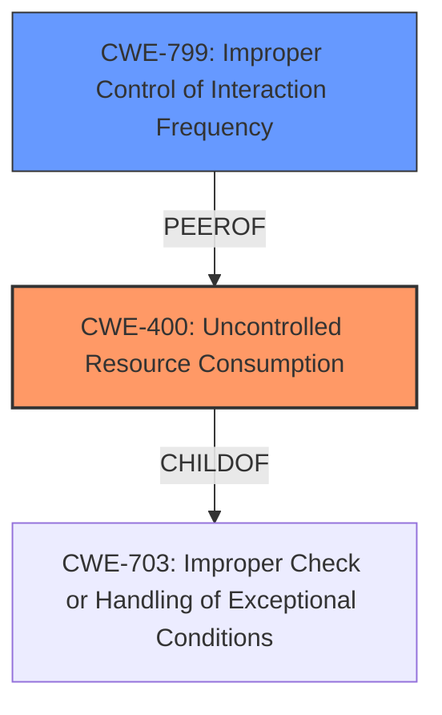

# Raw Analyzer Response for CVE-2024-7322

# Summary
| CWE ID | CWE Name | Confidence | CWE Abstraction Level | CWE Vulnerability Mapping Label | CWE-Vulnerability Mapping Notes |
|---|---|---|---|---|---|
| CWE-400 | Uncontrolled Resource Consumption | 0.7 | Class |  Primary CWE | Allowed-with-Review |
| CWE-799 | Improper Control of Interaction Frequency | 0.6 | Class | Secondary Candidate | Allowed-with-Review |

## Evidence and Confidence

*   **Confidence Score:** 0.7
*   **Evidence Strength:** MEDIUM

## Relationship Analysis
The primary CWE selected is CWE-400 **Uncontrolled Resource Consumption**, which is a Class-level CWE. The vulnerability description indicates a denial-of-service (DoS) condition, which aligns with the impact of uncontrolled resource consumption. CWE-799 **Improper Control of Interaction Frequency** is also considered, as the vulnerability involves an unsolicited encrypted rejoin response. Both CWE-400 and CWE-799 are Class-level CWEs, and a more specific Base or Variant CWE might be more appropriate if additional details were available.

## Vulnerability Chain
The vulnerability chain starts with receiving an unsolicited encrypted rejoin response, which leads to a ZigBee node changing its ID. This change in node ID results in a denial-of-service (DoS). The root cause is the **improper handling** or validation of the unsolicited rejoin response, leading to **uncontrolled resource consumption**.

## Summary of Analysis
The primary weakness identified is CWE-400 **Uncontrolled Resource Consumption**, as the vulnerability results in a denial-of-service condition due to a change in node ID upon receiving an unsolicited encrypted rejoin response. This DoS condition directly relates to the consumption of resources, rendering the ZigBee device unusable until the network is re-established. While CWE-799 **Improper Control of Interaction Frequency** is a plausible secondary candidate, CWE-400 aligns more directly with the described impact. Both CWE-400 and CWE-799 are Class-level CWEs, and a more specific Base or Variant CWE might be more appropriate if additional details were available about the specific mechanism triggering the node ID change.

Relevant CWE Information:

# Enhanced Context (25 CWEs)
The following CWEs were identified as potentially relevant to this vulnerability:

## CWE-799: Improper Control of Interaction Frequency
**Abstraction Level**: Class
**Similarity Score**: 0.71
**Source**: dense

**Description**:
The product does not properly limit the number or frequency of interactions that it has with an actor, such as the number of incoming requests.

**Mapping Guidance**:
- Usage: Allowed-with-Review
- Rationale: This CWE entry is a Class and might have Base-level children that would be more appropriate

## CWE-400: Uncontrolled Resource Consumption
**Abstraction Level**: Class
**Similarity Score**: 0.078

**Description**: The product consumes more resources than it should, or it does not properly restrict the amount of resources that are available to it.
**Mapping Guidance**: Discouraged, might have lower-level children that would be more appropriate.

CWEs considered but not used:

*   CWE-20 **Improper Input Validation**: While input validation might be related, the specific issue is the consumption of resources leading to DoS, making CWE-400 a more precise fit.
*   CWE-295 **Improper Certificate Validation**: Certificates are not explicitly mentioned in the vulnerability description, so it is not a good fit.
*   CWE-755 **Improper Handling of Exceptional Conditions**: This is a high-level Class CWE, and CWE-400 is more specific to the observed denial-of-service impact.
*   CWE-789 **Memory Allocation with Excessive Size Value**: Memory allocation is not mentioned, so it is not a good fit.
*   CWE-1284 **Improper Validation of Specified Quantity in Input**: Quantity is not mentioned, so it is not a good fit.