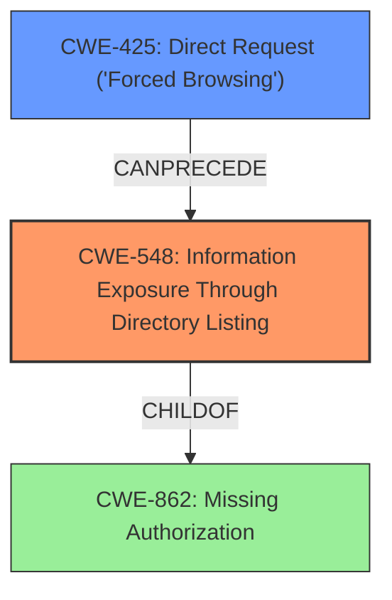

# Enhanced Analysis for CVE-2024-7414

# Summary

| CWE ID  | CWE Name                                           | Confidence | CWE Abstraction Level | CWE Vulnerability Mapping Label | CWE-Vulnerability Mapping Notes |
|---------|----------------------------------------------------|------------|-----------------------|-----------------------------------|---------------------------------|
| CWE-548 | Information Exposure Through Directory Listing | 0.8        | Base                  | Primary                           | Allowed                         |
| CWE-425 | Direct Request ('Forced Browsing') | 0.6        | Base                  | Secondary                           | Allowed                         |

## Evidence and Confidence

*   **Confidence Score:** 0.7
*   **Evidence Strength:** MEDIUM

## Relationship Analysis

The primary relationship considered was the parent-child relationship between CWE-548 and its potential parents. While several CWEs like CWE-862 (Missing Authorization) were considered, CWE-548 was deemed the most specific and relevant due to the direct exposure of files with sensitive information (full path). CWE-425 (Direct Request) was considered as a contributing factor, specifically the ability to directly request the `composer-setup.php` file. The abstraction levels were considered with a preference to Base level CWEs.



## Vulnerability Chain

The vulnerability chain starts with **direct access to a PHP file with display_errors on**, leading to full path disclosure.

1.  **Direct Request (CWE-425)**: An unauthenticated attacker can directly request the composer-setup.php file.
2.  **Information Exposure Through Directory Listing (CWE-548)**: The server exposes the full path due to `display_errors` being enabled in the requested file.

## Summary of Analysis

The primary weakness is the exposure of the full path due to the misconfiguration of the `composer-setup.php` file (display_errors on) and its direct accessibility. This aligns directly with the description of CWE-548, Information Exposure Through Directory Listing. The vulnerability description explicitly states that the plugin allows direct access to the composer-setup.php file which has display_errors on. This makes it possible for unauthenticated attackers to retrieve the full path of the web application.

The retriever results indicated other CWEs such as CWE-425, CWE-862, and CWE-306. However, these were not as directly relevant as CWE-548. CWE-425 (Direct Request) is a contributing factor but not the root cause itself. CWE-862 (Missing Authorization) is a more general case and CWE-548 is a more specific child.

Therefore, CWE-548 is the most appropriate primary CWE.

Relevant CWE Information:

# Enhanced Context (25 CWEs)

## CWE-425: Direct Request ('Forced Browsing')
**Abstraction Level**: Base
**Similarity Score**: 0.74
**Source**: dense

**Description**:
The web application does not adequately enforce appropriate authorization on all restricted URLs, scripts, or files.

**Mapping Guidance**:
- Usage: Allowed
- Rationale: This CWE entry is at the Base level of abstraction, which is a preferred level of abstraction for mapping to the root causes of vulnerabilities.

## CWE-548: Information Exposure Through Directory Listing
**Abstraction Level**: Base

**Description**: The web server contains a directory that does not have proper restrictions, allowing actors to list the files within that directory. The files themselves may or may not be accessible.

**Mapping Guidance**:
- Usage: Allowed
- Rationale: This CWE entry is at the Base level of abstraction, which is a preferred level of abstraction for mapping to the root causes of vulnerabilities.


## CWE Relationship Analysis

Current CWEs represent these abstraction levels: .


### Vulnerability Chain Analysis

**Chain starting from CWE-306:**
- 306 (Missing Authentication for Critical Function) - ROOT


**Chain starting from CWE-548:**
- 548 (Exposure of Information Through Directory Listing) - ROOT


### CWE Relationship Diagram

```mermaid
graph TD
    classDef primary fill:#f96,stroke:#333,stroke-width:2px
    classDef secondary fill:#69f,stroke:#333
    classDef tertiary fill:#9e9,stroke:#333
```