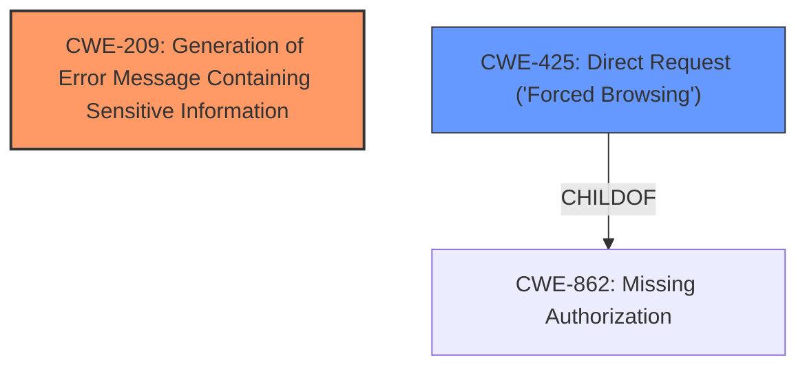

# Raw Analyzer Response for CVE-2024-7416

# Summary

| CWE ID | CWE Name | Confidence | CWE Abstraction Level | CWE Vulnerability Mapping Label | CWE-Vulnerability Mapping Notes |
|---|---|---|---|---|---|
| CWE-209 | Generation of Error Message Containing Sensitive Information | 1.0 | Base | Primary | Allowed |
| CWE-425 | Direct Request ('Forced Browsing') | 0.7 | Base | Secondary | Allowed |

## Evidence and Confidence

*   **Confidence Score:** 0.9
*   **Evidence Strength:** HIGH

## Relationship Analysis
The primary relationship that influenced the decision was the parent-child relationship between CWE-209 (Generation of Error Message Containing Sensitive Information) and its parents. While CWE-209 is a Base level CWE, its parent CWEs were considered but were too abstract to accurately represent the vulnerability. The secondary CWE, CWE-425 (Direct Request ('Forced Browsing')), has a child relationship to CWE-862 (Missing Authorization) which could be a more accurate description but the evidence does not support that the file required authorization.

## Vulnerability Chain
The vulnerability chain starts with allowing direct access to the `bootstrap.php` file, which has `display_errors` turned on. This leads to the generation of an error message containing the full path of the web application, resulting in information disclosure.

## Summary of Analysis
The initial assessment, based on the provided evidence, strongly points towards CWE-209 (Generation of Error Message Containing Sensitive Information) as the primary weakness. The vulnerability description highlights the **impact** as "Full Path Disclosure" and the root cause as "direct access to `bootstrap.php` file which has `display_errors` on." The CVE Reference Links Content Summary confirms this, stating, "The primary weakness is the exposure of the web application's full path due to the `display_errors` setting in the accessible `bootstrap.php` file." This aligns perfectly with CWE-209, which describes the generation of error messages containing sensitive information.

The retriever results also list CWE-209 as a relevant CWE. The graph relationships do not significantly alter this assessment, as the parent CWEs of CWE-209 are too abstract.

CWE-425 (Direct Request ('Forced Browsing')) is included as a secondary CWE because the vulnerability involves direct access to the `bootstrap.php` file. However, the primary issue is the exposure of sensitive information in the error message, making CWE-209 the more accurate classification.

The selected CWEs are at the optimal level of specificity, as they directly address the root cause and the resulting information disclosure. More generic CWEs would not capture the specific nature of the vulnerability.

Relevant CWE Information:

# Enhanced Context (25 CWEs)
The following CWEs were identified as potentially relevant to this vulnerability:

## CWE-425: Direct Request ('Forced Browsing')
**Abstraction Level**: Base
**Similarity Score**: 0.74
**Source**: dense

**Description**:
The web application does not adequately enforce appropriate authorization on all restricted URLs, scripts, or files.

**Mapping Guidance**:
- Usage: Allowed
- Rationale: This CWE entry is at the Base level of abstraction, which is a preferred level of abstraction for mapping to the root causes of vulnerabilities.

**Technical Explanation:**
The Reveal Template plugin for WordPress is vulnerable to Full Path Disclosure due to direct access to the `bootstrap.php` file. This file has `display_errors` enabled, leading to the exposure of the web application's full path in error messages.
**Security Implications:**
The exposure of the full path can aid attackers in planning and executing further attacks against the server.
**Relationship:**
CWE-425 (Direct Request ('Forced Browsing')) is included as a secondary CWE because the vulnerability involves direct access to the `bootstrap.php` file.

## CWE-209: Generation of Error Message Containing Sensitive Information
**Abstraction Level**: Base
**Similarity Score**: 0.70
**Source**: dense

**Description**:
The product generates an error message that includes sensitive information about its environment, users, or associated data.

**Mapping Guidance**:
- Usage: Allowed
- Rationale: This CWE entry is at the Base level of abstraction, which is a preferred level of abstraction for mapping to the root causes of vulnerabilities.

**Technical Explanation:**
The plugin generates an error message that includes the full path of the web application due to `display_errors` being enabled in the directly accessible `bootstrap.php` file.
**Security Implications:**
The full path disclosure can be used by attackers to gather more information about the server's configuration, which can be used to aid other attacks.
**Relationship:**
CWE-209 is the primary CWE because it directly addresses the root cause of the vulnerability, which is the generation of an error message containing sensitive information.