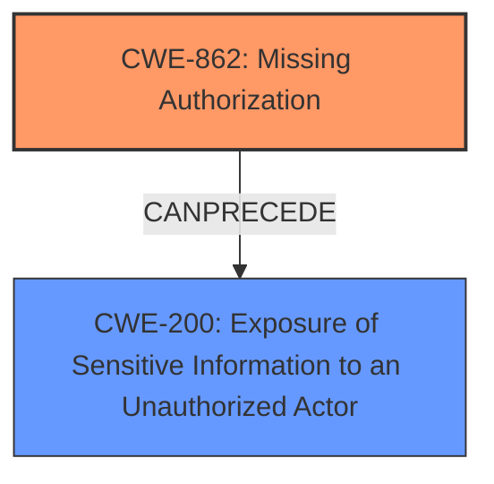

# Raw Analyzer Response for CVE-2024-7417

# Summary
| CWE ID | CWE Name | Confidence | CWE Abstraction Level | CWE Vulnerability Mapping Label | CWE-Vulnerability Mapping Notes |
|---|---|---|---|---|---|
| CWE-862 | Missing Authorization [CWE-862: Missing Authorization] | 0.9 | Class | Primary | Allowed-with-Review |
| CWE-200 | Exposure of Sensitive Information to an Unauthorized Actor [CWE-200: Exposure of Sensitive Information to an Unauthorized Actor] | 0.8 | Class | Secondary | Discouraged |

## Evidence and Confidence

*   **Confidence Score:** 0.85
*   **Evidence Strength:** HIGH

## Relationship Analysis
The primary weakness is **CWE-862 [CWE-862: Missing Authorization]**, as the vulnerability description and CVE details clearly state that the code **does not properly verify if the current user has the necessary permission** to view password-protected posts before including them in the search results. **CWE-862 [CWE-862: Missing Authorization]** is a Class-level CWE, and while there might be more specific Base or Variant level CWEs, none are provided in the Retriever Results that perfectly capture the **missing authorization** aspect in this particular scenario. The resulting impact of the **missing authorization** is **CWE-200 [CWE-200: Exposure of Sensitive Information to an Unauthorized Actor]**.

## Vulnerability Chain
The vulnerability chain starts with **CWE-862 [CWE-862: Missing Authorization]**, where the application **fails to check if the user is authorized** to view password-protected posts. This leads directly to **CWE-200 [CWE-200: Exposure of Sensitive Information to an Unauthorized Actor]**, as sensitive information from those posts is exposed to unauthorized users.

## Summary of Analysis
The initial analysis identified **CWE-862 [CWE-862: Missing Authorization]** as the primary weakness due to the **lack of proper authorization checks** for accessing password-protected posts. This directly leads to **CWE-200 [CWE-200: Exposure of Sensitive Information to an Unauthorized Actor]**. The evidence from the CVE description confirms this: "The vulnerability stems from insufficient access control checks within the `data_fetch` function... Specifically, it allows access to password-protected posts via AJAX requests even when the user should not have permission." The provided graph relationships influenced the decision by highlighting potential chains of vulnerabilities, further solidifying the understanding of how the **missing authorization** leads to **information exposure**. The selected CWEs are at the optimal level of specificity because **CWE-862 [CWE-862: Missing Authorization]** accurately captures the root cause, and **CWE-200 [CWE-200: Exposure of Sensitive Information to an Unauthorized Actor]** represents the direct consequence of this **missing authorization**.

Relevant CWE Information:
*   **CWE-862 [CWE-862: Missing Authorization]:** The product does not perform an authorization check when an actor attempts to access a resource or perform an action.
*   **CWE-200 [CWE-200: Exposure of Sensitive Information to an Unauthorized Actor]:** The product exposes sensitive information to an actor that is not explicitly authorized to have access to that information.
*   **CWE-284 [CWE-284: Improper Access Control]:** This was considered, but it is too general. **CWE-862 [CWE-862: Missing Authorization]** is a more specific child of this CWE.
*   **CWE-863 [CWE-863: Incorrect Authorization]:** This was considered, but the issue is a **missing authorization**, not an **incorrect authorization**.
*   **CWE-359 [CWE-359: Exposure of Private Personal Information to an Unauthorized Actor]:** This was considered, but **CWE-200 [CWE-200: Exposure of Sensitive Information to an Unauthorized Actor]** is a more general form of this CWE, since the information doesn't have to be personal.
*   **CWE-639 [CWE-639: Authorization Bypass Through User-Controlled Key]:** This was considered, but the bypass is not through user-controlled keys.
*   **CWE-425 [CWE-425: Direct Request ('Forced Browsing')]:** This was considered, but **CWE-862 [CWE-862: Missing Authorization]** is more specific.