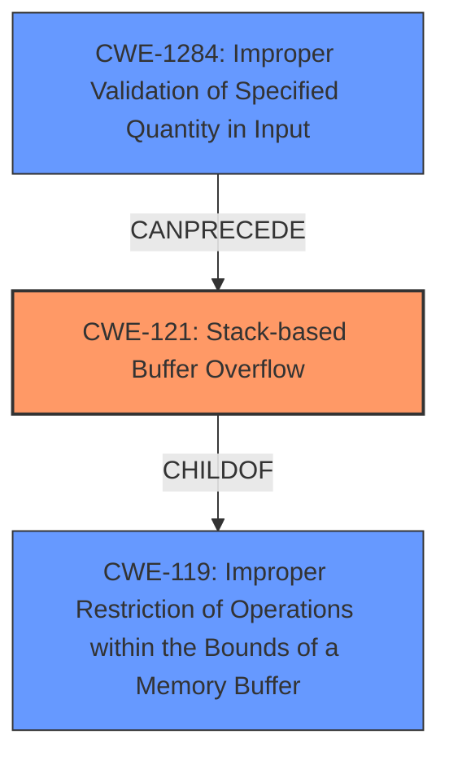

# Analysis for CVE-2024-7441

# Summary
| CWE ID | CWE Name | Confidence | CWE Abstraction Level | CWE Vulnerability Mapping Label | CWE-Vulnerability Mapping Notes |
|---|---|---|---|---|---|
| CWE-121 | Stack-based Buffer Overflow | 1.0 | Variant | Primary | Allowed |
| CWE-1284 | Improper Validation of Specified Quantity in Input | 0.7 | Base | Secondary | Allowed |
  - The Primary CWE should be first and noted as the Primary CWEs
  - The secondary candidate CWEs should be next and noted as secondary candidates.
  - The confidence is a confidence score 0 to 1 to rate your confidence in your overall assessment for that CWE.
  - The CWE Abstraction Level as one of these values: Base, Variant, Pillar, Class, Compound
  - The Mapping Notes Usage as one of these values: Allowed, Allowed-with-Review, Prohibited, Discouraged

## Evidence and Confidence

*   **Confidence Score:** 0.85
*   **Evidence Strength:** HIGH

## Relationship Analysis
The primary weakness is a **stack-based buffer overflow** (CWE-121), which is a variant of the more general **improper restriction of operations within the bounds of a memory buffer** (CWE-119). The overflow occurs because the `Content-Length` field is not validated, which is an instance of **improper validation of specified quantity in input** (CWE-1284).

## Vulnerability Chain
The vulnerability chain starts with **improper validation of specified quantity in input** (CWE-1284) of the `Content-Length` argument. This leads to a **stack-based buffer overflow** (CWE-121) when the `read` function attempts to read more data than the allocated buffer size. The impact is that an attacker can write arbitrary data to the stack, potentially leading to arbitrary code execution.

## Summary of Analysis
The vulnerability is a classic **stack-based buffer overflow** due to a missing check on the `Content-Length` field in HTTP requests. The primary CWE is therefore CWE-121. This is supported by the vulnerability description which states the **weakness** is a "**stack-based buffer overflow**" and confirmed by the "CVE Reference Links Content Summary" section which states "**Weaknesses/vulnerabilities present**: Stack buffer overflow due to lack of length check on the `Content-Length` field in HTTP requests."

CWE-1284 is included because the root cause is the **improper validation** of the `Content-Length` which is a "specified quantity in input". This is included as a secondary CWE.

Other CWEs considered from the Retriever Results include:

*   CWE-119: Improper Restriction of Operations within the Bounds of a Memory Buffer - This is a parent of CWE-121, so CWE-121 is more specific and preferred.
*   CWE-190: Integer Overflow or Wraparound - While integer overflows can sometimes lead to buffer overflows, the root cause here is the missing validation of the content length, making CWE-1284 more relevant.
*   CWE-125: Out-of-bounds Read - This is similar to CWE-787, but the vulnerability is specifically an out-of-bounds write (buffer overflow).

Relevant CWE Information:
* CWE-121 Description: When writing data to a buffer, the code does not properly check the length of the input (or the result of an operation) and can write beyond the end of the buffer.
* CWE-1284 Description: The product receives input that is expected to specify a quantity (such as size or length), but it does not validate or incorrectly validates that the quantity has the required properties.