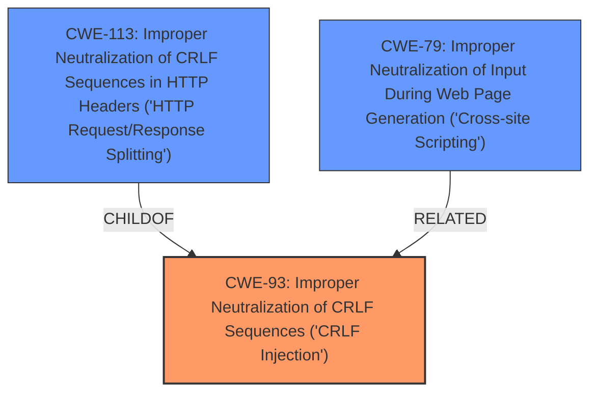

# Analysis Report for CVE-2024-7472

# Vulnerability Analysis Report: CVE-2024-7472

## Description

lunary-ai/lunary v1.2.26 contains an **email injection** vulnerability in the Send email verification API (/v1/users/send-verification) and Sign up API (/auth/signup). An unauthenticated attacker can inject data into outgoing emails by bypassing the extractFirstName function using a different whitespace character (e.g., \xa0). This vulnerability can be exploited to conduct phishing attacks, damage the applications brand, cause legal and compliance issues, and result in financial impact due to unauthorized email usage.

## Vulnerability Description Key Phrases

- **Rootcause:** bypass of extractFirstName function
- **Weakness:** email injection
- **Impact:** ['conduct phishing attacks', 'inject data into outgoing emails']
- **Vector:** different whitespace character
- **Attacker:** unauthenticated attacker
- **Product:** lunary-ai/lunary
- **Version:** v1.2.26
- **Component:** ["['Send email verification API'", "'Sign up API']"]

## Analysis (with Relationship Data)

# Summary
| CWE ID | CWE Name | Confidence | CWE Abstraction Level | CWE Vulnerability Mapping Label | CWE-Vulnerability Mapping Notes |
|---|---|---|---|---|---|
| CWE-93 | Improper Neutralization of CRLF Sequences ('CRLF Injection') | 0.8 | Base | Allowed | Primary CWE.  The unauthenticated attacker is able to inject data into outgoing emails by bypassing the extractFirstName function using a different whitespace character. |
| CWE-113 | Improper Neutralization of CRLF Sequences in HTTP Headers ('HTTP Request/Response Splitting') | 0.6 | Variant | Allowed | Secondary candidate. CRLF injection in HTTP headers is a possible impact, but not explicitly stated. |
| CWE-79 | Improper Neutralization of Input During Web Page Generation ('Cross-site Scripting') | 0.5 | Base | Allowed | Secondary candidate. Injection into emails could lead to the inclusion of malicious scripts, but this is not explicitly stated. |

## Evidence and Confidence

*   **Confidence Score:** 0.7
*   **Evidence Strength:** MEDIUM

## Relationship Analysis
The primary weakness is CWE-93, which focuses on the improper neutralization of CRLF sequences. CWE-113 is a variant of CWE-93, specifically concerning HTTP headers. CWE-79 is related, as injection could lead to cross-site scripting vulnerabilities if the injected content is displayed in a web page. The hierarchical relationship influenced the decision, as CWE-93 is a more general case of the injection.



## Vulnerability Chain
The vulnerability chain starts with the **bypass of extractFirstName function**, leading to **email injection**. This allows an unauthenticated attacker to inject data into outgoing emails. The impact includes conducting phishing attacks, damaging the application's brand, causing legal and compliance issues, and financial impact due to unauthorized email usage.

## Summary of Analysis
The analysis is primarily based on the vulnerability description, which clearly states an **email injection** vulnerability due to a **bypass of the extractFirstName function**. The description directly indicates that an unauthenticated attacker can inject data into outgoing emails.

The retriever results suggest CWE-93 as a potential candidate, and its description aligns well with the **email injection** aspect of the vulnerability. The hierarchical relationships, with CWE-113 being a variant of CWE-93, further support the selection of CWE-93 as the primary weakness. CWE-79 is a possible secondary weakness because injected emails could be used in a Cross-Site Scripting attack, but there is no direct evidence.

CWE-93 is at the optimal level of specificity because it accurately captures the **email injection** vulnerability without being overly specific to HTTP headers or web page generation. The selection is supported by the vulnerability description, retriever results, and hierarchical relationships.

Relevant CWE Information:

# Enhanced Context (25 CWEs)
The following CWEs were identified as potentially relevant to this vulnerability:

## CWE-93: Improper Neutralization of CRLF Sequences ('CRLF Injection')
**Abstraction Level**: Base
**Similarity Score**: 0.72
**Source**: dense

**Description**:
The product uses CRLF (carriage return line feeds) as a special element, e.g. to separate lines or records, but it does not neutralize or incorrectly neutralizes CRLF sequences from inputs.

**Mapping Guidance**:
- Usage: Allowed
- Rationale: This CWE entry is at the Base level of abstraction, which is a preferred level of abstraction for mapping to the root causes of vulnerabilities.

**Technical Explanation:**
The vulnerability involves the ability to inject data into outgoing emails by bypassing the extractFirstName function. This is achieved by using a different whitespace character, which is not properly neutralized. CRLF injection is a type of injection attack where an attacker injects carriage return and line feed characters into an input field to manipulate the output. In this case, the injection could be used to add arbitrary headers or content to the email.

**Security Implications:**
The security implications of this vulnerability are significant. An attacker can use the injection to conduct phishing attacks, damage the application's brand, cause legal and compliance issues, and result in financial impact due to unauthorized email usage.

**Relationship Details:**
CWE-93 is a base-level CWE, which is appropriate for mapping to the root cause of the vulnerability. It is also related to other CWEs, such as CWE-113 (Improper Neutralization of CRLF Sequences in HTTP Headers) and CWE-79 (Improper Neutralization of Input During Web Page Generation).

**Mapping Decision Influence:**
The high relevance score and the direct match with the vulnerability description make CWE-93 the primary weakness. The mapping guidance also supports this decision.

## CWE-113: Improper Neutralization of CRLF Sequences in HTTP Headers ('HTTP Request/Response Splitting')
**Abstraction Level**: Variant
**Similarity Score**: 0.68
**Source**: dense

**Description**:
The product receives data from an HTTP agent/component (e.g., web server, proxy, browser, etc.), but it does not neutralize or incorrectly neutralizes CR and LF characters before the data is included in outgoing HTTP headers.

**Mapping Guidance**:
- Usage: Allowed
- Rationale: This CWE entry is at the Variant level of abstraction, which is a preferred level of abstraction for mapping to the root causes of vulnerabilities.

**Technical Explanation:**
While the primary issue is email injection, it's possible that the injected data could be used to manipulate HTTP headers if the email functionality is used in conjunction with web requests. If the email content is reflected in HTTP headers, CRLF injection could lead to HTTP Request/Response Splitting.

**Security Implications:**
If the email injection leads to HTTP Request/Response Splitting, an attacker could potentially inject malicious code or redirect users to malicious websites.

**Relationship Details:**
CWE-113 is a variant of CWE-93, which means it is a more specific type of CRLF injection. It is related to HTTP headers, which may or may not be directly involved in the email injection vulnerability.

**Mapping Decision Influence:**
CWE-113 is considered a secondary candidate because the description does not explicitly state that the email injection leads to HTTP header manipulation. However, it is a possible consequence of the injection.

## CWE-79: Improper Neutralization of Input During Web Page Generation ('Cross-site Scripting')
**Abstraction Level**: Base
**Similarity Score**: 0.68
**Source**: dense

**Description**:
The product does not neutralize or incorrectly neutralizes user-controllable input before it is placed in output that is used as a web page that is served to other users.

**Mapping Guidance**:
- Usage: Allowed
- Rationale: This CWE entry is at the Base level of abstraction, which is a preferred level of abstraction for mapping to the root causes of vulnerabilities.

**Technical Explanation:**
If the injected email content is later displayed on a web page without proper neutralization, it could lead to cross-site scripting (XSS) vulnerabilities. For example, if the injected content contains JavaScript code, it could be executed in the user's browser.

**Security Implications:**
XSS vulnerabilities can allow an attacker to steal cookies, redirect users to malicious websites, or deface web pages.

**Relationship Details:**
CWE-79 is related to CWE-93 because the email injection could be a vector for XSS attacks. However, it is not a direct consequence of the injection.

**Mapping Decision Influence:**
CWE-79 is considered a secondary candidate because the description does not explicitly state that the email injection leads to XSS vulnerabilities. However, it is a possible consequence of the injection if the injected content is displayed on a web page.

Other CWEs Considered:

- CWE-1390, CWE-287, CWE-306: These relate to authentication issues, which are not the primary concern. While the attacker is unauthenticated, the core issue is the **email injection** due to improper input validation.
- CWE-1336: This relates to template engine issues, which aren't the focus here.
- CWE-359: This relates to exposure of private information, but the core weakness is the **email injection** itself.
- CWE-117: This relates to improper output neutralization for logs, which is not directly applicable to this vulnerability.


## CWE Relationship Analysis

Current CWEs represent these abstraction levels: .


### Vulnerability Chain Analysis

**Chain starting from CWE-1390:**
- 1390 (Weak Authentication) - ROOT


**Chain starting from CWE-359:**
- 359 (Exposure of Private Personal Information to an Unauthorized Actor) - ROOT


### CWE Relationship Diagram

```mermaid
graph TD
    classDef primary fill:#f96,stroke:#333,stroke-width:2px
    classDef secondary fill:#69f,stroke:#333
    classDef tertiary fill:#9e9,stroke:#333
```


*Report generated on 2025-07-14 02:47:47*
