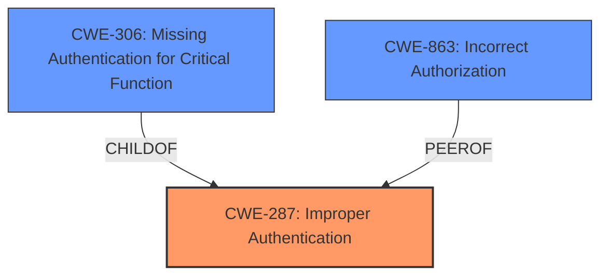

# Analysis Report for CVE-2024-7487

# Vulnerability Analysis Report: CVE-2024-7487

## Description

An **improper authentication vulnerability** exists in WSO2 Identity Server 7.0.0 due to an implementation flaw that allows app-native authentication to be bypassed when an invalid object is passed. Exploitation of this vulnerability could enable malicious actors to circumvent the client verification mechanism, compromising the integrity of the authentication process.

## Vulnerability Description Key Phrases

- **Rootcause:** improper authentication vulnerability
- **Impact:** ['bypass app-native authentication', 'integrity']
- **Attacker:** malicious actors
- **Product:** WSO2 Identity Server
- **Version:** 7.0.0

## Analysis (with Relationship Data)

# Summary
| CWE ID  | CWE Name                                            | Confidence | CWE Abstraction Level | CWE Vulnerability Mapping Label | CWE-Vulnerability Mapping Notes |
| :-------- | :-------------------------------------------------- | :--------- | :---------------------- | :------------------------------ | :-------------------------------- |
| CWE-287 | Improper Authentication                               | 0.85       | Class                   | Allowed-with-Review             | Primary CWE                      |
| CWE-306 | Missing Authentication for Critical Function        | 0.75       | Base                    | Allowed                         | Secondary Candidate              |
| CWE-863 | Incorrect Authorization                               | 0.65       | Class                   | Allowed-with-Review             | Secondary Candidate              |

## Evidence and Confidence

*   **Confidence Score:** 0.80
*   **Evidence Strength:** MEDIUM

## Relationship Analysis
The primary relationship that influenced the selection was the parent-child relationship between CWE-287 (Improper Authentication) and CWE-306 (Missing Authentication for Critical Function). While the description indicates an **improper authentication vulnerability**, the specifics aren't detailed enough to definitively determine if authentication is entirely missing (CWE-306) or improperly implemented. Given the guidance to prefer a more specific CWE when possible, I initially considered CWE-306. However, since the description mentions an "implementation flaw," it suggests that authentication is present but flawed, making CWE-287 a more suitable high-level classification. CWE-863 (Incorrect Authorization) was also considered but deemed less relevant as the vulnerability description focuses on authentication, not authorization.



## Vulnerability Chain
The vulnerability chain starts with the **improper authentication vulnerability** (CWE-287). This leads to a bypass of app-native authentication, ultimately compromising the integrity of the authentication process.

CWE-287 (Improper Authentication) -> Bypass Authentication -> Compromised Integrity

## Summary of Analysis
The initial analysis strongly pointed towards an authentication issue. The key phrase "**improper authentication vulnerability**" explicitly indicates a problem with the authentication process. The retriever results also highlighted CWE-287 and related authentication CWEs.

Based on the provided evidence, CWE-287 (Improper Authentication) appears to be the most appropriate primary CWE. The vulnerability description directly mentions "improper authentication", and the retriever results support this classification. While the description is not detailed enough to select a more specific child CWE with high confidence, CWE-287 captures the essence of the vulnerability. The abstraction level of Class is appropriate given the lack of specific details. Other CWEs were considered but ultimately deemed less relevant based on the available evidence.

Relevant CWE Information:

# Enhanced Context (25 CWEs)
The following CWEs were identified as potentially relevant to this vulnerability:

## CWE-303: Incorrect Implementation of Authentication Algorithm
**Abstraction Level**: Base
**Similarity Score**: 0.78
**Source**: dense

**Description**:
The requirements for the product dictate the use of an established authentication algorithm, but the implementation of the algorithm is incorrect.

**Mapping Guidance**:
- Usage: Allowed
- Rationale: This CWE entry is at the Base level of abstraction, which is a preferred level of abstraction for mapping to the root causes of vulnerabilities.

*This CWE could be a good fit if there was evidence of an incorrect implementation of a specific algorithm. Lacking that evidence, it is not the best choice.*

## CWE-1391: Use of Weak Credentials
**Abstraction Level**: Class
**Similarity Score**: 0.75
**Source**: dense

**Description**:
The product uses weak credentials (such as a default key or hard-coded password) that can be calculated, derived, reused, or guessed by an attacker.

**Mapping Guidance**:
- Usage: Allowed-with-Review
- Rationale: This CWE entry is a Class and might have Base-level children that would be more appropriate

*This CWE is not a good fit, as the vulnerability description is about app-native authentication to be bypassed when an invalid object is passed rather than the credentials being weak.*

## CWE-807: Reliance on Untrusted Inputs in a Security Decision
**Abstraction Level**: Base
**Similarity Score**: 0.75
**Source**: dense

**Description**:
The product uses a protection mechanism that relies on the existence or values of an input, but the input can be modified by an untrusted actor in a way that bypasses the protection mechanism.

**Mapping Guidance**:
- Usage: Allowed
- Rationale: This CWE entry is at the Base level of abstraction, which is a preferred level of abstraction for mapping to the root causes of vulnerabilities.

*This CWE could be a potential fit, but the provided information doesn't explicitly mention reliance on untrusted inputs in a security decision. More information is required.*

## CWE-288: Authentication Bypass Using an Alternate Path or Channel
**Abstraction Level**: Base
**Similarity Score**: 0.74
**Source**: dense

**Description**:
The product requires authentication, but the product has an alternate path or channel that does not require authentication.

**Mapping Guidance**:
- Usage: Allowed
- Rationale: This CWE entry is at the Base level of abstraction, which is a preferred level of abstraction for mapping to the root causes of vulnerabilities.

*This CWE is not a good fit because the vulnerability description is about bypassing app-native authentication rather than an alternate path or channel.*

## CWE-602: Client-Side Enforcement of Server-Side Security
**Abstraction Level**: Class
**Similarity Score**: 0.74
**Source**: dense

**Description**:
The product is composed of a server that relies on the client to implement a mechanism that is intended to protect the server.

**Mapping Guidance**:
- Usage: Allowed-with-Review
- Rationale: This CWE entry is a Class and might have Base-level children that would be more appropriate

*This CWE is not a good fit, as the provided information doesn't mention client-side enforcement of server-side security.*

## CWE-1390: Weak Authentication
**Abstraction Level**: Class
**Similarity Score**: 0.74
**Source**: dense

**Description**:
The product uses an authentication mechanism to restrict access to specific users or identities, but the mechanism does not sufficiently prove that the claimed identity is correct.

**Mapping Guidance**:
- Usage: Allowed-with-Review
- Rationale: This CWE entry is a Class and might have Base-level children that would be more appropriate

*This CWE is a possibility, but the description is about the mechanism being bypassed rather than the mechanism being weak itself.*

## CWE-345: Insufficient Verification of Data Authenticity
**Abstraction Level**: Class
**Similarity Score**: 0.74
**Source**: dense

**Description**:
The product does not sufficiently verify the origin or authenticity of data, in a way that causes it to accept invalid data.

**Mapping Guidance**:
- Usage: Discouraged
- Rationale: This CWE entry is a level-1 Class (i.e., a child of a Pillar). It might have lower-level children that would be more appropriate

*This CWE could apply, but the description is about bypassing authentication rather than insufficient verification of data authenticity.*

## CWE-274: Improper Handling of Insufficient Privileges
**Abstraction Level**: Base
**Similarity Score**: 0.74
**Source**: dense

**Description**:
The product does not handle or incorrectly handles when it has insufficient privileges to perform an operation, leading to resultant weaknesses.

**Mapping Guidance**:
- Usage: Discouraged
- Rationale: This CWE entry could be deprecated in a future version of CWE.

*This CWE is not relevant because it deals with handling insufficient privileges, and the vulnerability description focuses on authentication bypass.*

## CWE-280: Improper Handling of Insufficient Permissions or Privileges 
**Abstraction Level**: Base
**Similarity Score**: 0.74
**Source**: dense

**Description**:
The product does not handle or incorrectly handles when it has insufficient privileges to access resources or functionality as specified by their permissions. This may cause it to follow unexpected code paths that may leave the product in an invalid state.

**Mapping Guidance**:
- Usage: Allowed
- Rationale: This CWE entry is at the Base level of abstraction, which is a preferred level of abstraction for mapping to the root causes of vulnerabilities.

*This CWE is not relevant because it deals with handling insufficient permissions or privileges, and the vulnerability description focuses on authentication bypass.*

## CWE-204: Observable Response Discrepancy
**Abstraction Level**: Base
**Similarity Score**: 0.74


## CWE Relationship Analysis

Current CWEs represent these abstraction levels: .


### Vulnerability Chain Analysis

**Chain starting from CWE-288:**
- 288 (Authentication Bypass Using an Alternate Path or Channel) - ROOT


**Chain starting from CWE-863:**
- 863 (Incorrect Authorization) - ROOT


### CWE Relationship Diagram

```mermaid
graph TD
    classDef primary fill:#f96,stroke:#333,stroke-width:2px
    classDef secondary fill:#69f,stroke:#333
    classDef tertiary fill:#9e9,stroke:#333
```


*Report generated on 2025-07-14 02:49:05*
